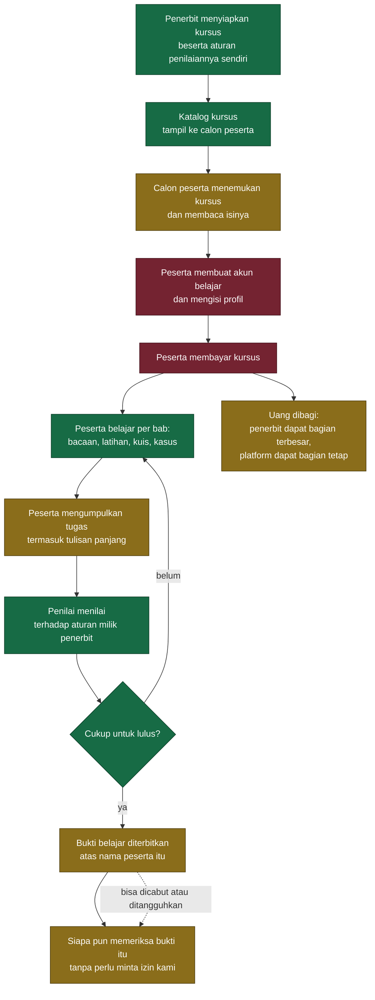
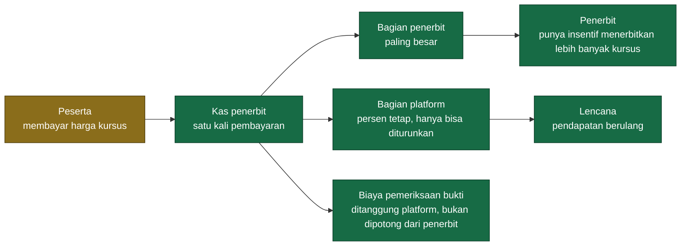

# 06 - Business Process

**Aturan halaman ini: nol istilah teknis.** Tidak ada nama kontrak, angka hash, alamat, perintah, atau
nama berkas di sini. Yang ditulis hanya: siapa melakukan apa, siapa membayar apa, dan mana yang **sudah
berjalan sebagai bisnis** versus yang **belum**. Mekanisme di balik setiap baris ada di
[[01-Architecture/01 - Architecture]] dan [[04-Signer-Service/01 - Signer Service]].

Status per **26 September 2026**. "Sudah" di halaman ini berarti *sudah berjalan dan bisa diperagakan*.
Ia **tidak** berarti *sudah dipakai orang sungguhan* — tidak ada satu pun peserta nyata atau penerbit
nyata yang memakai ini sampai hari ini, dan itu batas paling penting dari seluruh halaman.

## Alur utama: dari kursus ke bukti

**Hijau = sudah jalan. Kuning = sebagian / belum utuh. Merah = belum ada sama sekali.**

## Status per langkah, dengan akibat bisnisnya

| langkah | siapa yang merasakan | status | kalau belum ada, apa akibatnya |
|---|---|---|---|
| Penerbit menulis kursus dan **menentukan sendiri** apa yang dinilai | penerbit | **sudah** | — (ini justru pembedanya: kami tidak mengatur kurikulum orang) |
| Katalog menampilkan kursus, durasi, dan isinya | calon peserta | **sudah** | — |
| Peserta menemukan jalur belajar dari halaman utama | calon peserta | **sebagian** | halaman belajar ada, tapi tidak terhubung dari menu; pengunjung tidak tahu harus mengeklik apa |
| Peserta punya akun dan profil belajar | peserta | ❌ **belum** | tidak ada "kursus saya", tidak ada kelanjutan di perangkat lain, tidak ada tempat menagih pembayaran |
| Peserta **membayar** untuk ikut kursus | peserta → penerbit | ❌ **belum** | **tidak ada peristiwa bisnis yang dijual.** Produk hari ini menjual sesuatu yang tidak diminta dibayar |
| Peserta belajar per bab dengan kuis dan latihan di dalamnya | peserta | **sudah** | — |
| Peserta mengumpulkan pekerjaan dan melihat nilainya per bagian | peserta | **sebagian** | pengumpulan jalan di sisi kami, tapi di layar hasilnya membingungkan dan peserta tidak melihat dari mana angka datang |
| Penilai menilai terhadap aturan penerbit, dan **bisa menjatuhkan** | penerbit | **sudah** | — (sudah diuji dengan contoh yang seharusnya gagal, dan gagal) |
| Kelulusan dihitung, bukan dinyatakan | peserta | **sudah** | — |
| Bukti belajar diterbitkan atas nama peserta | peserta | **sebagian** | terbit dan terbaca; tapi bukti itu belum pernah **dibaca oleh pemeriksa asing**, jadi klaim luarnya masih milik kami sendiri |
| Orang luar memeriksa keaslian tanpa menghubungi kami | perekrut, penerima peserta | **sebagian** | mesin periksanya jalan dan gratis; yang belum adalah pemeriksaan oleh pihak ketiga yang bukan kami |
| Uang dibagi: penerbit dapat bagian terbesar, platform bagian tetap | penerbit ↔ kami | **sebagian** | pembagian berjalan dan aturannya tidak bisa kami naikkan diam-diam; yang belum adalah **pembayar nyata** |
| Penerbit baru bisa bergabung sendiri tanpa dilibatkan | penerbit | ❌ **belum** | semua penerbit di demo ini adalah kami sendiri, dan itu tertulis sebagai fiktif |
| Layanan berjalan sendiri tanpa ada orang yang menjalankan | semua | ❌ **belum** | hari ini penerbitan dilakukan dengan perintah yang dijalankan manusia; itu cukup untuk demo, bukan untuk pelanggan |

## Uang mengalir ke siapa

Tiga keputusan bisnis yang sudah dipaku, dan tidak boleh berubah diam-diam:

1. **Pemeriksaan bukti selalu gratis** bagi siapa pun. Menagih uang untuk kebenaran membuat kebenaran itu
   tidak bisa dipercaya.
2. **Biaya pemeriksaan ditanggung pihak yang menerbitkan**, bukan dipotong sebagai persentase dari bagian
   penerbit — kalau tidak, penerbit membayar untuk sesuatu yang tidak mereka minta.
3. **Bagian platform berupa persen tetap dan hanya boleh diturunkan.** Tidak ada buku utang: setiap
   pembayaran langsung dibagi dan tidak ada saldo yang kami tanggungkan kepada siapa pun.

## Yang boleh dijanjikan ke pelanggan hari ini, dan yang belum

| kalimat yang boleh dipakai sekarang | kalimat yang **belum** boleh dipakai |
|---|---|
| "Peserta belajar, hasilnya dinilai terhadap aturan penerbit itu sendiri." | "Penerbit nyata sudah memakai platform ini." |
| "Bukti belajar bisa diperiksa siapa pun tanpa menghubungi kami." | "Bukti kami lolos validator standar pihak ketiga." |
| "Status bukti bisa dicabut atau ditangguhkan, dan aturannya tertulis." | "Sistem ini berjalan sebagai layanan yang selalu aktif." |
| "Bagian platform tetap dan hanya bisa diturunkan." | "Ada pasar kursus tempat penerbit berlomba." |
| "Penilai otomatis bisa menjatuhkan pekerjaan yang tidak layak." | "Penilaian otomatis persis sama dengan penilaian manusia." |

Satu kalimat yang merangkum semuanya: **mesinnya berjalan dan bisa diperagakan dari awal ke akhir; yang
belum berjalan adalah bagian tempat seseorang membayar dan bagian tempat orang asing mengiyakan.**

## Langkah bisnis berikutnya, berurutan

1. Jadikan **pendaftaran + pembayaran kursus** sebagai peristiwa pertama yang benar-benar dijual
   (hari ini tidak ada yang bisa dibeli).
2. Buka **penerbit kedua** — walau satu kursus non-teknis dari kenalan — supaya kalimat "platform pihak
   ketiga" punya dasar.
3. Minta **satu orang sungguhan** memakai halaman belajar dan merekam apa yang bikin dia bingung.
4. Dapatkan **satu pemeriksaan asing** atas bukti yang kami terbitkan; itu satu-satunya yang mengubah
   janji menjadi bukti.
5. Kumpulkan **bukti kebutuhan pasar** untuk materi dampak dan kelayakan — hari ini masih nol.

**Related:** [[00-Overview/01 - Briefing]] · [[05-Course-Content/01 - Course Content]] ·
[[11-Refactoring/00 - Hub Refactoring]] · [[08-Results/01 - Evidence and Limits]] · [[Index]]
