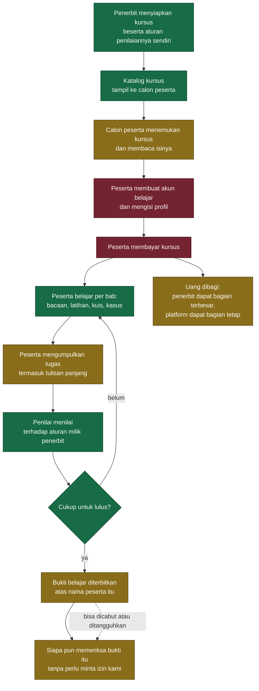
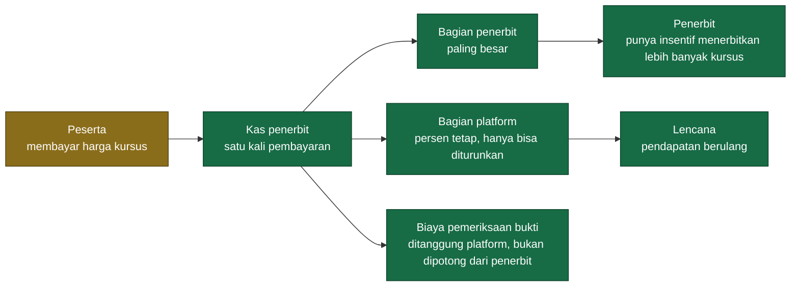
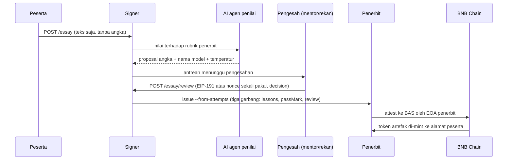

# 06 - Business Process

**Aturan halaman ini: nol istilah teknis.** Tidak ada nama kontrak, angka hash, alamat, perintah, atau
nama berkas di sini. Yang ditulis hanya: siapa melakukan apa, siapa membayar apa, dan mana yang **sudah
berjalan sebagai bisnis** versus yang **belum**. Mekanisme di balik setiap baris ada di
[[01-Architecture/01 - Architecture]] dan [[04-Signer-Service/01 - Signer Service]].

> **Koreksi 30 Sep (B117) — halaman ini memotret 26 Sep, dan empat barisnya sudah bergerak.** Tabel dan
> warna diagram di bawah tidak kutimpa; yang berubah sejak itu: (1) **akun/rekaman belajar** — bukan lagi
> "belum": enrollment, progres dan usaha peserta tercatat di server di bawah tanda tangan peserta sejak
> 28 Sep (identitasnya masih kunci perangkat, belum akun yang bisa dipulihkan); (2) **bukti dibaca pemeriksa
> asing** — baris yang menyebut "2 error" adalah run pertama 27 Sep; sejak itu validator menjawab VALID
> dengan 0 error; (3) **orang luar memeriksa tanpa menghubungi kami** — 19 dari 19 kertas bisa dibuka
> publik; (4) **pengumpulan esai** — sekarang diserahkan ke penerbit dan dinilai dengan kunci penerbit.
> Yang **tetap** merah: peserta membayar kursus, penerbit bergabung sendiri, dan layanan yang berjalan tanpa
> operator. Versi teknis dan terkini: [[00-Overview/12 - Business Process]].

Status per **26 September 2026**. "Sudah" di halaman ini berarti *sudah berjalan dan bisa diperagakan*.
Ia **tidak** berarti *sudah dipakai orang sungguhan* — tidak ada satu pun peserta nyata atau penerbit
nyata yang memakai ini sampai hari ini, dan itu batas paling penting dari seluruh halaman.

## Alur utama: dari kursus ke bukti

```mermaid
flowchart TD
  PUB["Penerbit menyiapkan kursus<br/>beserta aturan penilaiannya sendiri"] --> KAT["Katalog kursus<br/>tampil ke calon peserta"]
  KAT --> CARI["Calon peserta menemukan kursus<br/>dan membaca isinya"]
  CARI --> AKUN["Peserta membuat akun belajar<br/>dan mengisi profil"]
  AKUN --> BAYAR["Peserta membayar kursus"]
  BAYAR --> BELAJAR["Peserta belajar per bab:<br/>bacaan, latihan, kuis, kasus"]
  BELAJAR --> KUMPUL["Peserta mengumpulkan tugas<br/>termasuk tulisan panjang"]
  KUMPUL --> NILAI["Penilai menilai<br/>terhadap aturan milik penerbit"]
  NILAI --> LULUS{"Cukup untuk lulus?"}
  LULUS -- "belum" --> BELAJAR
  LULUS -- "ya" --> BUKTI["Bukti belajar diterbitkan<br/>atas nama peserta itu"]
  BUKTI --> CEK["Siapa pun memeriksa bukti itu<br/>tanpa perlu minta izin kami"]
  BAYAR --> BAGI["Uang dibagi:<br/>penerbit dapat bagian terbesar,<br/>platform dapat bagian tetap"]
  BUKTI -.->|"bisa dicabut atau ditangguhkan"| CEK

  classDef done fill:#176b45,color:#ffffff,stroke:#0a3d27
  classDef part fill:#8a6d1b,color:#ffffff,stroke:#4d3c0c
  classDef none fill:#742331,color:#ffffff,stroke:#421019
  class PUB,KAT,BELAJAR,NILAI,LULUS done
  class CARI,KUMPUL,BUKTI,CEK,BAGI part
  class AKUN,BAYAR none
```

**Hijau = sudah jalan. Kuning = sebagian / belum utuh. Merah = belum ada sama sekali.**

## Status per langkah, dengan akibat bisnisnya

| langkah | siapa yang merasakan | status | kalau belum ada, apa akibatnya |
|---|---|---|---|
| Penerbit menulis kursus dan **menentukan sendiri** apa yang dinilai | penerbit | **sudah** | — (ini justru pembedanya: kami tidak mengatur kurikulum orang) |
| Katalog menampilkan kursus, durasi, dan isinya | calon peserta | **sudah** | — |
| Peserta menemukan jalur belajar dari halaman utama | calon peserta | **sebagian** | halaman belajar ada, tapi tidak terhubung dari menu; pengunjung tidak tahu harus mengeklik apa |
| Peserta punya akun dan profil belajar | peserta | ❌ **belum** | tidak ada "kursus saya", tidak ada kelanjutan di perangkat lain, tidak ada tempat menagih pembayaran |
| Peserta **membayar** untuk ikut kursus | peserta → penerbit | ❌ **belum** | **tidak ada peristiwa bisnis yang dijual.** Produk hari ini menjual sesuatu yang tidak diminta dibayar |
| Peserta belajar per bab dengan kuis dan latihan di dalamnya | peserta | **sudah** | — |
| Peserta mengumpulkan pekerjaan dan melihat nilainya per bagian | peserta | **sebagian** | pengumpulan jalan di sisi kami, tapi di layar hasilnya membingungkan dan peserta tidak melihat dari mana angka datang |
| Penilai menilai terhadap aturan penerbit, dan **bisa menjatuhkan** | penerbit | **sudah** | — (sudah diuji dengan contoh yang seharusnya gagal, dan gagal) |
| Kelulusan dihitung, bukan dinyatakan | peserta | **sudah** | — |
| Bukti belajar diterbitkan atas nama peserta | peserta | **sebagian** | terbit dan terbaca; sejak 27 Sep bukti itu **sudah dibaca pemeriksa asing** — `vc.1ed.tech` mengembalikan 2 error bentuk dokumen dan 0 warning, jadi klaim kita sekarang diuji, bukan dijanjikan |
| Orang luar memeriksa keaslian tanpa menghubungi kami | perekrut, penerima peserta | **sebagian** | mesin periksanya jalan dan gratis; yang belum adalah pemeriksaan oleh pihak ketiga yang bukan kami |
| Uang dibagi: penerbit dapat bagian terbesar, platform bagian tetap | penerbit ↔ kami | **sebagian** | pembagian berjalan dan aturannya tidak bisa kami naikkan diam-diam; yang belum adalah **pembayar nyata** |
| Penerbit baru bisa bergabung sendiri tanpa dilibatkan | penerbit | ❌ **belum** | semua penerbit di demo ini adalah kami sendiri, dan itu tertulis sebagai fiktif |
| Layanan berjalan sendiri tanpa ada orang yang menjalankan | semua | ❌ **belum** | hari ini penerbitan dilakukan dengan perintah yang dijalankan manusia; itu cukup untuk demo, bukan untuk pelanggan |

## Uang mengalir ke siapa

```mermaid
flowchart LR
  PES["Peserta<br/>membayar harga kursus"] --> PUS["Kas penerbit<br/>satu kali pembayaran"]
  PUS --> P1["Bagian penerbit<br/>paling besar"]
  PUS --> P2["Bagian platform<br/>persen tetap, hanya bisa diturunkan"]
  PUS --> P3["Biaya pemeriksaan bukti<br/>ditanggung platform, bukan dipotong dari penerbit"]
  P2 --> KITA["Lencana<br/>pendapatan berulang"]
  P1 --> TERBIT["Penerbit<br/>punya insentif menerbitkan lebih banyak kursus"]

  classDef ok fill:#176b45,color:#ffffff,stroke:#0a3d27
  classDef warn fill:#8a6d1b,color:#ffffff,stroke:#4d3c0c
  class PES warn
  class PUS,P1,P2,P3,KITA,TERBIT ok
```

Tiga keputusan bisnis yang sudah dipaku, dan tidak boleh berubah diam-diam:

1. **Pemeriksaan bukti selalu gratis** bagi siapa pun. Menagih uang untuk kebenaran membuat kebenaran itu
   tidak bisa dipercaya.
2. **Biaya pemeriksaan ditanggung pihak yang menerbitkan**, bukan dipotong sebagai persentase dari bagian
   penerbit — kalau tidak, penerbit membayar untuk sesuatu yang tidak mereka minta.
3. **Bagian platform berupa persen tetap dan hanya boleh diturunkan.** Tidak ada buku utang: setiap
   pembayaran langsung dibagi dan tidak ada saldo yang kami tanggungkan kepada siapa pun.

## Yang boleh dijanjikan ke pelanggan hari ini, dan yang belum

| kalimat yang boleh dipakai sekarang | kalimat yang **belum** boleh dipakai |
|---|---|
| "Peserta belajar, hasilnya dinilai terhadap aturan penerbit itu sendiri." | "Penerbit nyata sudah memakai platform ini." |
| "Bukti belajar bisa diperiksa siapa pun tanpa menghubungi kami." | "Kami tersertifikasi 1EdTech" / "conformant" / "compatible" — yang terbukti adalah satu dokumen `outcome: VALID` di validator **member**, dan itu bukan sertifikasi |
| **Sejak 28 Sep:** "Bukti kami lolos validator standar pihak ketiga." — `vc.1ed.tech`, 14 checks, 0 error / 0 warning, dengan dokumen dan seluruh URL di dalamnya dibaca dari host tetap | "Sistem ini berjalan sebagai layanan yang selalu aktif." — tepi sajian memang permanen, tapi **penerbitannya** masih perintah yang dijalankan manusia (lihat baris layanan di bawah) |
| "Status bukti bisa dicabut atau ditangguhkan, dan aturannya tertulis." | "Ada pasar kursus tempat penerbit berlomba." |
| "Bagian platform tetap dan hanya bisa diturunkan." | "Penilai otomatis setara penilaian manusia." |
| "Penilai otomatis bisa menjatuhkan pekerjaan yang tidak layak." — terukur: esai lancar-kosong 4-8/100, esai berisi 91-100 | |

Satu kalimat yang merangkum semuanya: **mesinnya berjalan dan bisa diperagakan dari awal ke akhir, dan
orang asing sudah mengiyakan bentuk dokumennya; yang belum berjalan adalah bagian tempat seseorang
membayar.** Kalau tepi sajian ikut dinamai di depan juri, sebut juga batasnya yang jujur: ia memeriksa
chain setiap permintaan dan **menolak** menyajikan kalau bitnya tidak cocok — artinya berhenti menerbitkan
akan kelihatan sebagai 503, bukan sebagai daftar lama yang masih sah ([[04-Signer-Service/S10 - Edge surface]]).

## Langkah bisnis berikutnya, berurutan

1. Jadikan **pendaftaran + pembayaran kursus** sebagai peristiwa pertama yang benar-benar dijual
   (hari ini tidak ada yang bisa dibeli).
2. Buka **penerbit kedua** — walau satu kursus non-teknis dari kenalan — supaya kalimat "platform pihak
   ketiga" punya dasar.
3. Minta **satu orang sungguhan** memakai halaman belajar dan merekam apa yang bikin dia bingung.
4. Dapatkan **satu pemeriksaan asing** atas bukti yang kami terbitkan; itu satu-satunya yang mengubah
   janji menjadi bukti.
5. Kumpulkan **bukti kebutuhan pasar** untuk materi dampak dan kelayakan — hari ini masih nol.

**Related:** [[00-Overview/01 - Briefing]] · [[05-Course-Content/01 - Course Content]] ·
[[11-Refactoring/00 - Hub Refactoring]] · [[08-Results/01 - Evidence and Limits]] · [[Index]]

### 4d. Rantai tanda tangan sesudah D42 — TUJUAN, belum dibangun (dipilih 29 Sep)

Keputusan builder: AI agen sewaan menilai, **manusia mengesahkan** (mentor/rekan, tidak harus penerbit),
penerbit yang menerbitkan. Hari ini yang sudah ada: `graded_by` = `model`/`human` di skema, dan
penilaian esai sudah ditandatangani EOA **penerbit** lewat `judgeEssay`. Lapis pengesah manusia **belum**
ada — gambar di bawah adalah sasaran, bukan keadaan, dan tidak boleh dikutip sebagai yang ketiga.

```mermaid
sequenceDiagram
    participant P as Peserta
    participant S as Signer
    participant A as AI agen penilai
    participant M as Pengesah (mentor/rekan)
    participant I as Penerbit
    participant C as BNB Chain
    P->>S: POST /essay (teks saja, tanpa angka)
    S->>A: nilai terhadap rubrik penerbit
    A-->>S: proposal angka + nama model + temperatur
    S->>M: antrean menunggu pengesahan
    M->>S: POST /essay/review (EIP-191 atas nonce sekali pakai, decision)
    S->>I: issue --from-attempts (tiga gerbang: lessons, passMark, review)
    I->>C: attest ke BAS oleh EOA penerbit
    C->>I: token artefak di-mint ke alamat peserta
```

Tiga hal yang membuat gambar ini jujur:

1. **Angka model adalah proposal.** Tidak ada jalur dari A ke C. Yang sah masuk kertas hanya angka yang
   sudah melewati M dan I.
2. **Pengesahan dibuktikan tanda tangan, bukan akun.** Karena itu lapis ini bisa diuji dari luar: tanpa
   tanda tangan EIP-191 atas nonce sekali pakai, review tidak masuk — mekanisme yang sama sudah berjalan
   di `judgeEssay`.
3. **Gerbang ketiga fail-closed.** Esai tanpa pengesahan = tidak ada kredensial, bukan kredensial dengan
   catatan; kalau `decision` = `adjusted`, angka di kertas adalah angka pengesah.

Pekerjaan dipecah supaya tiap potong bisa diselesaikan utuh: **B104** (migrasi + rute + gerbang + dua
pemeriksaan harness) dan **B105** (halaman penerbit + kalimat onboarding yang benar; tergantung **B84/B41**).
