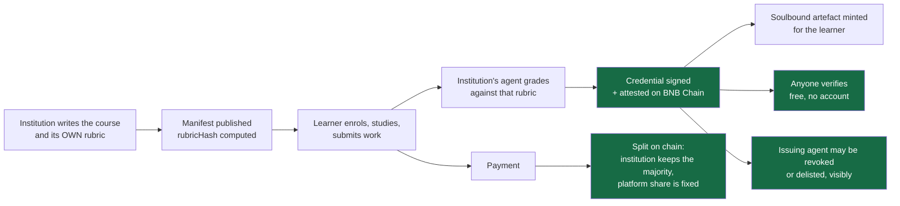
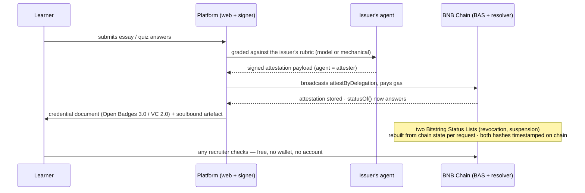

# 09 - Project Detail (submission)

Isi lengkap untuk field **"Project Detail * (markdown, mermaid diagrams supported)"**. Dokumen ini
sengaja *self-contained*: semua nomor di sini sudah diukur dari repo ini, dan alamat kontraknya
dicocokkan ke `broadcast/**/*.json` (catatan deploy asli), bukan disalin dari halaman lain.

Tempel mulai dari baris `# Lencana` di bawah sampai akhir bagian *Limits*. Blok `` adalah
**placeholder gambar** — daftar yang dibutuhkan ada di bagian paling bawah.

---

# Lencana

> **Finish the course, get the credential, rubric signed, status on BNB Chain, nothing rewritten
> quietly.**

A micro-course platform where an institution's **own agent** grades and signs the credential, and the
certificate can be checked by anyone without an account, a wallet, or our servers on the path.

## 1. The problem

A finished course leaves the learner holding a PDF. That PDF proves nothing on its own: to check it,
someone has to find the issuer, ask, and trust the answer. The certificate's value is borrowed from the
institution's reputation — so a small honest publisher cannot produce credible proof, while a loud one
can put anything on paper.

The record underneath it is editable, and silently. Rubric, weights and grades live in the issuer's own
database and can change after the certificate was handed out; nothing on the certificate shows that it
happened. Revocation is barely modelled either: we read the code of six open-source learning platforms
at pinned commits (Moodle, Open edX, Canvas, Chamilo, Frappe LMS, LearnHouse) and in none of them can a
stranger tell whether a credential is still valid without asking the platform that issued it. Moodle's
badge exporter says the reason out loud: *"Signed is not implemented yet."*

## 2. How the business actually works

Three invariants hold this together, and each one is the reason a competitor cannot copy the sentence:

1. **The rubric is the institution's, and it is sealed at issuance.** `rubricHash` — a hash over the
   grading policy alone — is written into the credential's `achievement.criteria`. Fixing a typo in the
   course material moves the material hash but **not** the policy hash; editing a rubric moves both.
2. **The party that signs is the issuer, not the platform.** `attestByDelegation` records the agent as
   the attester while Lencana broadcasts and pays the gas — so an institution needs no wallet and no
   crypto money.
3. **Verification needs nothing from us.** `web/src/verify.ts` reads issuer permission and credential
   status straight from the chain, has no DOM and no framework, and the *same file* is driven from Node
   by `scripts/probe.ts`. A green probe means the page's own logic passed against the public network,
   not a mock of it.

## 3. Lifecycle of one credential

Revocation is expressed with **two** lists because one bit cannot hold both meanings: revocation is
permanent, delisting an issuer is reversible, and an existing credential does not disappear when its
issuer falls out of favour.

## 4. Smart contracts (BNB Smart Chain **testnet, chain 97**)

| contract | address | what it is responsible for |
|---|---|---|
| **CredentialResolver** | `0x7CA624caFDe5cA3A27b33d26be56F73a90792065` | the brain: who may issue, a 7-field status read (`exists / revoked / expired / delisted / …`), and the prerequisite rule EAS itself does not enforce |
| **SoulboundCert** | `0xA5eB807A98BB73432fE5a1F171bb1154dE9c309c` | the artefact: ERC-721 + ERC-5192, `tokenId = uint256(credentialHash)`, mint refuses a credential that is not live, transfers always revert |
| **SettlementSplit** | `0xcB00E62B888113A1B09Fe9bbd01afC946e8e1bBE` | receives one payment, divides it, **keeps nothing**; `platformBps()` can only be lowered, cap `MAX_BPS = 2500` |
| **DemoCourseToken** | `0xEd19cDeB8b4Bb3355651680b089222d1140bCDDe` | the demo ERC-20 the settlement is paid in. **Open `mint`, clearly a demo, never intended for mainnet** |

Not ours: **BNB Attestation Service** `0x6c2270298b1e6046898a322acB3Cbad6F99f7CBD` (a public EAS 1.3.0
deployment we anchor into and call), Permit2 `0x000000000022D473030F116dDEE9F6B43aC78BA3`, and the x402
`ExactPermit2Proxy` `0x402085c248EeA27D92E8b30b2C58ed07f9E20001`. The proxy is identified in our fork
tests **by its own constants**, not by trusting an address in a document.

Everything above is cross-checked against `broadcast/DeployCredentials.s.sol/97/run-latest.json`.
**Nothing is deployed on BSC mainnet or opBNB**, and contract source is **not** verified on the explorer
(V1 deprecated, V2 paid) — the deploy and re-verification commands are in the README, so this is
auditable by running, not by trusting our screenshot.

## 5. Money, honestly

The settlement path is executed, not designed: `POST /verify` answers `402 Payment Required`, the client
signs two EIP-712 payloads (token permit + Permit2 witness) and sends **zero transactions**, the proxy
settles, and `SettlementSplit` divides. Measured on chain 97: **190,659 gas for one settlement + one
split** at the testnet's 0.1 gwei. `platformBps() = 1000` (10 %) read back from the deployed contract.

That number forced a product conclusion: at a $0.001 fee the break-even price of BNB is ≈ **$5.24**, so
verification is sold **in batches** (up to 25 reports per payment), never per lookup — and gas belongs
to *issuance*, paid by whoever broadcasts, never as a percentage cut taken out of the issuer's share.

## 6. What we measured

| command (from `app/`) | result | date |
|---|---|---|
| `forge test --evm-version cancun --fork-url https://bsc-testnet.publicnode.com` | **97 passed / 0 failed** | 26 Sep |
| `cd web && npx tsx scripts/probe.ts` | **59 / 0** (real `verify.ts`, four verdicts, against public 97) | 26 Sep |
| `cd web && npx tsx scripts/rubric-check.ts` | **17 / 0** (rubricHash stable, typo in material does not move it) | 26 Sep |
| `cd web && npx tsx scripts/inventory.ts` | 2 courses · 7 modules · 24 lessons · 34 pages · 412 min · 28 questions · 2 essays | 26 Sep |
| `cd signer && node scripts/check.js` | **53 / 0** (flipping one byte kills the signature) | 26 Sep |
| `cd signer && node scripts/serve-probe.js` | **20 / 0** (same over HTTP) | 26 Sep |
| `cd signer && npm run x402` | **20 / 0**, one payment buys two credentials with different verdicts | 24 Sep |
| `cd signer && npm run judge` | **7 / 0** — negative control: a fluent but empty essay scores **8/100** | 24 Sep |
| `cd signer && npm run judge-variance` | same essay scored **91–100** across 5 runs; the pass/fail decision never moved | 24 Sep |

## 7. Limits (read this before believing section 6)

- The 1EdTech validator at `vc.1ed.tech` has **never been run** against our document. We say *built to
  the specification*, not *compatible*. The blocker is issuer identity (the agent record was created
  with a localhost `verificationMethod`), not the routes.
- No real institution and no real learner: the publisher is fictitious and labelled so; graded essays in
  the demo are fixtures.
- No external payer: on the paid path **we are the facilitator**. No SLA, no third party.
- Progress is `localStorage` and is labelled **not evidence** — there is no enrolment record, and that is
  the biggest hole in the product (see `07-Backlog/03 - Findings and Tasks 2026-09-26`).
- Testnet only. No mainnet, no opBNB, no verified explorer source.

---

## Gambar yang dibutuhkan (placeholder → permintaan)

| slot | isi yang diminta | cara ambil | ukuran saran |
|---|---|---|---|
| `IMG-01` | beranda / katalog `#/learn` dengan 2 kursus | browser, `cd web && npm run dev` | 1600×900 PNG |
| `IMG-02` | satu halaman lesson dengan **kuis inline** + sidebar | route `#/learn`, ambil saat kuis belum dijawab | 1600×900 |
| `IMG-03` | halaman verifier hasil **VALID** | tempel `DEMO_HASH` dari `.env` ke `?q=` | 1400×900 |
| `IMG-04` | halaman verifier hasil **REVOKED** (bukti terkuat) | `DEMO_REVOKED_HASH` | 1400×900 |
| `IMG-05` | terminal: `402 Payment Required` lalu settlement nyata | `cd signer && npm run x402` | 1200×700 |
| `IMG-06` | BscScan: transaksi `splitErc20` dengan dua transfer keluar | cari tx split di chain 97 | 1400×800 |
| `IMG-07` | portofolio peserta dengan artefak soulbound-nya | `#/portfolio` | 1400×900 |
| `IMG-08` | (opsional) kartu "two status lists" — diagram arsitektur | bisa kubuat sebagai gambar kalau kamu mau | 1600×1000 |

Placeholder di dokumen di atas belum kumasang inline karena aku menunggu nama filenya; begitu kamu kirim
IMG-03 dan IMG-04 misalnya, taruh di `app/web/public/img/` dan kutempel sebagai
`` di section 3 dan 6.

**Related:** [[00-Overview/06 - Business Process]] · [[00-Overview/08 - Submission Copy]] ·
[[10-Contributors/Claims-Cheat-Sheet]] · [[02-Contracts/01 - Contracts]] · [[09-Testing/00 - Hub Testing]]
