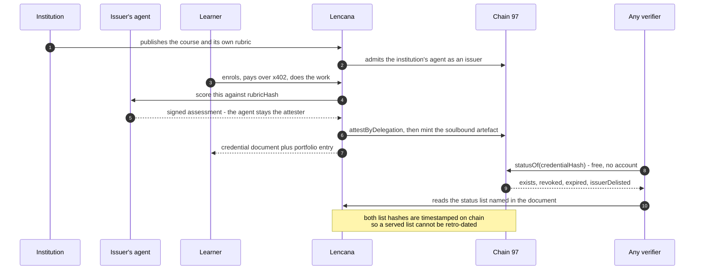

# Lencana — course credentials that stand on their own

> Finish the course, get the credential, rubric signed, status on BNB Chain, nothing rewritten quietly.

**What it is.** A micro-course platform whose output is a credential that keeps working after the issuer's
website is gone. The institution publishes the course and **its own rubric**; its **own agent** grades and
signs; Lencana relays it onto BNB Chain and pays the gas. Anyone can check it — no account, no wallet,
no trust in our database. Repo `github.com/Shenhan01-sys/Lencana` · **BNB testnet, chain 97**.

## The problem we want to solve

| the hole today | what it costs | our fix |
|---|---|---|
| Proof depends on asking the issuer | a recruiter cannot check a small academy's certificate without emailing them; a dead site buries it | status is read from a public chain — free, by anyone |
| The record underneath is editable | rubric, weights and grade sit in the issuer's database and can change **after** it exists | the grading policy is hashed (`rubricHash`) and printed inside the credential at issuance |
| Revocation is invisible to a stranger | six open-source platforms read at pinned commits (Moodle, Open edX, Canvas, Chamilo, Frappe, LearnHouse) let no outsider tell valid from withdrawn — Moodle's exporter says it: *"Signed is not implemented yet"* | two on-chain Bitstring Status Lists, rebuilt from chain state per request |
| Issuing costs sit with the wrong party | a wallet and gas asked of the institution | the agent signs; **Lencana broadcasts and pays** |

## How it works

1. **Rubric sealed with the result.** `rubricHash` covers the grading policy only: a typo in the course text
   moves the material hash, **not** the policy hash; editing the rubric moves both — a new cohort is visibly
   graded under different rules.
2. **The issuer signs, the platform pays.** `attestByDelegation` on BNB Attestation Service
   (public EAS 1.3.0, not ours) records the institution's agent as `attester` while Lencana broadcasts.
3. **The verdict is one call:** `statusOf(credentialHash)` → `exists / revoked / expired / issuerDelisted /
   issuer / issuedAt / expiresAt`, and our harness runs that same module against the public testnet, four
   verdicts. **Only identifiers are on chain** — credential, course and lesson hashes, the issuer whitelist, the two
   status lists, the artefact; no name, no email, no grade, no course text. The signed document (Open Badges 3.0 / VC 2.0,
   `eddsa-rdfc-2022`) is served off chain.
4. **Two status lists, not one bit.** Revocation is permanent, delisting recoverable; a credential must
   not vanish because its issuer fell out of favour.
5. **The artefact is display, not the credential:** an ERC-721 + ERC-5192 soulbound token per credential,
   mintable only while it is live, never transferable.
6. **Work is scored, not typed.** A mechanical scorer plus an optional model judge, neither allowed to
   invent a number.
7. **Money is machine-to-machine.** `POST /verify` answers `402`; the caller signs two EIP-712 payloads and
   sends **zero transactions**.

## Contracts (chain 97, from `broadcast/…/97/run-latest.json`)

| contract | address |
|---|---|
| CredentialResolver — admission, status, prerequisites | `0x7CA624caFDe5cA3A27b33d26be56F73a90792065` |
| SoulboundCert — the artefact | `0xA5eB807A98BB73432fE5a1F171bb1154dE9c309c` |
| SettlementSplit — platform share 10%, only lowerable | `0xcB00E62B888113A1B09Fe9bbd01afC946e8e1bBE` |
| DemoCourseToken — demo ERC-20, open `mint` | `0xEd19cDeB8b4Bb3355651680b089222d1140bCDDe` |

Not ours: BAS `0x6c2270298b1e6046898a322acB3Cbad6F99f7CBD` · Permit2 `0x000000000022D473030F116dDEE9F6B43aC78BA3` · x402 proxy `0x402085c248EeA27D92E8b30b2C58ed07f9E20001`. Settlement + split measured **190,659 gas**; at a $0.001 fee break-even is ≈ **$5.24** BNB — so verification is sold **in batches**, not per lookup.

## Measured — and what is not true yet

`forge test --evm-version cancun` **97/0** · verifier probe **59/0** · rubric **17/0** · signer **53/0**
(one flipped byte kills the signature) · x402 **20/0** · judge **7/0** — negative control: a fluent but empty
essay scores **8/100**.

Limits, kept on purpose: the 1EdTech validator has **not** been run against our document (its agent
record still carries a loopback URL), so we say *built to the specification*, never *compatible*; no real
institution or learner — the publisher is fictitious and labelled so; **no enrolment record** (progress is
`localStorage`, labelled *not evidence*); we are our own facilitator; testnet only.
