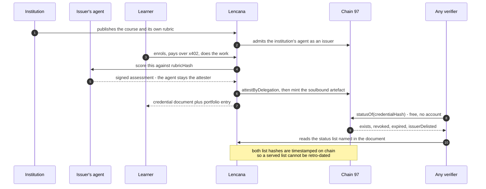
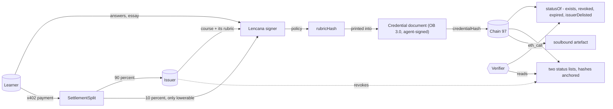

# Lencana — course credentials that stand on their own

> Finish the course, get the credential, rubric signed, status on BNB Chain, nothing rewritten quietly.

**What it is.** A micro-course platform whose output is a credential that keeps working after the issuer's
website is gone. The institution publishes the course and **its own rubric**; its **own agent** grades and
signs; Lencana relays it onto BNB Chain and pays the gas. Anyone can check it — no account, no wallet, no
trust in our database  A third party agrees: our credential **passes 1EdTech's OB 3.0
validator** (`vc.1ed.tech`): 0 errors, 0 warnings. Repo `github.com/Shenhan01-sys/Lencana` · **BNB testnet, chain 97**.

## The problem we want to solve

| the hole today | what it costs | our fix |
|---|---|---|
| Proof depends on asking the issuer | a recruiter cannot check a small academy's certificate without emailing them; a dead site buries it | status is read from a public chain — free, by anyone |
| The record underneath is editable | rubric, weights and grade sit in the issuer's database and can change **after** it exists | the grading policy is hashed (`rubricHash`) and printed inside the credential at issuance |
| Revocation is invisible to a stranger | six open-source platforms read at pinned commits (Moodle, Open edX, Canvas, Chamilo, Frappe, LearnHouse) let no outsider tell valid from withdrawn — Moodle's exporter says it: *"Signed is not implemented yet"* | two on-chain Bitstring Status Lists, rebuilt from chain state per request |
| Issuing costs sit with the wrong party | a wallet and gas asked of the institution | the agent signs; **Lencana broadcasts and pays** |

## How it works

```mermaid
sequenceDiagram
  autonumber
  participant IN as Institution
  participant AG as Issuer's agent
  participant LE as Learner
  participant PL as Lencana
  participant CH as Chain 97
  participant RE as Any verifier
  IN->>PL: publishes the course and its own rubric
  PL->>CH: admits the institution's agent as an issuer
  LE->>PL: enrols, pays over x402, does the work
  PL->>AG: score this against rubricHash
  AG-->>PL: signed assessment - the agent stays the attester
  PL->>CH: attestByDelegation, then mint the soulbound artefact
  PL-->>LE: credential document plus portfolio entry
  RE->>CH: statusOf(credentialHash) - free, no account
  CH-->>RE: exists, revoked, expired, issuerDelisted
  RE->>PL: reads the status list named in the document
  Note over CH,PL: both list hashes are timestamped on chain<br/>so a served list cannot be retro-dated
```

1. **Rubric sealed with the result.** `rubricHash` covers the grading policy only: a typo in the course text
   moves the material hash, **not** the policy hash; editing the rubric moves both — a new cohort is visibly
   graded under different rules.
2. **The issuer signs, Lencana broadcasts.** `attestByDelegation` on BNB Attestation Service (public
   EAS 1.3.0, not ours) keeps the institution's agent as `attester`; we relay and pay the gas.
3. **The verdict is one call:** `statusOf(credentialHash)` → `exists / revoked / expired / issuerDelisted /
   issuer / issuedAt / expiresAt`, and our harness runs that same module against the public testnet, four
   verdicts. **Only identifiers are on chain** — credential, course and lesson hashes, the issuer whitelist, the two
   status lists, the artefact; no name, email, grade or course text. The credential document
   itself — built to Open Badges 3.0 / VC 2.0, signed `eddsa-rdfc-2022` — is served off chain.
4. **Two status lists, not one bit.** Revocation is permanent, delisting recoverable, and a paused
   issuer does not erase its graduates — the paper points at revocation, the rest is read from chain.
5. **The artefact is display, not the credential:** an ERC-721 + ERC-5192 soulbound token per credential,
   mintable only while it is live, never transferable.
6. **Work is scored, not typed.** A mechanical scorer plus an optional model judge, neither allowed to
   invent a number.
7. **Money is machine-to-machine.** `POST /verify` answers `402`; the caller signs two EIP-712 payloads and
   sends **zero transactions**.

## Where each fact lives

```mermaid
flowchart LR
  IS[("Issuer")] -->|"course + its rubric"| PF["Lencana signer"]
  LRN[("Learner")] -->|"answers, essay"| PF
  PF -->|policy| RH["rubricHash"]
  RH -->|"printed into"| DOC["Credential document (OB 3.0, agent-signed)"]
  DOC -->|credentialHash| CH[("Chain 97")]
  CH --> ST["statusOf - exists, revoked, expired, issuerDelisted"]
  CH --> SL["two status lists, hashes anchored"]
  CH --> SB["soulbound artefact"]
  VT{{"Verifier"}} -->|"eth_call"| ST
  VT -->|reads| SL
  LRN -->|"x402 payment"| SP["SettlementSplit"]
  SP -->|90 percent| IS
  SP -->|"10 percent, only lowerable"| PF
  IS -.->|revokes| SL
```

## Contracts (chain 97, from `broadcast/…/97/run-latest.json`)

| contract | address |
|---|---|
| CredentialResolver — admission and status | `0x7CA624caFDe5cA3A27b33d26be56F73a90792065` |
| SoulboundCert — artefact | `0xA5eB807A98BB73432fE5a1F171bb1154dE9c309c` |
| SettlementSplit — 10% platform, only lowerable | `0xcB00E62B888113A1B09Fe9bbd01afC946e8e1bBE` |
| DemoCourseToken — demo fee token, open `mint` | `0xEd19cDeB8b4Bb3355651680b089222d1140bCDDe` |

Not ours: BAS `0x6c2270298b1e6046898a322acB3Cbad6F99f7CBD` (our anchor target) · x402 proxy
`0x402085c248EeA27D92E8b30b2C58ed07f9E20001` · Permit2 `0x0000…8BA3`. Settlement + split = **190,659 gas**; at a $0.001 fee, break-even ≈ **$5.24** BNB — so verification is sold **in batches**.
