# 10 - Project Detail, long form (submission)

Versi panjang dari [[00-Overview/09 - Project Detail (submission)]] untuk field yang plafonnya besar
(±68k karakter) dan mendukung Mermaid. Semua angka berasal dari perintah yang dijalankan di repo ini,
dan alamat kontrak dicocokkan ke `broadcast/DeployCredentials.s.sol/97/run-latest.json`.

**Part I (§1–§14)** is the argument: the problem, the three structural decisions, the lifecycle, the
comparison, the limits. **Part II (§15–§24)** is the machinery underneath it, for a reviewer who wants
to open the repo while reading: the course data, the signed document, the grading refusals, the chain
reads, the status lists, the payment guards, and how to reproduce every number.

| | |
|---|---|
| §1–§3 problem · decisions · who does what | §13 comparison with six platforms, read from their code |
| §4–§6 lifecycle · the three hashes · two status lists | §14 what an issuer actually does today |
| §7–§8 artefact · money | **§15 the e-course, in detail** |
| §9 what we measured (§17 adds the refusals) | **§16 the credential document, field by field** |
| §10 limits · §11 code map · §12 figures | **§18–§21 chain reads · lists · delegation · payment guards** |
| | **§22–§24 what a verifier can dereference · reproduce it · design debt** |

---

# Lencana

> **Finish the course, get the credential, rubric signed, status on BNB Chain, nothing rewritten
> quietly.**

A micro-course platform where the institution's **own agent** grades and signs the credential, the
grading rules are **sealed into the credential at the moment it is issued**, and the result can be
checked by anyone — **without an account, without a wallet, and without our servers being on the
request path**.

Built for the Indonesia Web3 Hackathon 2026, *Consumer Apps* track (· *AI Agents*), on BNB Smart Chain
testnet (chain 97).

## 1. The problem, precisely

A finished course leaves the learner holding a PDF. That PDF proves nothing on its own: to check it,
someone has to find the issuer, ask, and believe the answer. The certificate's value is therefore
**borrowed from the institution's reputation**, which produces two failures at once:

- a small, honest publisher with no brand cannot produce credible proof at all;
- a loud brand can put anything on paper and stays believed.

The record underneath the certificate is editable, **silently**. Rubric, weights and grades live in the
issuer's own database and can change after the certificate was handed out; nothing on the certificate
shows that it happened. And revocation is barely modelled: we read the code of six open-source learning
platforms at pinned commits — Moodle `e68a1418b`, Open edX `303f778`, Canvas `1c9f0bb`, Chamilo
`a6cceea`, Frappe LMS `aae024f`, LearnHouse `5e28b07` — and in **none** of them can a stranger tell
whether a credential is still valid without asking the platform that issued it. Moodle's badge exporter
states the reason out loud:

> `// Signed is not implemented yet.`
> — `references/moodle/public/badges/classes/local/backpack/ob/v2p0/assertion_exporter.php`

So the problem is not "people forge certificates" (a tired framing). It is narrower and more real:

| who | what they cannot do today |
|---|---|
| a learner | prove what they finished once the school's site, LMS or goodwill disappears |
| a recruiter | check a claim without contacting whoever made it — so they check the brand instead |
| a small honest institution | issue something believed, because belief is priced in reputation, not in the artifact |
| a grading system | show that the rules used were the rules in force **that day**, not rewritten afterwards |

## 2. The three structural decisions

Everything else follows from these. Each one is a sentence a competitor cannot currently sign.

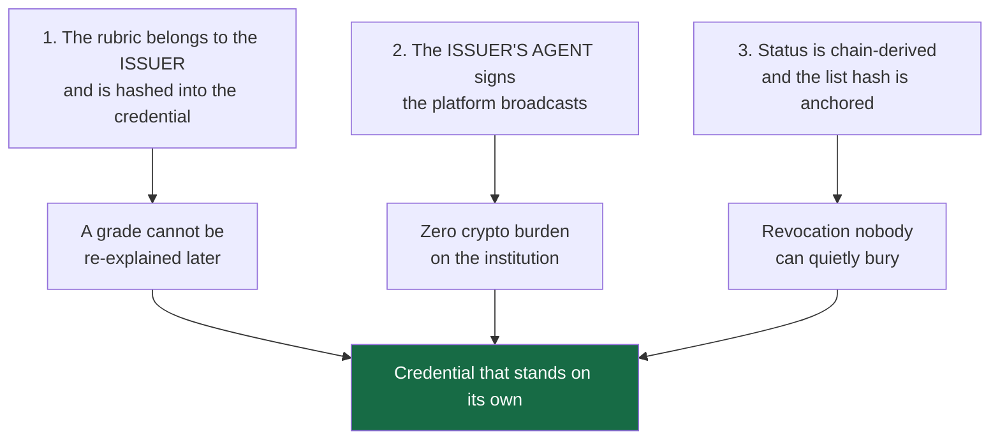

**Decision 1 — the issuer owns the rules.** A course ships with a `CourseManifest`: criteria, weights,
`passMark`, validity days, and each quiz/essay rubric. `rubricHash` is a keccak over **the policy alone**;
it is printed into the credential's `achievement.criteria`. `score.ts` computes the composite and
contains **no institutional numbers** — the platform literally has no place to invent a passing grade.
Consequence we accepted: `issue.js` **lost its `--score` flag**. Handing the platform a number to write
into a credential was the exact thing the product is supposed to make impossible.

**Decision 2 — the issuer is a third party, and its agent is the signer.** Lencana is the venue, not
the authority. `attestByDelegation` records the **agent** as the attester on BNB Attestation Service
(a public EAS 1.3.0 deployment we do not own), while the platform pays the gas. An institution therefore
needs no wallet, no BNB and no crypto staff — and if it misbehaves, `delistIssuer()` stops it from
issuing **new** attestation without erasing credentials it already issued.

**Decision 3 — status is derived from the chain, on every request.** Two Bitstring Status Lists —
`revocation` (permanent) and `suspension` (recoverable) — are rebuilt from `statusOf()` each time, served
as standard `BitstringStatusListCredential`s, and **both list hashes are timestamped on chain**. That is
what stops our own endpoint from editing a list silently: the bits it publishes are pinned. (The honest
limit of that sentence is in §9.)

## 3. Who does what

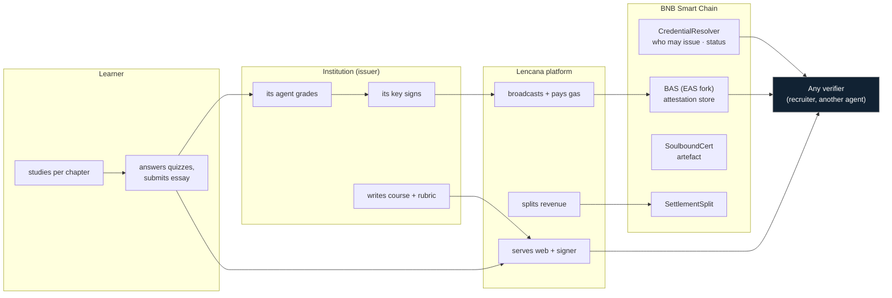

The line to read carefully is the last three: the verifier talks to the **chain** and to whatever URL
the credential carries — not to a service that could say yes or no.

## 4. Lifecycle of one credential

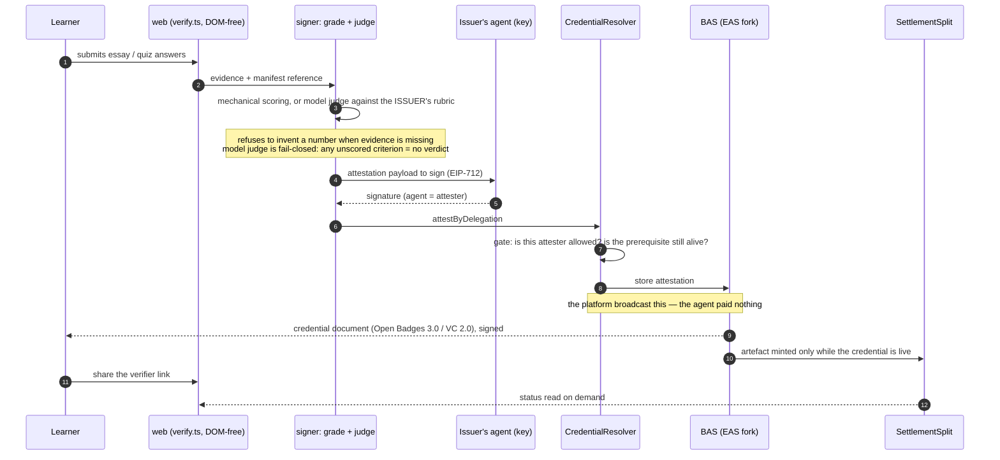

Five things happen inside those arrows that a normal LMS cannot do:

1. The **grader and the signer are the same party** — the institution's agent, not the platform's admin.
2. The **rules used are attached to the output** (`rubricHash` in `achievement.criteria`).
3. The **entity that broadcasts is not the entity that attests** — so issuance cost is a platform line,
   not an institution's tax.
4. A credential can be **refused at the gate**: an unapproved attester, or a prerequisite that has since
   been revoked, never becomes an attestation at all (revert, not a UI warning).
5. The **artefact is downstream of validity** — see §7.

## 5. The hash model: three hashes, three different promises

This is the part most likely to be misunderstood, so it gets its own diagram.

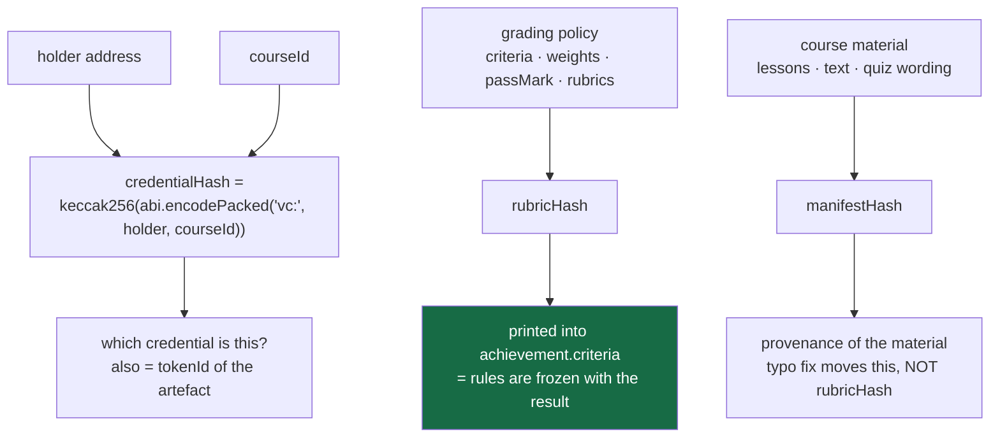

| hash | inputs | changes when… | where it lives |
|---|---|---|---|
| `credentialHash` | `(holder, courseId)` — lesson-level adds `lessonId` | either input changes | the lookup key everywhere: resolver status, artefact `tokenId`, verifier URL |
| `rubricHash` | **policy only** | criteria, weights, `passMark` or a rubric moves | inside the issued credential; `npm run rubric` asserts the separation |
| `manifestHash` | policy **and** material | anything in the course moves | README/issuer document as material provenance |

Why separate the last two: fixing a spelling mistake in lesson 3 must **not** invalidate the rules a
previous cohort was graded under. Measured: a material edit moves `manifestHash` and leaves
`rubricHash` byte-identical; changing a rubric's composition (same total, different parts) moves it.

**`credentialHash` is not a UID.** A BAS attestation UID additionally mixes in the mined
`block.timestamp`, so a UID cannot be predicted by the script that just created it. Two hard rules follow:
scripts consume **hashes**, never UIDs, and the demo seeder runs **twice** by design. It is also why
`/credentials/<hash>` takes a hash while `/healthz` reports slots keyed by **UID** — feeding one where the
other belongs produces a 404 that looks like an outage (we did exactly that, twice, before reading this).

## 6. Revocation: two lists, because one bit holds two meanings badly

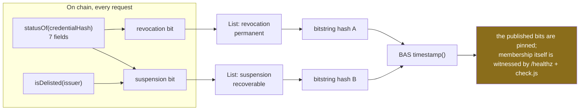

Why two and not one: a revoked credential must stay revoked forever; a **delisted issuer** is a
reversible judgement about an institution, and an existing learner's credential should not vanish because
we fell out with its publisher. A single bit cannot express both, and collapsing them would destroy the
distinction that makes the fourth verdict meaningful.

The bitstring is a fixed-length array, which buys determinism and costs a subtlety we refuse to gloss
over: **adding members whose bits are zero does not change the hash**. So the anchor witnesses *the
bits*, not *who is in the list* — and the thing that actually watches membership is `/healthz`
(`watched`, `flagged`, `unallocated`) plus the signer harness. We state this in the limits panel (§9)
rather than claim "the served list cannot be edited".

## 7. The artefact: what the NFT is *for*, and what it is not

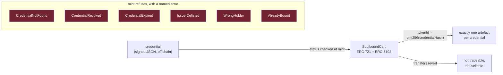

The artefact is deliberately **the least powerful object in the system**. It is what a learner shows,
what a profile holds, what a wallet displays — and it grants nothing: no rights, no transfer, and no
authority over the credential it points at. `mint()` can only be called by the platform's owner address
and refuses loudly (table above) unless the credential is live and belongs to the person being minted to.
"One credential, one artefact" is enforced by the key layout itself — `bytes32` and `uint256` are the
same 256 bits reinterpreted, not a bookkeeping convention.

Two things we record here rather than hide, because they are open work in our own backlog:

- **There is no burn.** Revocation happens to the *status*, not the token. So an artefact can outlive
  its own validity, which is exactly why the verifier page — not the wallet — is the correct place to
  check a claim. Fixing the presentation half (metadata that resolves to live status) is task **B38**.
- **Granularity is undecided** (**B39**). Lesson-level credentials exist; if every lesson minted a
  token, one learner would carry ~24 artefacts per course and the portfolio becomes noise. This is a
  product decision, and we would rather state it than let a default decide it.

## 8. Money: verification as a machine-to-machine service

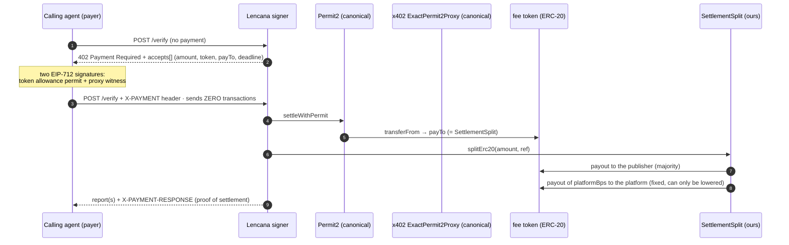

The client never holds or sends a transaction: it signs two typed structures, and the platform does the
rest. A payment is replay-proof by construction — the contract tracks `splitDone[ref]`, and a settlement
is only divided once per reference.

Measured, and the arithmetic that changed the product:

| what | number |
|---|---|
| one settlement + one split | **190,659 gas** (114,728 + 75,931) |
| at 0.1 gwei (this testnet) | ≈ 0.0000190659 BNB |
| break-even BNB price for a $0.001 fee at a 10 % platform share | ≈ **$5.24** |
| deployed `platformBps()` | **1000** (10 %), cap `MAX_BPS = 2500`, **decreases only** |

At a per-report price, the platform's share of a $0.001 fee is smaller than the gas it pays — so the
billable unit became a **batch** (up to 25 reports in one settlement, one payment returning reports with
*different* verdicts, which is the case a single-report design cannot answer). Gas belongs to
**issuance**, paid by whoever broadcasts; it is **never** a percentage deducted from the issuer's share,
because the issuer did not choose that cost.

## 9. What we measured — and the command that measures it

Nothing in this document is a claim without a command behind it. From a clone of `app/`:

| command | what it proves | result | date |
|---|---|---|---|
| `forge build` + `forge test --evm-version cancun --fork-url <97>` | the whole on-chain layer against **real** BAS on a fork of the public testnet | **97 passed / 0 failed** | 26 Sep |
| `forge test … --fork-url <56>` | same suite against **mainnet** state (interfaces and constants match production) | 97 / 0, identical gas | 23 Sep |
| `cd web && npx tsc --noEmit && npm run build` | the page compiles | clean | 26 Sep |
| `cd web && npx tsx scripts/probe.ts` | the **page's own** `verify.ts` reading chain 97 for four verdicts; the seeder's `credentialHash` recomputed from course data equals the on-chain attestation | **59 / 0** | 26 Sep |
| `cd web && npx tsx scripts/rubric-check.ts` | the pass mark is computed; policy and material hash separately | **17 / 0** | 26 Sep |
| `cd web && npx tsx scripts/inventory.ts` | the size of the learning surface, printed from the data | 2 · 7 · 24 · **34 pages** · 412 min · 28 · 2 | 26 Sep |
| `cd signer && node scripts/check.js` | document shape, `eddsa-rdfc-2022` round-trip, list bits equal to `statusOf()` | **53 / 0** | 26 Sep |
| `cd signer && node scripts/serve-probe.js` | the same over HTTP against the running server | **20 / 0** | 26 Sep |
| `cd signer && npm run x402` | `402` → pay → settle → **split** → report; balances read back **from the chain** | **20 / 0** | 24 Sep |
| `cd signer && npm run delegate` | the agent signs, the platform broadcasts; agent balance unchanged to the wei | 8 / 0 | 23–25 Sep |
| `cd signer && npm run judge` | **negative control** — a fluent but empty essay is failed, not passed | **7 / 0** (8/100) | 24 Sep |
| `cd signer && npm run judge-variance` | how much a model score moves at `temperature 0` | substantive essay **91–100**; verdict stable in 5 runs | 24 Sep |
| `cd signer && node scripts/anchor.js --dry-run` | what is being anchored, and that re-anchoring is idempotent | 11 watched, both list hashes unchanged | 26 Sep |

The verdicts the page can return. The first four are the cases `probe.ts` asserts against the public
network; `EXPIRED` is implemented in `verify.ts` and covered by tests, but **no seeded demo credential is
expired**, so it is not part of what the probe measures (and should not be shown in the video without
seeding one first).

| input | verdict | why it is interesting |
|---|---|---|
| a live credential | `VALID` | the ordinary case |
| a revoked one | `REVOKED` | the publisher cannot un-say it |
| a delisted publisher's credential | `ISSUER_DELISTED` | a judgement about the *issuer*, not the learner |
| valid, but its prerequisite was revoked | valid + chained warning | **the rule EAS itself does not enforce** — it checks a prerequisite exists, not that it is still alive |
| an expired one | `EXPIRED` | validity days come from the issuer's manifest — implemented and tested, **not seeded** |

## 10. Limits — what this is **not** yet

We would rather you read this than discover it.

- **The 1EdTech validator has never been run against our document.** We say *built to the
  specification*, never *compatible*. The blocker is issuer identity, not the routes — §22 lists the
  steps that remain, and the verdict will be pasted here whichever way it lands.
- **No real institution, no real learner.** The publisher is fictitious and labelled so; the graded
  essays in the demo are our own fixtures.
- **We are the facilitator on the paid path.** No third-party facilitator, no outside payer, no SLA,
  and the fee token is a demo ERC-20 with an open `mint`.
- **Verification is free and needs no account; the learner product has no enrolment record.** Progress is
  `localStorage` and is labelled *not evidence*. The event a learner would actually pay for does not
  exist yet — that is the largest gap in the product, and it is in our backlog, not in this document's
  claims.
- **Model-graded numbers have a range** (§ table above): the score is not bit-reproducible; the
  pass/fail decision was stable in what we measured, which is a weaker claim and the only one we make.
- **Testnet only.** Nothing on BSC mainnet, nothing on opBNB. Contract source is not verified on the
  explorer (V1 deprecated, V2 paid) — so audit it by running the commands, not by trusting a paste.
- **An anchored list pins its bits, not its membership** (§6). We do not claim the served list is
  uneditable; we claim editing it is detectable, and membership is watched separately.

## 11. Where to look in the code

| if you want to check… | open |
|---|---|
| that the platform cannot invent a grade | `web/src/score.ts`, `web/src/manifest.ts`, `signer/scripts/issue.js` (no `--score`) |
| the status the whole product rests on | `contracts/CredentialResolver.sol` → `statusOf()`, `isDelisted()` |
| the artefact's refusal to be a diploma | `contracts/SoulboundCert.sol` (`mint`, `NotTransferable`) |
| money being divided and kept nowhere | `contracts/SettlementSplit.sol` |
| that a byte flip kills the signature | `signer/scripts/check.js` |
| that verification does not touch our server | `web/src/verify.ts` (no DOM, no fetch of ours) + `web/scripts/probe.ts` |
| the payment handshake | `signer/src/x402.js`, `signer/src/server.js` (`/verify`) |
| our own mistakes, written down | `vault/00-Overview/04 - Corrections.md`, `vault/10-Contributors/Open-Items-for-Dave.md` |

## 12. Figures to insert

Eight screenshots are wanted — see the **annex**, which is the part *not* pasted into the form.

Related pages in the repository: `vault/00-Overview/06 - Business Process.md` (the business view),
`vault/00-Overview/08 - Submission Copy.md` (paste-ready tagline/problem/solution),
`vault/10-Contributors/Claims-Cheat-Sheet.md` (the sentences we forbid ourselves),
`vault/12-LMS-References/` (the six audited platforms, with commit SHAs),
`vault/09-Testing/` (every number above with its raw output).

## 13. How it compares — read from their code, not their marketing

Each cell was checked in the cloned source (commit pinned in
`vault/12-LMS-References/00 - Hub LMS References.md`). "No" means *we found no mechanism in that
tree*, not *the product is bad* — these are mature systems doing a different job.

| | Moodle | Open edX | Canvas | Chamilo | Frappe | LearnHouse | **Lencana** |
|---|---|---|---|---|---|---|---|
| course → chapter → lesson model | ✅ | ✅ XBlock | ✅ modules | ✅ | ✅ | ✅ | ✅ typed data |
| server-side enrolment record | ✅ | ✅ | ✅ state machine per user+section | ✅ | ✅ row lock + duplicate check | ✅ `TrailRun` | ❌ **not built** |
| grade **provenance** (who/what produced the number) | ✅ `usermodified` + history table | ✅ `score_type`, regrade | ✅ | ⚠️ | ⚠️ | ⚠️ | ⚠️ in the document, not in the UI |
| signed credential | ❌ `Signed is not implemented yet.` | ❌ uuid link | ❌ | ❌ no `@context`, unsigned | ❌ | ❌ no status column | ✅ `eddsa-rdfc-2022`, VC 2.0 |
| revocation visible to a stranger | ⚠️ row delete + `410`, so "never issued" is indistinguishable | ❌ | ❌ | ❌ | ❌ | ❌ | ✅ two chain-derived lists, anchored |
| grading policy pinned at issuance | ❌ criteria rebuilt per export | ⚠️ hashed, never enforced, never published | ❌ | ❌ | ❌ | ❌ | ✅ `rubricHash` inside the credential |
| issuer = third party with its own keys | ❌ | ❌ | ❌ | ❌ settings toggle, not a key | ❌ | ❌ | ✅ agent signs, platform broadcasts |
| verification without an account | ❌ | ❌ | ❌ | ⚠️ public name search | ⚠️ unguessable URL | ⚠️ unguessable URL | ✅ free, wallet-less |
| machine-to-machine paid verification | ❌ | ❌ | ❌ | ❌ | ❌ | ⚠️ closed-source | ✅ x402, batch, split on chain |
| prerequisites enforced outside the client | ⚠️ availability rules | ✅ content gating | ✅ module requirements | ❌ | ❌ order not server-gated | ⚠️ | ✅ at attestation time, on chain |

**Canvas caveat, stated so nobody over-reads its row:** its clone is a *sparse* checkout (`app/models`,
`app/controllers`, `db/migrate`, `lib`, `config`, `spec/models`), so its certificate and badge machinery
was **not inspected** — a ❌ in those cells means "no evidence found in what we read", which is weaker
than "does not exist". Every other column was read from a complete tree. Re-checking is cheap: widen the
sparse set and look for the certificate service.

What we deliberately do **not** take: their server-rendered admin surfaces, their authoring and
gradebook UIs, and any part of their front ends. Lencana's learner surface stays plain, fast and
typographic, and the learning data stays code-reviewed JSON rather than an editable database.

## 14. What an institution actually does (onboarding, described honestly)

Today an issuer's path is a handful of commands we operate for the demo — not a self-service flow.
Stated exactly, because "publishers can join" is a sentence we do not get to say:

| step | today | self-service would need |
|---|---|---|
| define the course and its rubric | ✅ a typed `CourseManifest` in this repo | a form that writes the same shape |
| be recognised by the chain | ✅ `addIssuer` + an agent key record | an approval flow, and a key-custody decision |
| issue credentials | ✅ `npm run issue` / `delegate`, run by us | a hosted issuance service with a queue and an idempotency record |
| anchor the status lists | ✅ `npm run anchor`, idempotent | a scheduled worker |
| get paid | ✅ the split contract keeps nothing back | a checkout, and the enrolment record above |
| be removed for misconduct | ✅ `delistIssuer`, visible as its own verdict | a review process, not only a function |

The honest summary: **the rails are built, the counter is not.** Every step above has a command behind
it; none of them has a customer yet.

---

# Part II — the machinery, for the reviewer who wants to open the repo

## 15. The e-course, in detail

Everything above is about the proof. This section is about the thing being proved, because a credential
from an empty course is still an empty course.

The counts below are **printed by a command** (`cd web && npx tsx scripts/inventory.ts`), which reads the
course data; no number in this section was typed into a document.

| course | modules | lessons | minutes | quiz lessons | essays | prerequisite |
|---|---|---|---|---|---|---|
| `web3-dasar-2026` — *Web3 Dasar untuk Praktisi* | 5 | 19 | 307 | 4 | 1 | — |
| `web3-lanjut-2026` — *Untuk yang sudah bisa membaca transaksi* | 2 | 5 | 105 | 1 | 1 | `web3-dasar-2026` |
| **catalog total** | **7** | **24** | **412** (≈6.9 h) | **5** (28 questions) | **2** | one real chain |

Structure, flagship course: `m1` Fondasi dan keselamatan (4 lessons) · `m2` Transaksi dan gas (4) ·
`m3` Token, kontrak, dan cara membacanya (4) · `m4` Bukti belajar dan batasnya (4) · `m5` Merangkai
semuanya (3). The last module ends in the graded essay, and `web3-lanjut-2026` opens only if the
prerequisite credential is still alive on chain.

Where a learner's time actually goes — every lesson kind is used, and `probe.ts` **requires** all six to
appear, so the set is not decorative:

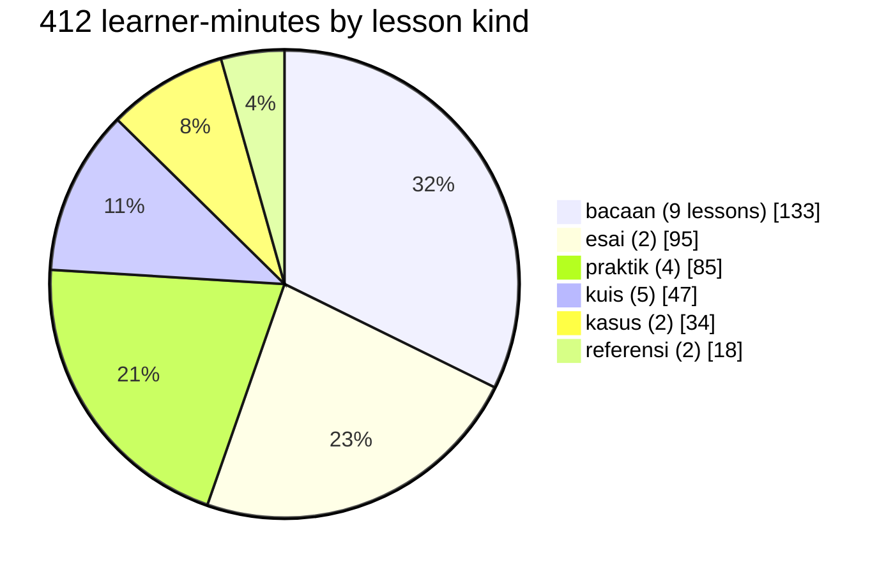

| kind | what a lesson of this kind must carry | what it can prove |
|---|---|---|
| `bacaan` reading | text blocks only | nothing on its own — it is the material |
| `kuis` quiz | a `quiz` payload: options, one answer **index**, and a mandatory `why` per question | scored component (40 % of the grade) |
| `esai` essay | an `essay` payload: prompt, `minWords`, a rubric whose maxima sum to 100, and `guidance` | scored component, judged against the issuer's rubric |
| `praktik` hands-on | a task done outside the page | binary component (20 %) |
| `kasus` case | a scenario to reason about | discussion, not a number |
| `referensi` reference | glossary + links to the **primary** spec documents | the learner's next step |

Ten block types are allowed in a page (`p, h, ul, ol, code, note, quote, terms, links, try`) —
deliberately few, so one renderer keeps every page the same shape and an auditor has something to check.

### What "interactive" means here, concretely

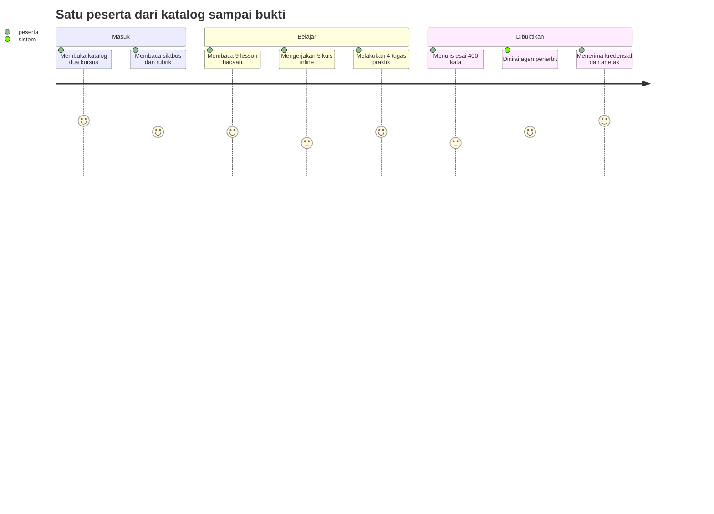

A quiz is **inline on the lesson page**, not a modal and not a separate exam screen: answering reveals
the `why`, because the explanation is the learning moment and a quiz without reasons only trains
guessing. The answer key is stored as an index and validated against the option count, so a re-ordered
option list turns the harness red instead of silently inverting the correct answer.

The graded essay is a judgement task, not a summary task — this is the actual prompt, translated:

> *Candidate A hands over a certificate from training institution X; its verification page says
> "valid", there is no contract address and no downloadable document. Candidate B hands over a
> 32-byte credential hash and a contract address; you read its `statusOf` and found an issuer on the
> permission list, but you cannot see the essay grade. Compare them and decide whose evidence is more
> trustworthy — on condition that you name at least one thing that **no** evidence here lets you
> conclude.* (400–700 words)

Its published rubric: separating "checkable myself" from "looks convincing" (25) · stating the limits of
proof explicitly instead of dressing them up (25) · using the concepts correctly: issuer, permission,
status, time (25) · a specific follow-up question (15) · structure and clarity (10). And the manifest
publishes what will **not** be accepted, e.g. *"B is better because it has an address"* without saying
what that address makes checkable — and *"'blockchain cannot be forged'* without naming which part
cannot be, and who can still lie."

That is the product stance in one artifact: **the course teaches the same discipline the credential
system enforces.** The issuer's rubric is open before the learner writes, because a grade whose rubric is
secret is a guess, not an assessment.

### The learner path, as it exists

`#/learn` (catalog) → course syllabus (outcome, audience, rubric, modules) → module page → lesson page
(reading + inline quiz, or essay editor with the rubric visible) → `#/me` portfolio → verifier link.
A hash router over typed data, **no UI framework** — the same reason `verify.ts` stays DOM-free and
therefore probeable from Node.

Course text is Indonesian because the learner is Indonesian; everything the judge reads (code, docs,
this document) is English. An Indonesian/English switch on the verifier page is in the backlog, not
built — the audience for verification is Indonesian HR staff.

### What the course layer does **not** pretend to be

| absent | status | why it matters for reading our claims |
|---|---|---|
| server-side enrolment record | **the largest hole** | progress is `localStorage`, labelled *not evidence*; the paid event a real LMS bills for does not exist |
| self-serve authoring UI | not built | courses are TypeScript objects reviewed like code; an issuer today edits with a pull request |
| proctoring / video / SCORM / cohorts | not built, deliberately | we sell the proof layer, not the content pipeline — and no social or invigilation claim appears anywhere |

The content being code is a decision, not a shortcut: the rubric, the weights and the pass mark are
**pull-requestable objects** whose every change is attributable — precisely what a credential system needs
from its source data. The cost is that no non-programmer can publish today, and we say so rather than
calling it "a roadmap item".

## 16. Anatomy of the document that comes out

A **real issued credential**, from `app/signer/.store/state.json` — the one whose number did not come from
a human typing a flag: composite **94** against the issuer's `passMark` **70**. Only the host is redacted
(the stored document says `http://127.0.0.1:8787`; §10 says why).

```json
{
  "@context": [
    "https://www.w3.org/ns/credentials/v2",
    "https://purl.imsglobal.org/spec/ob/v3p0/context-3.0.3.json"
  ],
  "id": "https://<public-host>/credentials/0x63b510bd733f7fe1cbaef72002358566ac6026cec6461287699a05611879a1b9",
  "type": ["VerifiableCredential", "OpenBadgeCredential"],
  "issuer": {
    "id": "https://<public-host>/issuers/agent-demo",
    "type": "Profile",
    "name": "Lencana Demo Agent"
  },
  "validFrom": "2026-09-24T08:28:31Z",
  "validUntil": "2028-09-23T08:28:31Z",
  "name": "Web3 Dasar untuk Praktisi",
  "description": "Seratus sembilan puluh menit yang mengubah kamu dari \"pernah dengar blockchain\" menjadi orang yang buka explorer, baca transaksi, dan menolak klaim sertifikat yang tidak bisa diverifikasi.",
  "credentialSubject": {
    "id": "https://<public-host>/learners/0x5cA36D61009c2C5A0406F046FFb2B7c939Fd7c3B",
    "type": "AchievementSubject",
    "achievement": {
      "id": "https://<public-host>/achievements/web3-dasar-2026",
      "type": ["Achievement"],
      "name": "Web3 Dasar untuk Praktisi",
      "criteria": {
        "id": "https://<public-host>/criteria/web3-dasar-2026",
        "type": "Criteria",
        "narrative": "Nilai akhir >= 70 dari 100. Komposisi: kuis 40%, tugas praktik 20%, esai dinilai agen penerbit 40%. Semua kuis harus dikerjakan; kuis bukan gerbang, tapi tanpa semuanya tidak ada yang bisa dinilai. Esai dinilai terhadap rubrik yang sama yang dipakai penerbit, dan rubriknya dibuka di depan peserta. [rubrik 2a45d0d00bc4]"
      }
    },
    "result": [
      {
        "id": "https://<public-host>/results/web3-dasar-2026/0x63b510bd733f7fe1cbaef72002358566ac6026cec6461287699a05611879a1b9",
        "type": ["Result"],
        "resultDescription": "https://<public-host>/criteria/web3-dasar-2026#scale",
        "value": "94"
      }
    ]
  },
  "credentialStatus": [
    {
      "id": "https://<public-host>/credentials/status/revocation#0xf62691df6988389f3c70a81167502fb171b3405f6052824ba7df2754fbd36ba4",
      "type": "BitstringStatusListEntry",
      "statusPurpose": "revocation",
      "statusListIndex": "20",
      "statusListCredential": "https://<public-host>/credentials/status/revocation"
    },
    {
      "id": "https://<public-host>/credentials/status/suspension#0xf62691df6988389f3c70a81167502fb171b3405f6052824ba7df2754fbd36ba4",
      "type": "BitstringStatusListEntry",
      "statusPurpose": "suspension",
      "statusListIndex": "21",
      "statusListCredential": "https://<public-host>/credentials/status/suspension"
    }
  ],
  "proof": {
    "type": "DataIntegrityProof",
    "created": "2026-09-24T08:28:33Z",
    "verificationMethod": "https://<public-host>/issuers/agent-demo#z6MkjXgjgsko1CtP9qWq5MD1i25kBwdh9sYCPfeA6bJJJjX4",
    "cryptosuite": "eddsa-rdfc-2022",
    "proofPurpose": "assertionMethod",
    "proofValue": "z29yiagNEdCiqd7SsNC3bq7REz7YqdPL9rEB2Vx663DXJZRFDtsfSrGgEjxGR4gt31vkbpzutQdirt9u5zPd5JovY"
  }
}
```

| field | the promise it carries | how we know it is not decorative |
|---|---|---|
| `@context`, two URIs, **in this order** | the document canonicalises reproducibly | `eddsa-rdfc-2022` hashes the canonicalised form, so order is signature material; `check.js` asserts the exact array |
| `type` inheritance `AchievementSubject` → `Achievement` → `Result` | any OB 3.0 reader finds the fields where the spec says they are | shape assertions in `check.js` |
| `validUntil` = `validFrom` + **730 days** | the *issuer's* `validDays` reached the document | 730 is the number in `web3-dasar.ts:44`, not a constant in the signer |
| `criteria.narrative` … `[rubrik 2a45d0d00bc4]` | **the rules are sealed with the result** — the 12-hex prefix of `rubricHash` | `rubric-check.ts` proves the hash moves only with policy; the string is composed at `issue.js:241` |
| `result[0].value: "94"` (a **string**) | the number is the composite of evidence against the policy | `computeScore()` + `formatScore()`; no `--score` flag exists to type it |
| two `credentialStatus` entries | revocation **and** suspension are separate facts with separate owners | slots 20 and 21 in two different lists; `statusListIndex` is a decimal *string*, and the entry `id` differs from the list URL by its `#uid` fragment |
| `proof.verificationMethod` → the issuer document | the verifier reads the key from the issuer's published `assertionMethod`, we never hand it one | `sign.js` passes **no** key to the verifier; emptying `assertionMethod` makes verification fail (`check.js:121`) |
| `proof.proofValue` (multibase base58btc, leading `z`) | one flipped byte kills it | `check.js:104-107` edits `result[0].value` `87 → 100` and requires `verified === false` |

What is **not** in there: no learner name, no email, no DID, no course text, no quiz responses — and §18
shows the chain holds three `bytes32` and nothing else. The credential layer has no personal data to leak.

Two absences we record as open work rather than spin:

- `achievement.description` and `name` are the issuer's course copy — which means **prose errors in a
  course ship inside signed documents, and stay there**. The sample above carries exactly one: the
  blurb says *"Seratus sembilan puluh menit"* (190 minutes) while the course data computes **307**.
  It was found by comparing `npm run inventory` against the prose, not by reading the prose. The copy is
  now fixed in source, and `auditCourse` **refuses** any duration written into a blurb at all — a derived
  number belongs to the derivation. The already-issued document keeps the old sentence forever, which is
  the strongest argument in this whole project for why the rules are hashed and the status is anchored.
  The fix moved no hash that matters: `rubricHash` is still `0x2a45d0d00bc46f3d`, asserted by
  `npm run rubric` (17/0) and visible as `[rubrik 2a45d0d00bc4]` in the document above.
- The grading *method* string (`rubric 2a45d0d00bc4; essay judged by <model> at temperature 0`) is
  assembled in `issue.js` but **does not reach this document**: OB 3.0's `Result` is
  `{achievedLevel, resultDescription, status, value}`, and `credential.js` refuses to smuggle other
  terms through — an out-of-context property is dropped in canonicalisation and then fails as an
  unresolvable IRI. So the document proves *which rubric* produced the number, not *which judge ran it*
  → open work (**B44**), not written up as done.

**Related:** [[04-Signer-Service/S1 - The credential document]] · [[05-Course-Content/K2 - The issuer manifest and rubricHash]] ·
[[05-Course-Content/K1 - The content model]] · [[Concepts/rubricHash and manifestHash]]

## 17. The grading pipeline, including every way it refuses

One function per job, and neither of them can invent a number.

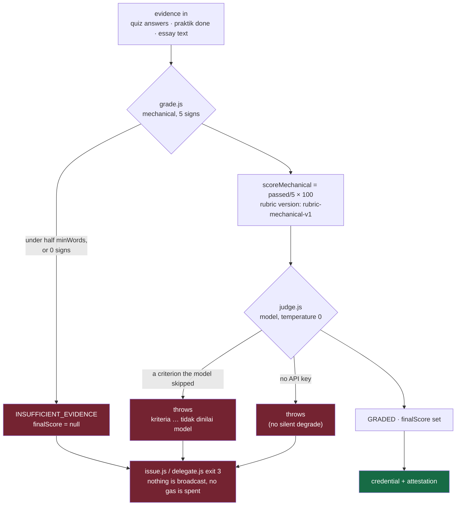

The five mechanical signs are the things derivable from the text alone: length against the lesson's
`minWords`, an `0x…` address, an openable URL, a concrete function or command, and the writer stating
their own limits. That is `scoreMechanical` — **what a written rule can check**. Every rubric criterion
starts as `method: 'requires-judgement', score: null`, because some criteria ("tell a finding apart from
a guess") cannot be regexed, and dressing a check up as a judgement is the fastest way to build a product
that deceives its own verifier.

`finalScore` stays `null` until a judge — model, or human — is injected. The refusal ladder:
`NOT_AN_ESSAY_LESSON` → `INSUFFICIENT_EVIDENCE` → `AWAITING_JUDGE` → `PARTIAL_JUDGEMENT` → `GRADED`, and
each refusal keeps `finalScore` null. Two measured refusals on the fixtures: a 33-word answer against
`minWords: 400` → `INSUFFICIENT_EVIDENCE`, mechanical 20 (1/5 signs); a 230-word, substantively decent
answer → `AWAITING_JUDGE`, mechanical 80 (4/5) — the second one is *good work with no grade*, because the
criteria that need judgement have nobody judging them yet.

The judge is the single seam where a model enters, and it is fail-closed in both directions: no API key
throws rather than degrading, a criterion the model skipped throws instead of being filled with `0` or
averaged away, and scored values are clamped to `0..max`. Rate limits are honoured, not treated as
failure: `retry-after` is read, a missing header pauses 15 s, cumulative waiting gives up past 180 s —
because reporting "the judge is broken" when it means "wait" would be its own lie.

| harness | what it forces to be true | result |
|---|---|---|
| `npm run judge` | the judge can **flunk**: the fluent-but-empty fixture must land below the issuer's `passMark`, the substantive one above it, and per-criterion scores must not all be identical | **7 / 0** — hollow essay scored **8/100** |
| `npm run judge-variance` | what a model score actually does at `temperature: 0` | substantive **91–100** (spread 9, mean 96.4), hollow **2–3**, pass/fail decision identical in all 5 runs |
| same file, rival model | the negative control is not model-specific | `qwen/qwen3.8-27b` held to the same test |

The sentence we allow ourselves: **the decision is stable, the score has a range.** The sentence we
forbid: "the score reproduces exactly".

The learner-side arithmetic has the same shape. `computeScore()` reads every weight, the pass mark and
the quiz requirement **from the issuer's manifest** — its own literals are scale bounds (0, 100) and the
`/100` divisor, never a grade policy — and its third verdict is not a number: `LULUS` / `TIDAK_LULUS` /
**`BELUM_LENGKAP`**, because `0` is a statement about the learner while "nothing to score" is a statement
about the tool, and the wrong one would go out under an agent's signature. Weights that do not sum to 100
stop everything (`manifest rusak, tidak ada nilai yang boleh diterbitkan`), and the boundary is tested on
both sides of the rounding: `69.6 → 70 → LULUS`, `68.8 → 69 → TIDAK_LULUS`.

What the platform cannot do, structurally: hand over a grade. `issue.js` **has no `--score` flag**; an
unknown course id stops before any gas moves; and if a judged essay produces a different number than the
recomputed one, the script stops rather than picking one.

**Related:** [[05-Course-Content/K4 - Scoring without the platform deciding]] · [[04-Signer-Service/S5 - Grading and the model judge]] · [[Concepts/Negative Control]]

## 18. What is actually on chain — down to the bytes

A reviewer's first question should be "what exactly is public?", so here it is literally.

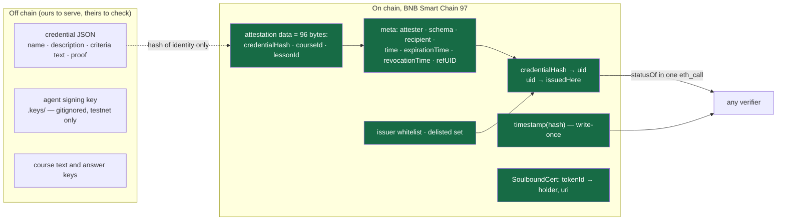

The schema is three `bytes32` and we re-read it from the deployed contract rather than quoting a
document: `cast call 0x7CA624caFDe5cA3A27b33d26be56F73a90792065 "CREDENTIAL_SCHEMA()(string)"
--rpc-url https://bsc-testnet.publicnode.com` → `bytes32 credentialHash,bytes32 courseId,bytes32
lessonId` (25 Sep). Decoder refuses anything that is not exactly 96 bytes (`BadDataLength`), so a future
schema edit fails hard instead of shifting every field one word.

| on-chain fact | who may write it | what it is for |
|---|---|---|
| attestation (data = the three hashes, `attester` = the signing agent) | the admitted agent, relayed by anyone | the claim exists and who made it |
| `revocationTime` | **only the original attester** (EAS rule) | permanent cancellation |
| `expirationTime` | set at issuance from the issuer's `validDays` | decay without anyone acting |
| `refUID` + our liveness check | the resolver, at `onAttest` | prerequisites that are still alive |
| issuer whitelist / delisted set | `onlyOwner`, always emitting | who may issue; who is paused |
| `timestamp(bitstringHash)` | write-once per value | pins *which bits were served* (§19) |

**No name, no email, no DID, no grade, no course text** is in any of it. The learner's identifier in the
`credentialHash` is an address the learner chose to reveal by asking for verification of that URL. That
is a design constraint, not a marketing line: a credential system that put grades on chain would be
publishing personal data to an immutable ledger, and revocation would not be able to take it back.

`statusOf(bytes32)` answers the entire product in **one** `eth_call` — seven values, no wallet, no
indexer (BNB Attestation Service ships an Indexer for opBNB only, so direct reads are a requirement, not
a preference):

| field | read from | meaning |
|---|---|---|
| `exists` | uid known **and** `issuedHere[uid]` | "a credential we recognise", not "a record exists" |
| `revoked` | `revocationTime != 0` | the attester's own act; permanent |
| `expired` | `expirationTime` set and passed | detected with no action by anyone |
| `issuerDelisted` (position **4**) | `_delisted[a.attester]` | the platform's judgement of the issuer; recoverable |
| `issuer` | `a.attester` | the key that signed the claim |
| `issuedAt` / `expiresAt` | `a.time` / `a.expirationTime` | `0` means "never expires" |

The second half of `exists` is not decoration: without `issuedHere`, any attestation published under
someone else's schema that happened to collide with our hash would read as ours. And one
`credentialHash` maps to exactly one uid (`AlreadyIssued`), so a re-issue attempt is a revert, not a
duplicate page.

Two admin actions that must never be merged in a UI: `removeIssuer` revokes the right to issue **and
leaves old credentials VALID**; `delistIssuer` additionally makes them read `issuerDelisted`.
`addIssuer` cannot undo a delisting (`DelistedCannotBeReadmitted`) — recovery is the explicit
`relistIssuer`, because a two-character fix to someone's reputation is not a thing the platform should
do by accident.

## 19. The two status lists: slot ownership, determinism, and what an anchor does *not* prove

The list is never stored. Per request: `buildList()` → `servedHashes()` → `renderList()` → read chain →
`encodeList()` → `statusListCredential()` → `signDocument()`. No cache, so a served list cannot be older
than the chain, and cannot lag behind a delisting that was later reversed.

```mermaid
sequenceDiagram
  autonumber
  participant IS as Issuer (issue.js / delegate.js)
  participant ST as Store (byUid, nextIndex)
  participant SV as Server (read-only)
  participant CH as Chain (statusOf)
  participant AN as anchor.js
  participant BA as BAS
  IS->>ST: slot() — allocation happens AT ISSUANCE
  Note over IS,ST: the issuer side owns the bit number;<br/>the server only ever peeks
  SV->>ST: peek() for each watched credential
  SV->>CH: attestationOf(hash) then statusOf(uid)
  CH-->>SV: revoked → revocation bit · issuerDelisted && !revoked → suspension bit
  Note over SV,CH: an unknown hash is DROPPED, never defaulted to zero
  SV-->>AN: the exact served bitstring (multibase u + base64url of gzip)
  AN->>BA: timestamp(sha256(served string)) — only if absent
  Note over AN,BA: idempotent: an unchanged list costs no gas
```

Mechanics with teeth: `LIST_BITS = 16384` makes a fixed **2048-byte** array; index 0 is the leftmost bit
(`0x80 >> (index % 8)`), and a `decodeBit()` mirror exists so the harness can *prove* bit semantics
instead of assuming them. Determinism is a tested property: re-rendering the same input gives the same
hash, and reversing the input order must **not** change it — otherwise the index written into every older
document loses its meaning.

**Why allocation belongs to the issuer and not the server.** If the server allocated, the number would
follow that request's iteration order, and an older document's `statusListIndex` could point at someone
else's bit. Signature verification would still pass: the document stays perfectly valid while pointing at
the wrong stranger. No cryptographic check can see that failure, which is why it is structurally prevented
rather than tested.

**The limit of the anchor, measured rather than reasoned.** Adopting three lesson credentials moved a
list from 5 members to 8 and **both hashes stayed byte-identical** (revocation `0x1c27a74cbd081a51…`,
suspension `0x1c6997d2a2a6032a…`) — new members whose bits are zero change no byte of a fixed-length
array. So:

| the anchor proves | the anchor does not prove |
|---|---|
| *which bits* were set at a timestamp | *who* was in the watched set |
| our endpoint cannot retro-date a different bitstring | membership (an added credential with a zero bit is invisible to it) |

What witnesses membership instead: `/healthz` prints `watched`, `flagged`, `unallocated` and the slot map,
and `check.js` requires the chain to recognise every watched credential — today **11 credentials, 1
revoked, 1 suspended**. A watched credential with no slot is *printed*, not quietly omitted. If binding
membership ever matters, the fix is to fold a digest of the member set into the anchored payload — a
small change we have not made, and therefore do not claim.

Both lists come from one renderer with a different `purpose`, and `expired` is in neither on purpose: the
document already carries `validUntil`, and encoding expiry twice creates two sources of truth allowed to
disagree. Neither list carries a reason string — a bit answers "flagged or not"; *why* stays on chain.

**Related:** [[04-Signer-Service/S2 - Status lists from chain state]] · [[04-Signer-Service/S3 - Two status lists]] · [[Concepts/Anchored Bits not Membership]]

## 20. Delegated issuance, where the "no wallet for the institution" claim is actually built

Three actors, never to be merged in the reader's head: the agent **signs**, the platform **broadcasts**,
the platform's **fee share** is what makes it whole (§8).

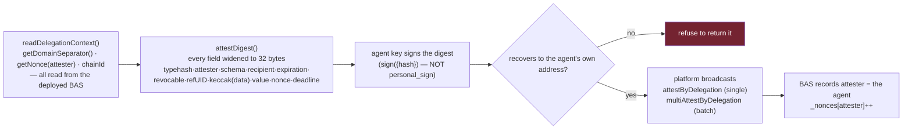

Nothing in that box is guessed, which is the point of writing it down:

- The **domain separator and the nonce are read from the contract**, never recomputed. If BAS ever
  changes its domain, a test goes red instead of a signature breaking in production.
- `ATTEST_TYPEHASH` is stored as a **digest value**, not as `keccak256("Attest(…)")` typed out by hand:
  the string was never transcribed from `EIP1271Verifier.sol`, the number was exercised by the fork suite.
  A wrong transcription therefore fails as `InvalidSignature` rather than passing for the wrong reason.
- Struct hashing is `abi.encode` per field. Running `encodePacked` on a `uint64` produces **8 bytes**, not
  32, and yields a signature the public chain refuses **while every local test stays green** — the single
  most expensive class of bug this project could have, avoided by encoding every field as one word.
- viem's `sign({ hash })` and not `signMessage({ message: { raw } })`: the latter is `personal_sign` and
  always prefixes `\x19Ethereum Signed Message:\n32`, producing a 65-byte, ECDSA-valid, chain-refused
  signature. `v` normalisation (0/1 vs 27/28) happens in exactly one place, and a guard refuses to return
  any signature that does not recover to the agent's own address — so what gets broadcast cannot differ
  from what was signed.
- Single and batch are **two builders**, not one with an optional array. Sharing a builder put an array
  into a struct position and produced `InvalidAddressError: Address "[object Object]"` client-side, before
  any gas moved — which is exactly why review missed it at first: the single path already worked.

Measured on the public testnet, reading every claim back from the chain instead of trusting return
values: one delegated attestation **370,131 gas**; three lesson credentials in **one** batched transaction
**1,024,813 gas**; the `attester` was the agent, not the broadcaster; the **agent's balance was unchanged
to the wei** (the script asserts this rather than describing it); the attester nonce advanced exactly once
per request; and `lessonOf(uid)` equalled the lesson id derived from the course material.

The honest limits of fronting, all three still true: the relayer can **delay or drop** a delegation but
cannot forge or alter one, a leaked delegation is a bearer instrument whose damage is bounded by *when*
(nonce is single-use, default `deadline` 900 s, and `deadline = 0` is warned about because it means
"never expires"), and an agent can always relay its own `attest()` — so the platform's censorship is not
total, and `increaseNonce()` is the agent's escape hatch, invalidating every unused delegation below it.

## 21. The paid path, and the seven guards that run before any gas leaves

`POST /verify` answers `402 Payment Required` with `{x402Version: 1, error, accepts}` plus
`www-authenticate: X-PAYMENT realm="x402", error="insufficient_payment"`. `accepts[]` is rebuilt per
request so `resource` matches the URL actually asked, and `payTo` is the **split contract, never a platform
EOA**. Then, in order, before the server touches the network:

| # | guard | what it prevents |
|---|---|---|
| 1 | the token named in the payment must be **our** configured token | paying in a fake token |
| 2 | `payTo` must equal our split contract | being told to move money to an arbitrary address |
| 3 | the nonce must be an integer | type confusion into a bogus allowance |
| 4 | `BigInt(amount) >= PRICE`, and an unparsable amount is **refused, not coerced** | a string trick into a free report |
| 5 | the deadline must not have passed | a captured payment header replayed forever |
| 6 | both signatures present | settling without authorisation |
| 7 | `splitRef = keccak256("x402-http:<salt>")`, salt unique per payment | a constant salt would break every payment after the first, because the contract's replay guard is what makes `splitErc20` safe to re-call |

Two EIP-712 payloads are required from the client, and their domains differ by **exactly one field**: the
token's `Permit` domain carries `version: "1"`, the Permit2 `PermitWitnessTransferFrom` domain does not.
Swap them and you get a well-formed signature the contract refuses. The witness type must be named exactly
`Witness`, because Permit2 weaves the type name into the typehash. `tokenNonce` is read from the token's
`nonces(owner)` — paying twice with nonce `0` fails far from the fix.

**Zero transactions from the client is measured, not asserted:** the payer's key is derived from a constant
string and has never held BNB, and its token balance must drop by exactly the price. What comes back is
the report plus `X-PAYMENT-RESPONSE`, which carries the spec fields and one addition made **outside** the
specification, deliberately: `settlement: {settleTx, splitTx, splitRef}` — evidence the income was
*divided*, not merely received.

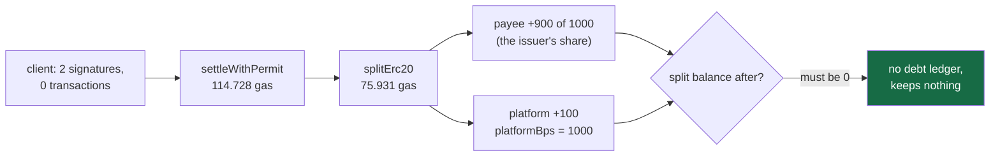

The harness asserts the accounting rule rather than the intention: `payeeGain + platformGain === price`
exactly, the split holds nothing afterwards, and the platform's address is read **from the contract**
(`SettlementSplit.platform()`), not from `.env`. Gas never appears as a line item in that equality — if we
netted gas out of the issuer's share, the assertion could not hold, which is the whole point of writing it
that way. The batch exists because of that arithmetic: `PER_VERIFICATION_GAS = 190659` is fixed per
settlement, so 25 reports amortise it to ≈7,626 each, while one report per payment charges 190,659 to one
report and the platform's 10 % is eaten by the BNB price. Reports are built 4 at a time: 25 parallel
verifications is ≈300 simultaneous `eth_call` at a public RPC, which returns half-empty reports — a
failure we would rather engineer around than demonstrate.

One failure mode is worth telling, because it decided a design: the first version of this route died
**mid-request, after the settlement had already succeeded** — `JSON.stringify` throws on the `bigint`
values the report carries. Money moved, the client got no proof: the worst shape a payment system can
have. The fix is a single bigint-safe serialiser (bigints as decimal strings) plus a `try/catch` that
guarantees an explanatory 500 instead of a dropped connection, and a failed settlement now returns `402`
with the reason **instead of withholding the data**.

**Related:** [[04-Signer-Service/S4 - Delegated issuance]] · [[04-Signer-Service/S6 - x402 paid verification]] ·
[[02-Contracts/C3 - SettlementSplit]] · [[Concepts/Fronted Gas]] · [[Concepts/Batch not Data]]

## 22. What a verifier dereferences — including what we do **not** serve yet

One `node:http` server, no framework, ~325 lines. It exists to serve exactly the documents a third-party
validator opens, and it is deliberately boring about everything else.

| route | what comes back | notes |
|---|---|---|
| `GET /issuers/<slug>` | the issuer document — the `assertionMethod` key list | this is where a verifier gets the key; we never hand one over |
| `GET /credentials/status/revocation` | signed `BitstringStatusListCredential` | rebuilt from chain state per request |
| `GET /credentials/status/suspension` | same renderer, other purpose | `issuerDelisted && !revoked` |
| `GET /credentials/0x…` | the stored signed document, or a 404 that says *"belum diterbitkan lewat backend ini"* | the route takes a **credentialHash**; `GET` by UIDs 404s and that is correct |
| `POST /verify` | `402` until paid, then reports | the only route that asks for money |
| `GET /healthz` | `ok`, `baseUrl`, `resolver`, `rpc`, `watched`, and per purpose `flagged` / `bitstringHash` / `unallocated` / `slots`, plus `sha256OfEncodedList` and the whole `payment` block | the uid → bit-slot map is published **only** here, so a harness can read it instead of inferring it |
| anything else | 404 **listing the real routes** | a bad URL should tell you where to go |
| any thrown error | 500 carrying `err.message` | a config failure must read as a config failure, not as an outage |

Every response sets `access-control-allow-origin: *` (a verifier fetches from a browser) and
`cache-control: no-store` (a cached list is a list staler than the chain). Request bodies are capped at
64 000 characters, because without a cap one large POST is enough to exhaust the process. And `buildList()`
**refuses** rather than faking: with no resolver address, no RPC, or an empty watched set it throws
instead of serving a valid-looking all-zero list.

What the credential in §16 references that we do **not** serve: `/learners/<address>`,
`/achievements/<slug>`, `/criteria/<slug>#scale`. They are stable identifiers, not pages — legal under the
spec, but whether a strict validator dereferences them is exactly the kind of thing we refuse to guess at.

**The public-URL situation, measured rather than assumed.** Through a quick tunnel on 26 Sep:
`GET /issuers/agent-demo` → 200 JSON, `GET /credentials/0x041e5898…` → **200, 3202 bytes**, `/healthz` →
`ok: true`, 11 watched, both anchored list hashes unchanged. And in that same 3202-byte body the tunnel
host appeared **0** times while `127.0.0.1` appeared **13** (9 in `id` fields, 1 in `verificationMethod`,
2 in `statusListCredential`). Document URLs are written **at issuance** and are not re-rendered from
configuration, so a tunnel cannot retro-fix a credential that already carries loopback URLs — the `.env`
template's own words: *terbitkan ulang, jangan menambal* (re-issue, don't patch).

That leaves the last step as a five-step chain, four of which we had already run in some order:

1. start the tunnel and read **its** domain from the tunnel log (it is random per run);
2. create a **new** agent record under that `BASE_URL` — the generator refuses to overwrite the localhost
   one, which is the reason `BASE_URL` never reached issuer identity;
3. whitelist its address with `addIssuer` (an unadmitted agent reverts `NotAnIssuer`);
4. issue one credential under it and require the public host to appear **≥3 times** in the document;
5. `POST /upload` to the 1EdTech member validator with the multipart part named `file` (a `uri` alone is
   refused: *"Required part 'file' is not present."*) and paste the verdict here — **pass or fail**.

The decision recorded on 26 Sep is that issuance is **not** postponed for this: the credential is the
thing a learner would put on their profile, so a run that only *displays* credentials is not a demo of the
product. Until step 5 has produced a verdict we keep the sentence "built to the specification" and keep
"1EdTech compatible" out of every field of the submission.

## 23. Reproducing every number in this document

From a clone of `app/`, on Node ≥ 22.18, with `.env` copied from `.env.example` (the template ships with
the keys of **burner testnet wallets only** and says so at the top).

| # | command | needs beyond `.env` |
|---|---|---|
| 1 | `forge build && forge test --evm-version cancun --fork-url https://bsc-testnet.publicnode.com` | Foundry |
| 2 | `cd web && npx tsc --noEmit && npm run build` | node_modules |
| 3 | `cd web && npx tsx scripts/probe.ts` | `RESOLVER_ADDRESS`, `CERT_ADDRESS`, the four `DEMO_*_HASH` |
| 4 | `cd web && npx tsx scripts/rubric-check.ts` · `scripts/inventory.ts` | — (the latter prints the §15 tables) |
| 5 | `cd signer && node scripts/check.js` | `RESOLVER_ADDRESS` |
| 6 | `cd signer && npm run serve`, then `node scripts/serve-probe.js` | the server up |
| 7 | `cd signer && npm run x402` | server up + `DEMO_TOKEN_ADDRESS`, `SPLIT_ADDRESS`, `ISSUER_ADDRESS` — without them it stops and says *"server not configured for payment — this is not a test failure"* |
| 8 | `cd signer && npm run judge` / `judge-variance` | `GROQ_API_KEY` (no key ⇒ it throws rather than degrading) |
| 9 | `cd signer && node scripts/anchor.js --dry-run` | `RESOLVER_ADDRESS` |

Results and dates: **§9**. What each one asserts: the section it belongs to (§15 course data, §16
document shape, §17 refusals, §19 list mechanics, §21 payment guards).

⚠️ **A green line is not a scope statement, and this is the one trap in our own harnesses we want a
reviewer to check us on.** The chain-reading harnesses take configuration from `process.env` and **skip
whole groups** when those variables are absent — they still print a green summary, with the skipped group
named underneath. Measured on 25 Sep: without the variables `check.js` reported **28** checks instead of
53 and `serve-probe.js` **11** instead of 20. The counts in §9 are the *configured* runs; the fix if you
want to prove it is to run them both ways.

Two more things that cost time and are now written in the repo rather than in someone's memory:
`--evm-version cancun` is mandatory on `forge test` **and** `forge script`, and the old
`data-seed-prebsc-*` testnet endpoints are proven flaky, which is why the fork target is a named
`bscTestnet` alias instead of a pasted URL.

## 24. The debt we would pay first

Not a wishlist — the holes a reviewer would find in a week, named before they do.

| # | hole | why it is first on the list |
|---|---|---|
| **B44** | the grading **method** never reaches the credential (§16) | the artefact answers "which rubric" but not "which judge" |
| **B41** | the validator run (§22) | our only remaining strong claim, and it needs no new code |
| **B38** | `tokenURI` is **frozen at mint** (`_uris[tokenId] = uri`, no burn path) | the wallet view is the one place our story is currently false: a revoked credential keeps an artefact whose metadata still looks valid |
| **B39** | artefact granularity undecided | lesson-level credentials exist; ~24 artefacts per learner per course would turn a portfolio into noise |
| **B40** | no batch mint | issuance gas scales per credential while settlement already batches ≤25 |
| **B42** | no cold-store probe | exactly how a "green 20/20" once hid a real path failure |
| — | **no enrolment record** | the paid event of an e-course does not exist; progress is `localStorage` and is labelled *not evidence* |
| — | **issuance is a script, not a service** | no queue, no idempotency key, no retry semantics; a person runs it |
| — | **no index the platform controls** | `credentialsOf` grows unbounded per address with no pagination (BAS ships no BSC indexer), so a hosted "my certificates" page still needs backend work |
| — | **the money has no user action attached to it** | no checkout, no enrolment event, no third-party facilitator — see §10 and **RF5** |

### If you have five minutes as a judge

1. `cd web && npx tsx scripts/probe.ts` — the **page's own** verification code, no mock, against the
   public testnet. This is the one command that ties what you see on screen to what is on chain.
2. Open `https://testnet.bscscan.com/address/0x7CA624caFDe5cA3A27b33d26be56F73a90792065` and call
   `statusOf` with any `DEMO_*_HASH` — or use `web/`'s own verifier page, which does exactly that.
3. `cd signer && node scripts/check.js` — then read `check.js:104-107`: it edits one field of a signed
   document and requires verification to **fail**. That is the whole tamper claim, in four lines.
4. `cd signer && npm run x402` with the server up — `402` → two signatures → real settlement → split,
   with balances read back from the chain.
5. Read `vault/00-Overview/04 - Corrections.md`. Every entry is us catching ourselves, including the
   claims an assistant got wrong, with the measurement that settled each one.

---
---

## Annex — **not** part of the submission text

Everything above this line is what goes into the "Project Detail" field. Everything below is our own
shopping list.

### Images wanted (§12), and where each one comes from

| slot | caption | how to capture | size |
|---|---|---|---|
| `IMG-01` | catalogue: `#/learn` with the two courses | `cd web && npm run dev` | 1600×900 PNG |
| `IMG-02` | one lesson with an **inline quiz** and the sidebar | `#/learn`, quiz unanswered | 1600×900 |
| `IMG-03` | verifier, `VALID` | paste `DEMO_HASH` from `.env` into `?q=` | 1400×900 |
| `IMG-04` | verifier, `REVOKED` — the strongest single image we have | `DEMO_REVOKED_HASH` | 1400×900 |
| `IMG-05` | terminal: `402 Payment Required` → real settlement | `cd signer && npm run x402` | 1200×700 |
| `IMG-06` | BscScan: one `splitErc20`, two payouts | chain 97, any split tx | 1400×800 |
| `IMG-07` | learner portfolio holding its soulbound artefact | `#/portfolio` | 1400×900 |
| `IMG-08` | the essay screen with the issuer's rubric visible before writing | `#/learn` | 1600×1000 |

Drop them in `app/web/public/img/` and they get inlined as `` in §3, §7 and §12 of the
pasted text. `IMG-04` is the one that carries the argument: a revoked credential, checked by a stranger.

### Housekeeping

- The `190 menit` copy defect (§16) and the dropped `method` field (**B44**, **B45**) are logged in
  [[00-Overview/04 - Corrections]] and [[07-Backlog/03 - Findings and Tasks 2026-09-26]] with their
  measurements, so this page can be re-checked against the vault rather than trusted.
- Character budget: the pasteable region must stay **under 68,000 characters** (the form's ceiling), so
  anything added here has to displace something there.

**Related:** [[00-Overview/09 - Project Detail (submission)]] (the short version, if the field is
smaller) · [[00-Overview/08 - Submission Copy]] · [[00-Overview/06 - Business Process]] ·
[[10-Contributors/Claims-Cheat-Sheet]] · [[09-Testing/00 - Hub Testing]]


