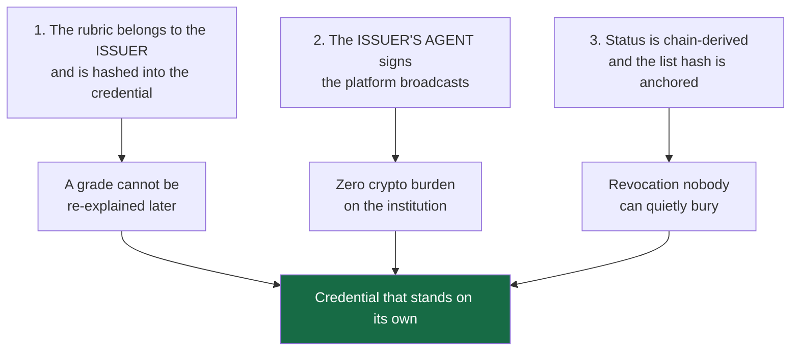
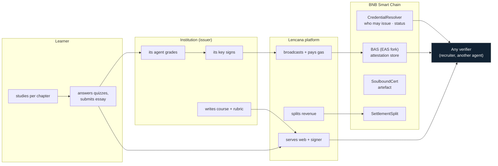
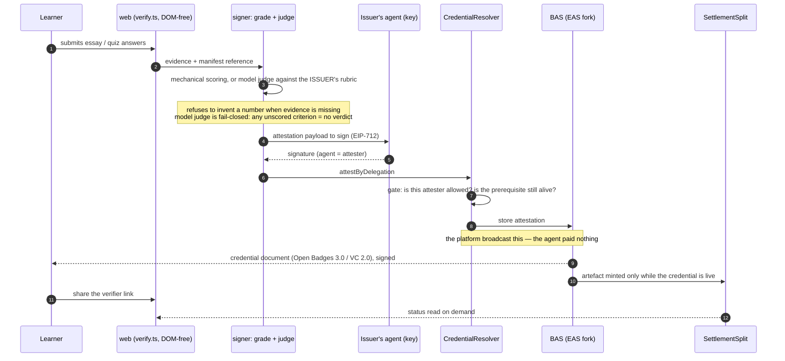
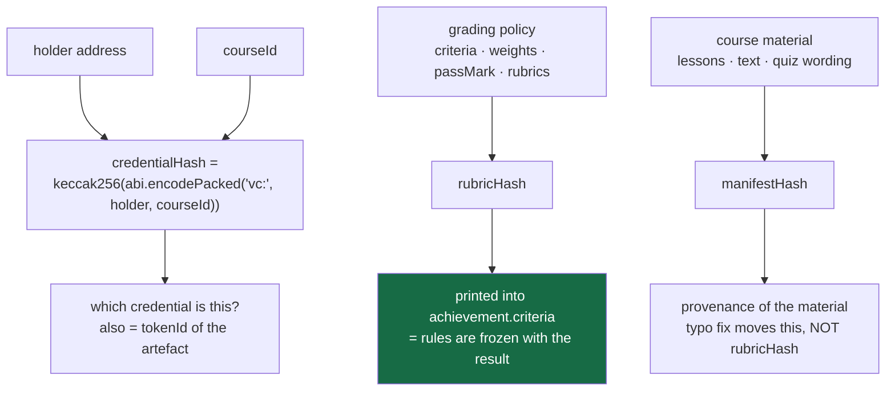
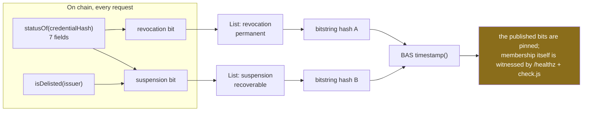

# 10 - Project Detail, long form (submission)

Versi panjang dari [[00-Overview/09 - Project Detail (submission)]] untuk field yang plafonnya besar
(±68k karakter) dan mendukung Mermaid. Ditulis per bagian; bagian yang belum selesai ditandai
sentinel di bawah. Semua angka berasal dari perintah yang dijalankan di repo ini, dan alamat kontrak
dicocokkan ke `broadcast/DeployCredentials.s.sol/97/run-latest.json`.

---

# Lencana

> **Finish the course, get the credential, rubric signed, status on BNB Chain, nothing rewritten
> quietly.**

A micro-course platform where the institution's **own agent** grades and signs the credential, the
grading rules are **sealed into the credential at the moment it is issued**, and the result can be
checked by anyone — **without an account, without a wallet, and without our servers being on the
request path**.

Built for the Indonesia Web3 Hackathon 2026, *Consumer Apps* track (· *AI Agents*), on BNB Smart Chain
testnet (chain 97).

## 1. The problem, precisely

A finished course leaves the learner holding a PDF. That PDF proves nothing on its own: to check it,
someone has to find the issuer, ask, and believe the answer. The certificate's value is therefore
**borrowed from the institution's reputation**, which produces two failures at once:

- a small, honest publisher with no brand cannot produce credible proof at all;
- a loud brand can put anything on paper and stays believed.

The record underneath the certificate is editable, **silently**. Rubric, weights and grades live in the
issuer's own database and can change after the certificate was handed out; nothing on the certificate
shows that it happened. And revocation is barely modelled: we read the code of six open-source learning
platforms at pinned commits — Moodle `e68a1418b`, Open edX `303f778`, Canvas `1c9f0bb`, Chamilo
`a6cceea`, Frappe LMS `aae024f`, LearnHouse `5e28b07` — and in **none** of them can a stranger tell
whether a credential is still valid without asking the platform that issued it. Moodle's badge exporter
states the reason out loud:

> `// Signed is not implemented yet.`
> — `references/moodle/public/badges/classes/local/backpack/ob/v2p0/assertion_exporter.php`

So the problem is not "people forge certificates" (a tired framing). It is narrower and more real:

| who | what they cannot do today |
|---|---|
| a learner | prove what they finished once the school's site, LMS or goodwill disappears |
| a recruiter | check a claim without contacting whoever made it — so they check the brand instead |
| a small honest institution | issue something believed, because belief is priced in reputation, not in the artifact |
| a grading system | show that the rules used were the rules in force **that day**, not rewritten afterwards |

## 2. The three structural decisions

Everything else follows from these. Each one is a sentence a competitor cannot currently sign.

**Decision 1 — the issuer owns the rules.** A course ships with a `CourseManifest`: criteria, weights,
`passMark`, validity days, and each quiz/essay rubric. `rubricHash` is a keccak over **the policy alone**;
it is printed into the credential's `achievement.criteria`. `score.ts` computes the composite and
contains **no institutional numbers** — the platform literally has no place to invent a passing grade.
Consequence we accepted: `issue.js` **lost its `--score` flag**. Handing the platform a number to write
into a credential was the exact thing the product is supposed to make impossible.

**Decision 2 — the issuer is a third party, and its agent is the signer.** Lencana is the venue, not
the authority. `attestByDelegation` records the **agent** as the attester on BNB Attestation Service
(a public EAS 1.3.0 deployment we do not own), while the platform pays the gas. An institution therefore
needs no wallet, no BNB and no crypto staff — and if it misbehaves, `delistIssuer()` stops it from
issuing **new** attestation without erasing credentials it already issued.

**Decision 3 — status is derived from the chain, on every request.** Two Bitstring Status Lists —
`revocation` (permanent) and `suspension` (recoverable) — are rebuilt from `statusOf()` each time, served
as standard `BitstringStatusListCredential`s, and **both list hashes are timestamped on chain**. That is
what stops our own endpoint from editing a list silently: the bits it publishes are pinned. (The honest
limit of that sentence is in §9.)

## 3. Who does what

The line to read carefully is the last three: the verifier talks to the **chain** and to whatever URL
the credential carries — not to a service that could say yes or no.

## 4. Lifecycle of one credential

Five things happen inside those arrows that a normal LMS cannot do:

1. The **grader and the signer are the same party** — the institution's agent, not the platform's admin.
2. The **rules used are attached to the output** (`rubricHash` in `achievement.criteria`).
3. The **entity that broadcasts is not the entity that attests** — so issuance cost is a platform line,
   not an institution's tax.
4. A credential can be **refused at the gate**: an unapproved attester, or a prerequisite that has since
   been revoked, never becomes an attestation at all (revert, not a UI warning).
5. The **artefact is downstream of validity** — see §7.

## 5. The hash model: three hashes, three different promises

This is the part most likely to be misunderstood, so it gets its own diagram.

| hash | inputs | changes when… | where it lives |
|---|---|---|---|
| `credentialHash` | `(holder, courseId)` — lesson-level adds `lessonId` | either input changes | the lookup key everywhere: resolver status, artefact `tokenId`, verifier URL |
| `rubricHash` | **policy only** | criteria, weights, `passMark` or a rubric moves | inside the issued credential; `npm run rubric` asserts the separation |
| `manifestHash` | policy **and** material | anything in the course moves | README/issuer document as material provenance |

Why separate the last two: fixing a spelling mistake in lesson 3 must **not** invalidate the rules a
previous cohort was graded under. Measured: a material edit moves `manifestHash` and leaves
`rubricHash` byte-identical; changing a rubric's composition (same total, different parts) moves it.

**`credentialHash` is not a UID.** An EAS/BAS attestation UID additionally mixes in the mined
`block.timestamp`, so a UID cannot be predicted by the script that just created it. That single fact
produced two hard rules in this repo: scripts consume **hashes**, never UIDs; and the demo seeder runs
**twice** by design. It is also why `/credentials/<hash>` takes a hash while `/healthz` reports slots
keyed by **UID** — mixing the two produces a 404 that looks like an outage (we hit this ourselves).

## 6. Revocation: two lists, because one bit holds two meanings badly

Why two and not one: a revoked credential must stay revoked forever; a **delisted issuer** is a
reversible judgement about an institution, and an existing learner's credential should not vanish because
we fell out with its publisher. A single bit cannot express both, and collapsing them would destroy the
distinction that makes the fourth verdict meaningful.

The bitstring is a fixed-length array, which buys determinism and costs a subtlety we refuse to gloss
over: **adding members whose bits are zero does not change the hash**. So the anchor witnesses *the
bits*, not *who is in the list* — and the thing that actually watches membership is `/healthz`
(`watched`, `flagged`, `unallocated`) plus the signer harness. We state this in the limits panel (§9)
rather than claim "the served list cannot be edited".

<!-- MORE -->
