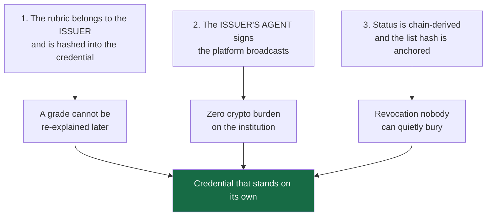
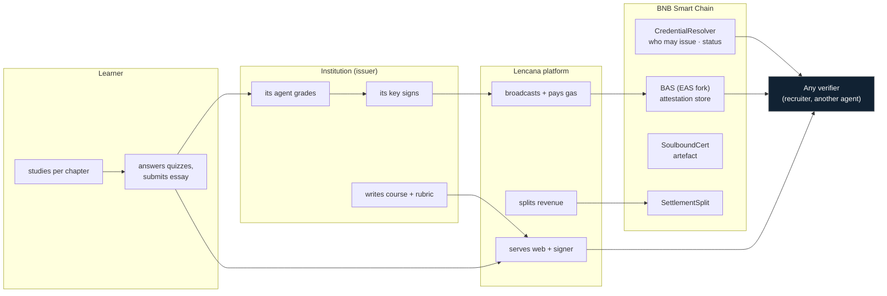
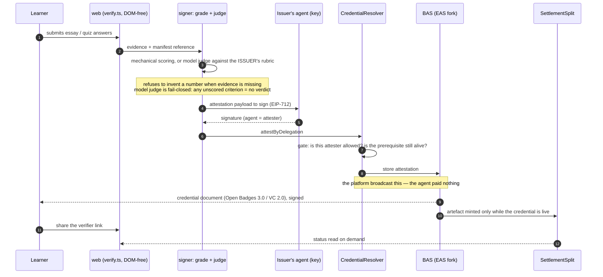
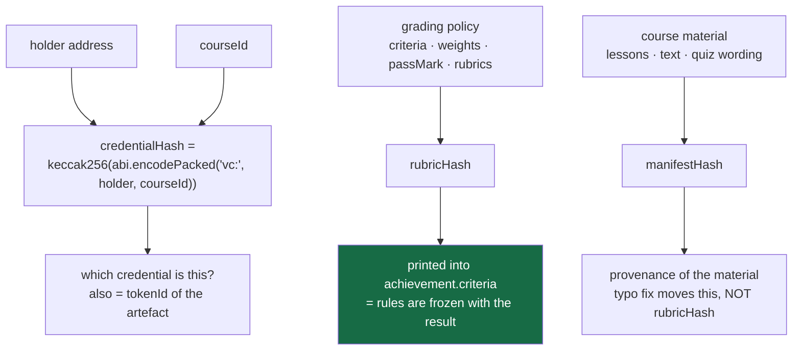
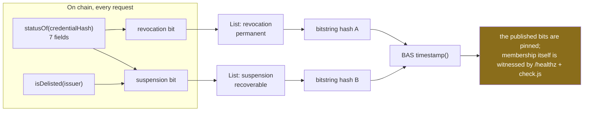
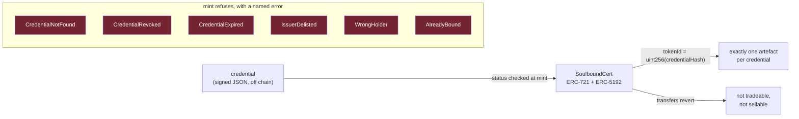
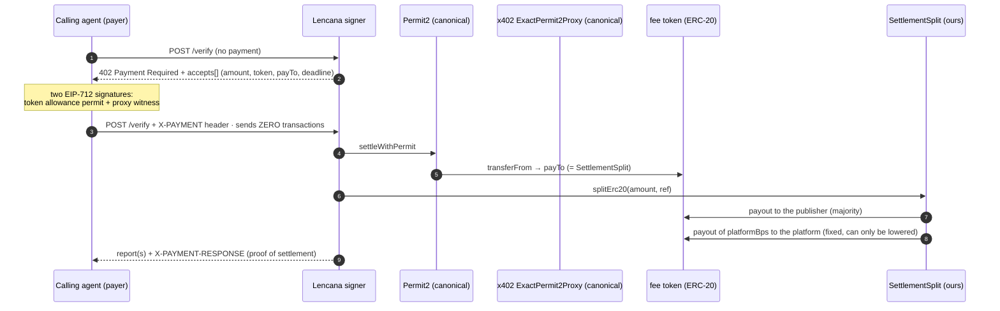

# 10 - Project Detail, long form (submission)

Versi panjang dari [[00-Overview/09 - Project Detail (submission)]] untuk field yang plafonnya besar
(±68k karakter) dan mendukung Mermaid. Ditulis per bagian; bagian yang belum selesai ditandai
sentinel di bawah. Semua angka berasal dari perintah yang dijalankan di repo ini, dan alamat kontrak
dicocokkan ke `broadcast/DeployCredentials.s.sol/97/run-latest.json`.

---

# Lencana

> **Finish the course, get the credential, rubric signed, status on BNB Chain, nothing rewritten
> quietly.**

A micro-course platform where the institution's **own agent** grades and signs the credential, the
grading rules are **sealed into the credential at the moment it is issued**, and the result can be
checked by anyone — **without an account, without a wallet, and without our servers being on the
request path**.

Built for the Indonesia Web3 Hackathon 2026, *Consumer Apps* track (· *AI Agents*), on BNB Smart Chain
testnet (chain 97).

## 1. The problem, precisely

A finished course leaves the learner holding a PDF. That PDF proves nothing on its own: to check it,
someone has to find the issuer, ask, and believe the answer. The certificate's value is therefore
**borrowed from the institution's reputation**, which produces two failures at once:

- a small, honest publisher with no brand cannot produce credible proof at all;
- a loud brand can put anything on paper and stays believed.

The record underneath the certificate is editable, **silently**. Rubric, weights and grades live in the
issuer's own database and can change after the certificate was handed out; nothing on the certificate
shows that it happened. And revocation is barely modelled: we read the code of six open-source learning
platforms at pinned commits — Moodle `e68a1418b`, Open edX `303f778`, Canvas `1c9f0bb`, Chamilo
`a6cceea`, Frappe LMS `aae024f`, LearnHouse `5e28b07` — and in **none** of them can a stranger tell
whether a credential is still valid without asking the platform that issued it. Moodle's badge exporter
states the reason out loud:

> `// Signed is not implemented yet.`
> — `references/moodle/public/badges/classes/local/backpack/ob/v2p0/assertion_exporter.php`

So the problem is not "people forge certificates" (a tired framing). It is narrower and more real:

| who | what they cannot do today |
|---|---|
| a learner | prove what they finished once the school's site, LMS or goodwill disappears |
| a recruiter | check a claim without contacting whoever made it — so they check the brand instead |
| a small honest institution | issue something believed, because belief is priced in reputation, not in the artifact |
| a grading system | show that the rules used were the rules in force **that day**, not rewritten afterwards |

## 2. The three structural decisions

Everything else follows from these. Each one is a sentence a competitor cannot currently sign.

**Decision 1 — the issuer owns the rules.** A course ships with a `CourseManifest`: criteria, weights,
`passMark`, validity days, and each quiz/essay rubric. `rubricHash` is a keccak over **the policy alone**;
it is printed into the credential's `achievement.criteria`. `score.ts` computes the composite and
contains **no institutional numbers** — the platform literally has no place to invent a passing grade.
Consequence we accepted: `issue.js` **lost its `--score` flag**. Handing the platform a number to write
into a credential was the exact thing the product is supposed to make impossible.

**Decision 2 — the issuer is a third party, and its agent is the signer.** Lencana is the venue, not
the authority. `attestByDelegation` records the **agent** as the attester on BNB Attestation Service
(a public EAS 1.3.0 deployment we do not own), while the platform pays the gas. An institution therefore
needs no wallet, no BNB and no crypto staff — and if it misbehaves, `delistIssuer()` stops it from
issuing **new** attestation without erasing credentials it already issued.

**Decision 3 — status is derived from the chain, on every request.** Two Bitstring Status Lists —
`revocation` (permanent) and `suspension` (recoverable) — are rebuilt from `statusOf()` each time, served
as standard `BitstringStatusListCredential`s, and **both list hashes are timestamped on chain**. That is
what stops our own endpoint from editing a list silently: the bits it publishes are pinned. (The honest
limit of that sentence is in §9.)

## 3. Who does what

The line to read carefully is the last three: the verifier talks to the **chain** and to whatever URL
the credential carries — not to a service that could say yes or no.

## 4. Lifecycle of one credential

Five things happen inside those arrows that a normal LMS cannot do:

1. The **grader and the signer are the same party** — the institution's agent, not the platform's admin.
2. The **rules used are attached to the output** (`rubricHash` in `achievement.criteria`).
3. The **entity that broadcasts is not the entity that attests** — so issuance cost is a platform line,
   not an institution's tax.
4. A credential can be **refused at the gate**: an unapproved attester, or a prerequisite that has since
   been revoked, never becomes an attestation at all (revert, not a UI warning).
5. The **artefact is downstream of validity** — see §7.

## 5. The hash model: three hashes, three different promises

This is the part most likely to be misunderstood, so it gets its own diagram.

| hash | inputs | changes when… | where it lives |
|---|---|---|---|
| `credentialHash` | `(holder, courseId)` — lesson-level adds `lessonId` | either input changes | the lookup key everywhere: resolver status, artefact `tokenId`, verifier URL |
| `rubricHash` | **policy only** | criteria, weights, `passMark` or a rubric moves | inside the issued credential; `npm run rubric` asserts the separation |
| `manifestHash` | policy **and** material | anything in the course moves | README/issuer document as material provenance |

Why separate the last two: fixing a spelling mistake in lesson 3 must **not** invalidate the rules a
previous cohort was graded under. Measured: a material edit moves `manifestHash` and leaves
`rubricHash` byte-identical; changing a rubric's composition (same total, different parts) moves it.

**`credentialHash` is not a UID.** An EAS/BAS attestation UID additionally mixes in the mined
`block.timestamp`, so a UID cannot be predicted by the script that just created it. That single fact
produced two hard rules in this repo: scripts consume **hashes**, never UIDs; and the demo seeder runs
**twice** by design. It is also why `/credentials/<hash>` takes a hash while `/healthz` reports slots
keyed by **UID** — mixing the two produces a 404 that looks like an outage (we hit this ourselves).

## 6. Revocation: two lists, because one bit holds two meanings badly

Why two and not one: a revoked credential must stay revoked forever; a **delisted issuer** is a
reversible judgement about an institution, and an existing learner's credential should not vanish because
we fell out with its publisher. A single bit cannot express both, and collapsing them would destroy the
distinction that makes the fourth verdict meaningful.

The bitstring is a fixed-length array, which buys determinism and costs a subtlety we refuse to gloss
over: **adding members whose bits are zero does not change the hash**. So the anchor witnesses *the
bits*, not *who is in the list* — and the thing that actually watches membership is `/healthz`
(`watched`, `flagged`, `unallocated`) plus the signer harness. We state this in the limits panel (§9)
rather than claim "the served list cannot be edited".

## 7. The artefact: what the NFT is *for*, and what it is not

The artefact is deliberately **the least powerful object in the system**. It is what a learner shows,
what a profile holds, what a wallet displays — and it grants nothing: no rights, no transfer, and no
authority over the credential it points at. `mint()` can only be called by the platform's owner address
and refuses loudly (table above) unless the credential is live and belongs to the person being minted to.
"One credential, one artefact" is enforced by the key layout itself — `bytes32` and `uint256` are the
same 256 bits reinterpreted, not a bookkeeping convention.

Two things we record here rather than hide, because they are open work in our own backlog:

- **There is no burn.** Revocation happens to the *status*, not the token. So an artefact can outlive
  its own validity, which is exactly why the verifier page — not the wallet — is the correct place to
  check a claim. Fixing the presentation half (metadata that resolves to live status) is task **B38**.
- **Granularity is undecided** (**B39**). Lesson-level credentials exist; if every lesson minted a
  token, one learner would carry ~24 artefacts per course and the portfolio becomes noise. This is a
  product decision, and we would rather state it than let a default decide it.

## 8. Money: verification as a machine-to-machine service

The client never holds or sends a transaction: it signs two typed structures, and the platform does the
rest. A payment is replay-proof by construction — the contract tracks `splitDone[ref]`, and a settlement
is only divided once per reference.

Measured, and the arithmetic that changed the product:

| what | number |
|---|---|
| one settlement + one split | **190,659 gas** (114,728 + 75,931) |
| at 0.1 gwei (this testnet) | ≈ 0.0000190659 BNB |
| break-even BNB price for a $0.001 fee at a 10 % platform share | ≈ **$5.24** |
| deployed `platformBps()` | **1000** (10 %), cap `MAX_BPS = 2500`, **decreases only** |

At a per-report price, the platform's share of a $0.001 fee is smaller than the gas it pays — so the
billable unit became a **batch** (up to 25 reports in one settlement, one payment returning reports with
*different* verdicts, which is the case a single-report design cannot answer). Gas belongs to
**issuance**, paid by whoever broadcasts; it is **never** a percentage deducted from the issuer's share,
because the issuer did not choose that cost.

## 9. What we measured — and the command that measures it

Nothing in this document is a claim without a command behind it. From a clone of `app/`:

| command | what it proves | result | date |
|---|---|---|---|
| `forge build` + `forge test --evm-version cancun --fork-url <97>` | the whole on-chain layer against **real** BAS on a fork of the public testnet | **97 passed / 0 failed** | 26 Sep |
| `forge test … --fork-url <56>` | same suite against **mainnet** state (interfaces and constants match production) | 97 / 0, identical gas | 23 Sep |
| `cd web && npx tsc --noEmit && npm run build` | the page compiles | clean | 26 Sep |
| `cd web && npx tsx scripts/probe.ts` | the **page's own** `verify.ts` reading chain 97 for four verdicts; the seeder's `credentialHash` recomputed from course data equals the on-chain attestation | **59 / 0** | 26 Sep |
| `cd web && npx tsx scripts/rubric-check.ts` | the pass mark is computed; policy and material hash separately | **17 / 0** | 26 Sep |
| `cd web && npx tsx scripts/inventory.ts` | the size of the learning surface, printed from the data | 2 · 7 · 24 · **34 pages** · 412 min · 28 · 2 | 26 Sep |
| `cd signer && node scripts/check.js` | document shape, `eddsa-rdfc-2022` round-trip, list bits equal to `statusOf()` | **53 / 0** | 26 Sep |
| `cd signer && node scripts/serve-probe.js` | the same over HTTP against the running server | **20 / 0** | 26 Sep |
| `cd signer && npm run x402` | `402` → pay → settle → **split** → report; balances read back **from the chain** | **20 / 0** | 24 Sep |
| `cd signer && npm run delegate` | the agent signs, the platform broadcasts; agent balance unchanged to the wei | 8 / 0 | 23–25 Sep |
| `cd signer && npm run judge` | **negative control** — a fluent but empty essay is failed, not passed | **7 / 0** (8/100) | 24 Sep |
| `cd signer && npm run judge-variance` | how much a model score moves at `temperature 0` | substantive essay **91–100**; verdict stable in 5 runs | 24 Sep |
| `cd signer && node scripts/anchor.js --dry-run` | what is being anchored, and that re-anchoring is idempotent | 11 watched, both list hashes unchanged | 26 Sep |

The verdicts the page can return. The first four are the cases `probe.ts` asserts against the public
network; `EXPIRED` is implemented in `verify.ts` and covered by tests, but **no seeded demo credential is
expired**, so it is not part of what the probe measures (and should not be shown in the video without
seeding one first).

| input | verdict | why it is interesting |
|---|---|---|
| a live credential | `VALID` | the ordinary case |
| a revoked one | `REVOKED` | the publisher cannot un-say it |
| a delisted publisher's credential | `ISSUER_DELISTED` | a judgement about the *issuer*, not the learner |
| valid, but its prerequisite was revoked | valid + chained warning | **the rule EAS itself does not enforce** — it checks a prerequisite exists, not that it is still alive |
| an expired one | `EXPIRED` | validity days come from the issuer's manifest — implemented and tested, **not seeded** |

## 10. Limits — what this is **not** yet

We would rather you read this than discover it.

- **The 1EdTech validator has never been run against our document.** We say *built to the
  specification*, never *compatible*. The blocker is specific: the issuer identity was created with a
  localhost `verificationMethod`, and the tool that creates it refuses to overwrite — so a public URL
  does not yet reach the fields a verifier dereferences. The credential route itself answered
  `200, 3202 bytes` through a public tunnel, so this is a last step, not a redesign.
- **No real institution, no real learner.** The publisher is fictitious and labelled so; the graded
  essays in the demo are our own fixtures.
- **We are the facilitator on the paid path.** No third-party facilitator, no outside payer, no SLA,
  and the fee token is a demo ERC-20 with an open `mint`.
- **Verification is free and needs no account; the learner product has no enrolment record.** Progress is
  `localStorage` and is labelled *not evidence*. The event a learner would actually pay for does not
  exist yet — that is the largest gap in the product, and it is in our backlog, not in this document's
  claims.
- **Model-graded numbers have a range** (§ table above): the score is not bit-reproducible; the
  pass/fail decision was stable in what we measured, which is a weaker claim and the only one we make.
- **Testnet only.** Nothing on BSC mainnet, nothing on opBNB. Contract source is not verified on the
  explorer (V1 deprecated, V2 paid) — so audit it by running the commands, not by trusting a paste.
- **An anchored list pins its bits, not its membership** (§6). We do not claim the served list is
  uneditable; we claim editing it is detectable, and membership is watched separately.

## 11. Where to look in the code

| if you want to check… | open |
|---|---|
| that the platform cannot invent a grade | `web/src/score.ts`, `web/src/manifest.ts`, `signer/scripts/issue.js` (no `--score`) |
| the status the whole product rests on | `contracts/CredentialResolver.sol` → `statusOf()`, `isDelisted()` |
| the artefact's refusal to be a diploma | `contracts/SoulboundCert.sol` (`mint`, `NotTransferable`) |
| money being divided and kept nowhere | `contracts/SettlementSplit.sol` |
| that a byte flip kills the signature | `signer/scripts/check.js` |
| that verification does not touch our server | `web/src/verify.ts` (no DOM, no fetch of ours) + `web/scripts/probe.ts` |
| the payment handshake | `signer/src/x402.js`, `signer/src/server.js` (`/verify`) |
| our own mistakes, written down | `vault/00-Overview/04 - Corrections.md`, `vault/10-Contributors/Open-Items-for-Dave.md` |

## 12. Figures to insert

| slot | caption | source |
|---|---|---|
| `IMG-01` | catalogue: `#/learn` with the two courses | `cd web && npm run dev` |
| `IMG-02` | one lesson with an **inline quiz** and the sidebar | `#/learn` |
| `IMG-03` | verifier, `VALID` | paste `DEMO_HASH` from `.env` |
| `IMG-04` | verifier, `REVOKED` | `DEMO_REVOKED_HASH` |
| `IMG-05` | terminal: `402 Payment Required` → settlement | `cd signer && npm run x402` |
| `IMG-06` | BscScan: one `splitErc20`, two payouts | chain 97 |
| `IMG-07` | learner portfolio with its soulbound artefact | `#/portfolio` |
| `IMG-08` | essay screen with the issuer's rubric visible | `#/learn` |

Related pages in the repository: `vault/00-Overview/06 - Business Process.md` (the business view),
`vault/00-Overview/08 - Submission Copy.md` (paste-ready tagline/problem/solution),
`vault/10-Contributors/Claims-Cheat-Sheet.md` (the sentences we forbid ourselves),
`vault/12-LMS-References/` (the six audited platforms, with commit SHAs),
`vault/09-Testing/` (every number above with its raw output).

## 13. How it compares — read from their code, not their marketing

Each cell was checked in the cloned source (commit pinned in
`vault/12-LMS-References/00 - Hub LMS References.md`). "No" means *we found no mechanism in that
tree*, not *the product is bad* — these are mature systems doing a different job.

| | Moodle | Open edX | Canvas | Chamilo | Frappe | LearnHouse | **Lencana** |
|---|---|---|---|---|---|---|---|
| course → chapter → lesson model | ✅ | ✅ XBlock | ✅ modules | ✅ | ✅ | ✅ | ✅ typed data |
| server-side enrolment record | ✅ | ✅ | ✅ state machine per user+section | ✅ | ✅ row lock + duplicate check | ✅ `TrailRun` | ❌ **not built** |
| grade **provenance** (who/what produced the number) | ✅ `usermodified` + history table | ✅ `score_type`, regrade | ✅ | ⚠️ | ⚠️ | ⚠️ | ⚠️ in the document, not in the UI |
| signed credential | ❌ `Signed is not implemented yet.` | ❌ uuid link | ❌ | ❌ no `@context`, unsigned | ❌ | ❌ no status column | ✅ `eddsa-rdfc-2022`, VC 2.0 |
| revocation visible to a stranger | ⚠️ row delete + `410`, so "never issued" is indistinguishable | ❌ | ❌ | ❌ | ❌ | ❌ | ✅ two chain-derived lists, anchored |
| grading policy pinned at issuance | ❌ criteria rebuilt per export | ⚠️ hashed, never enforced, never published | ❌ | ❌ | ❌ | ❌ | ✅ `rubricHash` inside the credential |
| issuer = third party with its own keys | ❌ | ❌ | ❌ | ❌ settings toggle, not a key | ❌ | ❌ | ✅ agent signs, platform broadcasts |
| verification without an account | ❌ | ❌ | ❌ | ⚠️ public name search | ⚠️ unguessable URL | ⚠️ unguessable URL | ✅ free, wallet-less |
| machine-to-machine paid verification | ❌ | ❌ | ❌ | ❌ | ❌ | ⚠️ closed-source | ✅ x402, batch, split on chain |
| prerequisites enforced outside the client | ⚠️ availability rules | ✅ content gating | ✅ module requirements | ❌ | ❌ order not server-gated | ⚠️ | ✅ at attestation time, on chain |

**Canvas caveat, stated so nobody over-reads the row:** its clone was taken as a *sparse* checkout
(`app/models`, `app/controllers`, `db/migrate`, `lib`, `config`, `spec/models`), so its certificate and
badge machinery was **not inspected** — the ❌ in those five cells means "no evidence found in what we
read", which is weaker than "does not exist". Every other column was read from a complete tree. The
money cell is also scoped: exactly one payment-related string exists in the checked-out paths
(`# Inactive is a "hard" state, i.e. tuition not paid`), and `app/services`/`gems`/`plugins` were out of
scope. Re-checking this is cheap: widen the sparse set and look for the certificate service.

What we deliberately do **not** take: their server-rendered admin surfaces, their authoring and
gradebook UIs, and any part of their front ends. Lencana's learner surface stays plain, fast and
typographic, and the learning data stays code-reviewed JSON rather than an editable database.

## 14. What an institution actually does (onboarding, described honestly)

Today an issuer's path is a handful of commands we operate for the demo — not a self-service flow.
Stated exactly, because "publishers can join" is a sentence we do not get to say:

| step | today | self-service would need |
|---|---|---|
| define the course and its rubric | ✅ a typed `CourseManifest` in this repo | a form that writes the same shape |
| be recognised by the chain | ✅ `addIssuer` + an agent key record | an approval flow, and a key-custody decision |
| issue credentials | ✅ `npm run issue` / `delegate`, run by us | a hosted issuance service with a queue and an idempotency record |
| anchor the status lists | ✅ `npm run anchor`, idempotent | a scheduled worker |
| get paid | ✅ the split contract keeps nothing back | a checkout, and the enrolment record above |
| be removed for misconduct | ✅ `delistIssuer`, visible as its own verdict | a review process, not only a function |

The honest summary: **the rails are built, the counter is not.** Every step above has a command behind
it; none of them has a customer yet.
