# 12 - Proses bisnis Lencana, dengan diagram yang bisa diperiksa

**Peta:** [[START-HERE]] · **Bar:** [[00-Overview/11 - Product Bar]] · **Arsitektur:** [[01-Architecture/01 - Architecture]] · **Perintah + angkanya:** [[09-Testing/00 - Hub Testing]] · **Klaim yang dilarang:** [[10-Contributors/Claims-Cheat-Sheet]]

Halaman ini menjelaskan **apa yang sebenarnya terjadi** ketika seseorang mendaftar, belajar, lulus,
dan ketika orang lain memeriksa kertasnya. Setiap panah di bawah punya alamat: nama rute, nama tabel,
atau nama fungsi kontrak. Tidak ada panah yang menggambarkan sesuatu yang belum ada — dan bagian
terakhir halaman ini justru mencatat apa yang **tidak** bisa dilakukan sistem, supaya diagramnya tidak
dibaca lebih dari yang ditegakkan kode.

Angka yang dikutip berasal dari run **29 September 2026** dengan perintah yang disebut di sampingnya.

---

## 1. Empat aktor dan apa yang mereka pegang

| aktor | pegang | tidak pegang |
|---|---|---|
| **Peserta** | alamat EVM + kunci penandatangan; draft esai di browsernya | nilai akhir yang bisa diedit; status on-chain |
| **Penerbit** (institusi / bootcamp) | materi kursus, rubrik + bobot, ambang lulus (`passMark`), kunci agen (`signer/.keys/<slug>.json`) | gas dan penyiaran (itu platform); daftar status (itu platform, atas perintahnya) |
| **Platform (Lencana)** | server signer, Postgres, penyiaraan ke chain, Bitstring Status Lists, Worker + KV tempat dokumen tayang | otoritas menilai: ia tidak pernah memutuskan siapa yang lulus |
| **Verifier** (HR, kampus lain, agen/otomasi) | hanya `credentialHash` — atau kunci pembayaran x402 | `.env` kita, kunci kita, laptop kita |

**Aturan yang membuat tabel ini berarti:** yang menandatangani kertas adalah kunci **penerbit**, dan
yang membaca status adalah **chain publik**. Platform menyiarkan dan membayar. Kalau platform besok
hilang, attestation dan daftar status tetap terbaca di BSC.

---

## 2. BPMN — alur end-to-end di empat jalur (lane)

Bentuknya BPMN-ish: tiap `subgraph` adalah jalur satu pihak, gerbang keputusan adalah tempat sistem
menolak (bukan memaafkan).

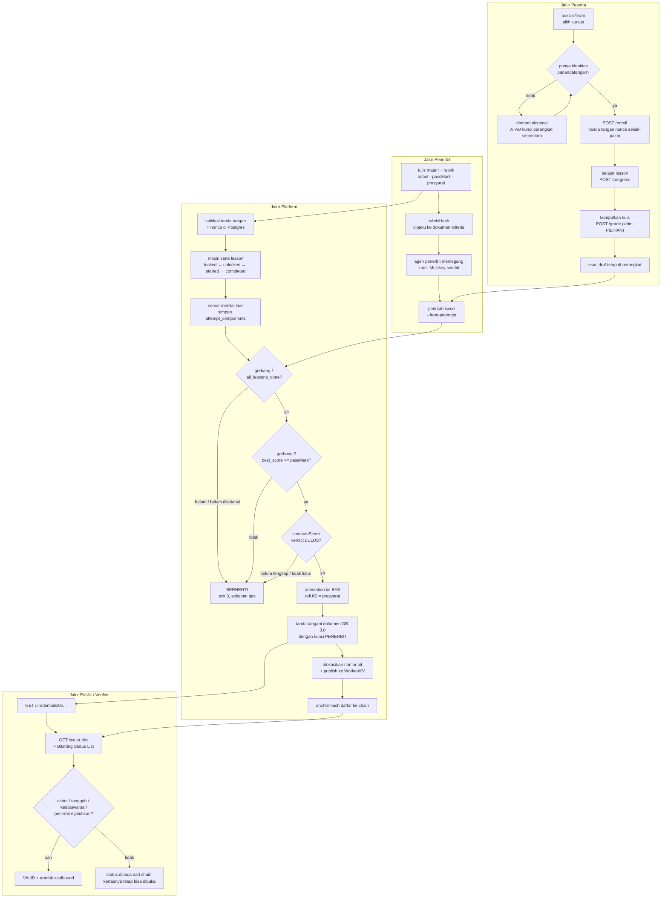

**Dua hal yang harus dibaca dari diagram ini, bukan hanya dilewati:**

1. **Tiga penolakan sebelum satu pun transaksi bergerak** (`X1`). Harness mencetaknya: `verify:attempts:live`
   55/0 menguji bahwa `issue --from-attempts` keluar non-nol dan bahwa **tidak ada attestation baru yang
   tercipta oleh penolakan itu** (`attestationOf(hash)` tetap nol).
2. **`NULL` pada gerbang 1 berarti "penyebutnya belum diketahui"**, bukan "lolos" — ini bug yang nyata
   pernah terjadi (`bool_and` atas nol baris) dan sekarang dijaga migrasi `0004` + view `course_gates`.

---

## 3. Sequence diagram — dari enroll sampai kertas tayang

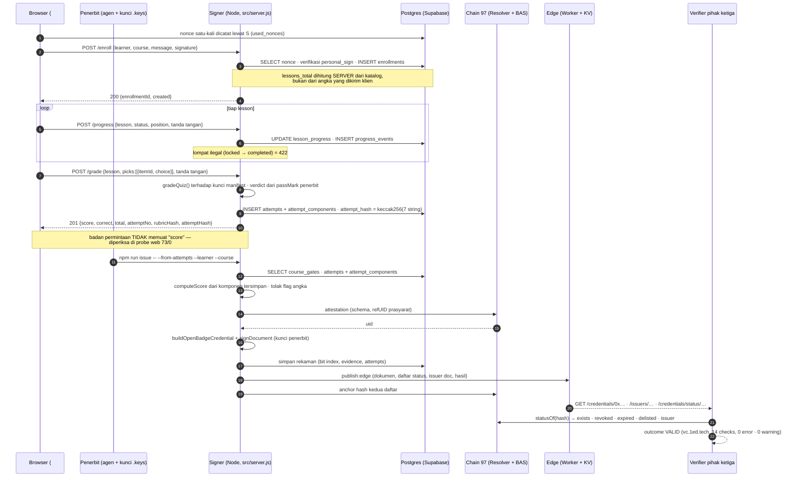

---

## 4. Data flow diagram (DFD level 1) — di mana tiap state benar-benar tinggal

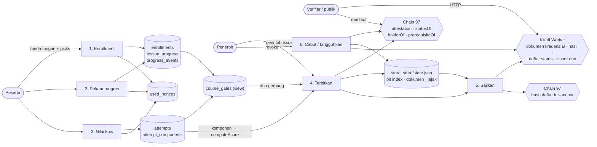

Pembagian yang harus dijaga: **state belajar di Postgres, yang dipercaya publik di chain, teks
karangan di perangkat peserta.** Angka apa pun yang tercetak di kertas bisa ditelusuri ke salah satu
dari tiga tempat itu — itu isi blok `attempts` pada `GET /results/<course>/<hash>`.

---
## 4b. DFD level 2 — tiap proses dibedah sampai nama fungsi, tabel, dan kolom

Konvensi di semua gambar bawah: `{{ }}` proses, `[( )]` tempat data, `([ ])` aktor. Setiap anak panah
diberi nama isinya, dan setiap kotak proses menyebut **nama fungsi yang benar-benar ada di repo** —
kalau suatu hari namanya berubah, gambarnya ikut salah, dan itu memang gunanya.

### DFD-2 · P1 Enrollment — `POST /enroll`

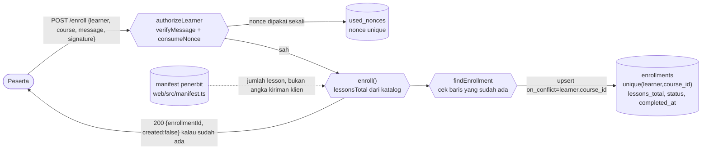

Dua hal yang ditegak di mari: tanda tangan EIP-191 atas nonce yang **hidup di DB** (bukan `Set` dalam
proses), dan penyebut "selesai" dihitung server. `created:false` pada enroll kedua itu hasil yang
benar, bukan kegagalan.

### DFD-2 · P2 Progres belajar — `POST /progress`, `GET /progress`

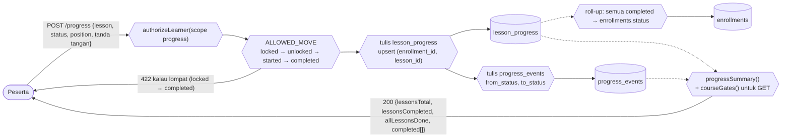

`allLessonsDone` di jawaban adalah hasil `bool_and` atas `lesson_progress` — dan `NULL` (belum ada
baris sama sekali) **diterjemahkan jadi `false`** di `progressSummary`, bukan dihamburkan apa adanya.

### DFD-2 · P3 Penilaian kuis — `POST /grade`

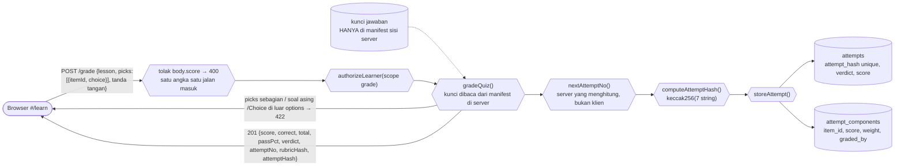

Yang membuat rute ini berarti: `verdict` dihitung dari `lesson.quiz.passPct` **milik penerbit**, dan
jawaban memuat `attemptNo` + `rubricHash` supaya klien bisa menghitung ulang hash tanpa secret key.
Batas yang jujur: kunci tetap terbundel ke browser (B80) — yang dihapus adalah *laporan angka oleh
peserta*, bukan *keterbukaan soal*.

### DFD-2 · P4 Penerbitan dari rekaman — `issue --from-attempts`

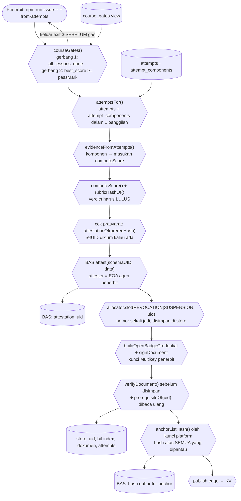

Empat penolakan (gerbang 1, gerbang 2, `BELUM_LENGKAP`, `TIDAK_LULUS`) semuanya terjadi **sebelum**
kotak `C6`. Itulah yang diukur `verify:attempts:live`: penolakannya exit non-nol, dan
`attestationOf(hash)` tetap nol — artinya tidak ada satu pun transaksi yang lahir dari percobaan
menembus gerbang.

### DFD-2 · P5 Penyajian publik — `publish:edge` lalu Worker

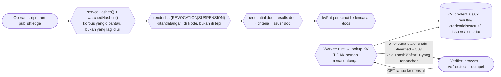

Fungsi P5 yang sering salah dimengerti: tepi adalah **cache yang bisa dibaca orang**, bukan sumber
kebenaran. Kalau ia menyimpulkan hash daftar tidak cocok dengan chain, ia menjawab 503 — jujur, bukan
menyajikan status yang mungkin basi.

### DFD-2 · P6 Pencabutan & penangguhan — `npm run revoke`

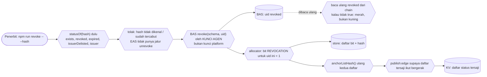

`revoke` dijalankan dengan kunci **agen penerbit**, karena pencabutan adalah pernyataan institusi itu,
bukan pernyataan platform. Kalau `--publish` tidak dipakai, skrip **mencetak** bahwa daftar belum
bergerak — keadaan setengah jadi tidak dibuat terlihat selesai.

### DFD-2 · P7 Verifikasi berbayar mesin-ke-mesin — `POST /verify` (x402)

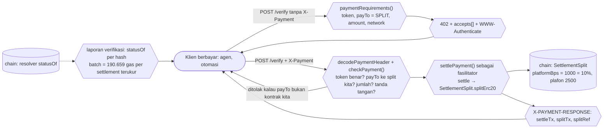

Uangnya mengalir di sini, dan ini satu-satunya proses yang menyebut angka pembagian: 10% platform,
sisanya ke penerbit, **dieksekusi kontrak yang kita tulis** — bukan oleh kode Node kita. Karena itu
kalimat "pembagiannya bisa diaudit" benar, dan kalimat "kami menarik biaya kursus" belum (bar 10,
OI-11: enrollment belum menempel ke harga).

### DFD-2 · P8 Penyerahan esai + antrean penilaian — `POST /essay`, `POST /essay/judgement`

```mermaid
flowchart LR
  PE([Peserta])
  IN([Penerbit: npm run grade:essay])
  F1{{"essayLesson() dari manifest<br/>rubrik + max per kriteria"}}
  F2{{"gradeAgainstRubric() tanpa judge<br/>5 tanda mekanis, TIDAK ada angka akhir"}}
  F3{{"submitEssay()<br/>attempts(score NULL, verdict incomplete)<br/>+ komponen mech:* weight 0<br/>+ submissions(state awaiting_judge)"}}
  F4{{"authorizeLearner<br/>tanda tangan peserta"}}
  Q1[("attempts · attempt_components")]
  Q2[("submissions<br/>body teks, state, judged_at")]
  H1{{"judgeEssay()<br/>tuntutan: tanda tangan EOA penerbit<br/>+ nonce + semua kriteria terisi<br/>+ label asing ditolak + max>0"}}
  H2{{"komponen crit:* disimpan sebagai PERSEN 0..100<br/>weight = max penerbit"}}
  H3{{"hash dihitung ulang (skor berubah)<br/>hash lama dilaporkan sebagai replacedHash"}}
  GT{{"courseGates: graded_attempts/best_score<br/>baru bergerak sesudah dinilai"}}
  PUB([Dokumen hasil /results/…<br/>menunjuk attempt_hash yang baru])

  PE -->|"POST /essay {lesson, teks, message, signature}"| F4
  F4 --> F1
  F1 --> F2
  F2 -->|INSUFFICIENT_EVIDENCE → state insufficient| F3
  F2 -->|AWAITING_JUDGE| F3
  F3 --> Q1
  F3 --> Q2
  IN -->|"queuePendingEssays() lalu tanda tangani penilaian"| H1
  Q2 -.->|teks dibaca penerbit, TIDAK ada rute anonim untuk mengambil antrean| H1
  F1 -.->|rubrik: sumber max yang sah| H1
  H1 --> H2
  H2 --> Q1
  H2 --> H3
  H3 --> Q1
  H3 -->|state judged| Q2
  Q1 -.-> GT
  Q1 -.-> PUB
```

Yang membedakan proses ini dari `POST /attempts`: **angka masuk lewat kunci penerbit**, bukan lewat
peserta. Peserta hanya mengirim teks; `verdict`-nya `incomplete`; `score`-nya `NULL`; dan selagi
begitu, `issue --from-attempts` menolak terbit (bar 6: belum dinilai ≠ nol, dan `ungraded` tidak
dianggap lulus).

**Satu jebakan yang harus tercatat di sini, karena dia mengubah angka tanpa membuat satu pun baris
merah.** `attempts.score` dan `attempt_components.score` sama-sama persen 0..100, tapi kriteria rubrik
esai penerbit berbentuk `{label, max}` dengan max 25/25/25/15/10 = 100. Kalau komponen disimpan apa
adanya (`score = 25`, `weight = 25`), rata-rata berbobot di `fromAttempts` menghasilkan
`(25·25+25·25+25·25+15·15+10·10)/100 = 22` untuk karangan yang **nilainya penuh** — kertas tercetak
sah dengan angka yang salah. Karena itu `judgeEssay` menyimpan persen (`v/max·100`) dengan `weight =
max`, dan dijaga dua sisi: `attempts-check.js` menguji 100% → 100 dan 50% → 50, `verify:db` menguji
esai penuh menghasilkan `score 100` lewat HTTP.

---

## 5. UML activity + state machine

### 5a. Mesin status satu lesson (ditegak server, bukan dihias di UI)

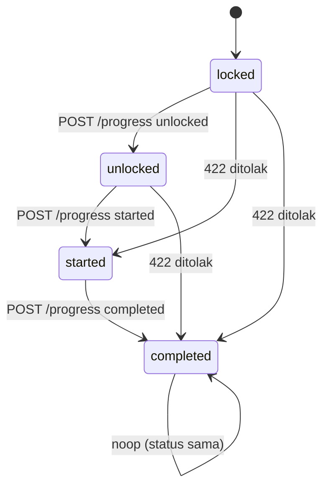

### 5b. Aktivitas penerbitan, dengan tiga gerbang dan satu pascakondisi

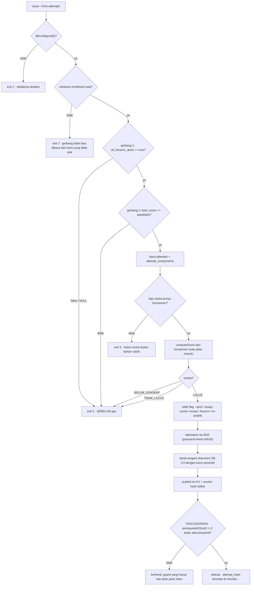

---

## 6. Dua proses kedua yang juga nyata

### 6a. Verifikasi berbayar antar-mesin (x402) — satu-satunya jalur yang menghasilkan uang

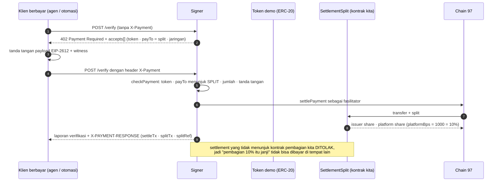

Satu settlement = **190.659 gas** (diukur dari receipt, dicatat di `server.js`). Karena itu rute ini
membatch: harga per item harus turun lewat batch supaya 10% platform tetap masuk akal.

### 6b. Daur hidup status setelah kertas terbit

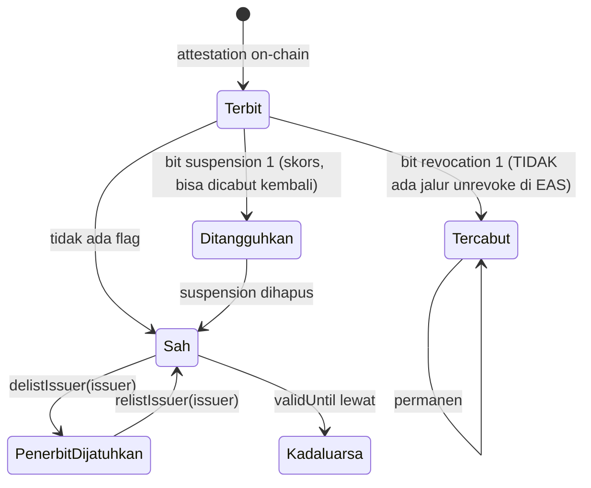

Pembeda yang harus disebut saat menjelaskan: **penerbit dijatuhkan ≠ kredensial dicabut.** Peserta
yang memegang kertas dari agen yang sudah tidak dipercaya dapat verdict `ISSUER_DELISTED`, sementara
attestation-nya sendiri tetap utuh dan artefaknya tetap di wallet-nya. Empat kasus ini punya baris
ujinya sendiri di `npm run probe` (web) **73/0** dan `npm run check` **88/0** (29 Sep).

---

## 7. Tahapan ↔ jaminan ↔ perintah yang membuktikannya

| # | tahap | yang dijamin | perintah (29 Sep) |
|---|---|---|---|
| 1 | identitas peserta | tanda tangan EIP-191 atas nonce satu-kali; nonce hidup di DB, bukan di `Set` dalam proses | `npm run verify:db` **70/0** (30 Sep malam; 48/0 sebelum B78(c) dan B104) |
| 2 | enrollment | baris per `(learner, course)`; `lessons_total` dari katalog; idempoten | `verify:attempts:live` 55/0 |
| 3 | belajar | state machine ditegak server, setiap perpindahan di-event-log | 57 POST progres, `walkFails = 0` |
| 4 | kuis | angka dihitung **server**; klien mengirim pilihan; `attempt_no` server yang naik; `verdict` dari ambang penerbit | `verify:db` (9 pemeriksaan `/grade`) |
| 5 | gerbang kelulusan | `all_lessons_done` **dan** `best_score >= passMark`, `NULL` = belum selesai | penolakan terukur + `attestationOf` tetap nol |
| 6 | penerbitan | kunci penerbit menandatangani; platform yang menyiarkan + bayar gas; prasyarat lewat `refUID` + pascakondisi `prerequisiteOf` | `npm run issue` / `npm run journey` 34/0 |
| 7 | sajian publik | 19 dari 19 kertas dapat dibuka tanpa laptop kami; kunci tiap kertas terdaftar di dokumen penerbitnya; kedua daftar status 200 tanpa `x-lencana-stale` dan healthz melaporkan `checked:27 / unchecked:0` | `npm run verify:edge` **8/0** (29 Sep sore) |
| 8 | penilaian eksternal | `outcome: VALID`, 14 checks, 0 error / 0 warning | `npm run validator -- --hash … --record` |
| 9 | pencabutan | `npm run revoke` di dalam repo; cabut permanen; status dibaca dari chain | `e2e` 46/0 · `check.js` 84/0 |
| 10 | jejak angka | `attempt_hash` tercetak di `/results/<course>/<hash>` dan bisa dihitung ulang dari baris Postgres | `verify:attempts` 25/0 |
| 11 | uang | pembayaran harus menunjuk kontrak pembagian kita; 10% platform di on-chain | `verify:x402` 20/0 (24 Sep) |
| 12 | **esai: penyerahan + antrean + penilaian penerbit** | teks masuk TANPA angka (`score NULL`, `verdict incomplete`); angka hanya bisa ditulis oleh tanda tangan EOA penerbit atas nonce; kriteria asing/sebagian ditolak; `attempt_hash` dihitung ulang dan hash lama dilaporkan | `verify:db` **45/0** (17 pemeriksaan esai) — 29 Sep |

---

## 8. Yang TIDAK bisa dilakukan sistem ini (jangan diucapkan di video)

| batasan | keadaan sebenarnya | kalimat yang boleh dipakai |
|---|---|---|
| **B81 sudah ditutup untuk esai — sisanya **praktik**** | Esai: `POST /essay` + `POST /essay/judgement` + `npm run grade:essay` (29 Sep). Praktik: belum punya rute sendiri — kalau suatu hari butuh bukti berupa berkas/tautan, itu tabel + rute baru, bukan kolom tambahan di `attempts` | "esai diserahkan ke penerbit dan dinilai dengan kunci penerbit; praktik belum punya permukaan penyerahan" |
| **B80 — kunci kuis ada di bundel browser** | `web/src/manifest.ts` menyalin `answer`; `/grade` menghapus **laporan angka oleh peserta**, bukan keterbukaan soalnya | "peserta tidak bisa melaporkan nilainya sendiri" — bukan "kuis tidak bisa dicurangi" |
| **B82 — tidak ada pemulihan akun** | identitas = alamat penandatangan; "kunci perangkat" viem di `sessionStorage` hangus bersama tab | "identitas peserta hari ini adalah alamat EVM-nya; dompet = akun" + sebut bahwa ini tahap awal |
| **Tidak ada peran learner/publisher/mentor sebagai produk** | Yang SUDAH ada: `publisher` punya padanan on-chain berupa **allowlist** (`addIssuer`/`delistIssuer`/`isIssuer` di `CredentialResolver.sol`). Yang belum: identitas **staf** (signer hanya mengenali tanda tangan peserta), tabel peran, dan custodia kunci agen (hari ini di `signer/.keys/` mesin ini). Tiga jalur + biayanya ada di **B87** — termasuk jalur mentor yang tidak menyentuh chain dan hanya ±½ hari | jangan sebut multi-institusi, onboarding self-service, atau peran mentor. Yang boleh: "penerbit terdaftar di allowlist on-chain; otoritas menilai tetap di sisi penerbit" |
| **Testnet 97 saja** | atas pilihan sadar (aturan hackathon membolehkan testnet); nol dana asli | "prototipe di BSC testnet; tidak ada dana riil di jalur ini" |
| **Reproducibility dari clone ada batasnya** | suite offline + `rubric`/`inventory` jalan dari clone; yang menyentuh chain butuh `.env`, kunci agen, dan store | "perintahnya ada di repo; angkanya dicetak oleh `.env` kami" — jangan "siapa pun bisa mengulang angka kami" |
| **Angka harness yang berubah sudah dijelaskan, bukan dihindari** | `check.js` 88 → 94 → 84. Sebab (29 Sep): pemeriksaan daftar sajian berlipat **per entri** `credentialStatus`; 5 dokumen lama masih array dua entri (22 entri) lalu dinormalkan jadi satu objek (17 entri) → 22−17 = 5 × 2 = **tepat 10**. `check.js` sekarang mencetak `info : 17 rekaman · 17 entri status × 2 = 34 pemeriksaan daftar sajian` supaya jumlahnya bisa direkonstruksi (B85 tertutup) | "84/0 pada 29 Sep, dan jumlah itu mengikuti bentuk korpus — baris `info` mencetak rinciannya" |

---

## 9. Naskah 90 detik untuk video (peta ke adegan)

1. **Masalah (10 dtk).** Ijazah digital hari ini adalah gambar: tidak ada yang bisa menjawab "masih
   sahkah ini, dari rubrik yang mana, dan angkanya dari mana".
2. **Standar umum dulu (20 dtk).** Buka `#/learn`: daftar → progres per lesson tercatat di backend →
   kuis dinilai **server** → progres dan usaha terbaca di kotak "Rekaman di penerbit".
3. **Sisipan on-chain (25 dtk).** `issue --from-attempts` → dua gerbang → attestation BAS → kertas
   Open Badges 3.0 ditandatangani **kunci institusi**, platform yang bayar gas → artefak soulbound.
4. **Yang bisa diperiksa orang (20 dtk).** `verify:edge` 17/17 · `vc.1ed.tech` `outcome: VALID` ·
   cabut kertasnya → bit berbalik → kertasnya **tetap terbaca**, statusnya berubah; dan prasyarat yang
   tercabut membuat ijazah turunannya terdeteksi lewat `prerequisiteOf`.
5. **Batas yang kami akui (15 dtk).** Testnet; esai masih jalur penerbit; identitas = dompet.

Perintah yang menggerakkan adegan 2-4 tanpa akting: `npm run journey` (sepuluh tahap, satu alur nyata)
lalu `npm run e2e` (menyatukan chain · daftar · URL di dalam kertas · artefak · verdict pihak ketiga).

---

## 10. Baca lanjutan

- [[00-Overview/11 - Product Bar]] — 12 elemen e-course + mana yang sudah/belum kita penuhi
- [[01-Architecture/01 - Architecture]] — pembagian lapis dan pemiliknya
- [[04-Signer-Service/S10 - Edge surface]] — kenapa tepi tidak pernah menandatangani
- [[12-LMS-References/L7 - What an e-course must have]] — kerangka umum yang jadi pembanding
- [[09-Testing/00 - Hub Testing]] — setiap angka di halaman ini dengan keluaran aslinya

