# 13 - Proses Bisnis End-to-End (dibaca dari kode)

**Peta:** [[Index]] · [[START-HERE]] · **Backlog:** [[07-Backlog/03 - Findings and Tasks 2026-09-26]] ·
**Rute:** [[04-Signer-Service/S7 - Server routes and lifecycle]] · **Kontrak:** [[02-Contracts/01 - Contracts]] ·
**Klaim yang boleh diucapkan:** [[10-Contributors/Claims-Cheat-Sheet]] · **Testing:** [[09-Testing/00 - Hub Testing]]

> **Asal halaman ini.** Ditulis 30 Sep atas permintaan builder: "paparkan proses bisnis Lencana dari
> pemahamanmu sendiri, jangan langsung percaya halaman proses bisnis yang sudah ada". Jadi sumbernya
> **kode dan kontrak**, bukan [[00-Overview/06 - Business Process]] atau [[00-Overview/12 - Business Process]].
> Yang kubaca: `web/src/learning.ts`, `web/src/verify.ts`, `web/src/manifest.ts`, `web/src/score.ts`,
> `signer/src/server.js`, `signer/src/db.js`, `signer/src/quiz.js`, `signer/src/grade.js`,
> `signer/src/judge.js`, `signer/src/fromAttempts.js`, `signer/src/credential.js`,
> `signer/src/relay.js`, `signer/src/deposit.js`, `signer/src/x402.js`, `signer/scripts/issue.js`,
> `signer/scripts/grade-essay.js`, `signer/scripts/revoke.js`, `signer/scripts/publish.js`,
> `cloudflare/worker.mjs`, `contracts/CredentialResolver.sol`, `contracts/SoulboundCert.sol`,
> `contracts/SettlementSplit.sol`, `contracts/CourseDeposit.sol`, `supabase/migrations/`.
> **Aku belum mencocokkannya baris per baris dengan dua halaman lama itu** — kalau ada selisih, yang
> benar adalah kodenya, dan selisihnya layak jadi koreksi terlihat di halaman lama.
>
> **Perubahan arah sesudah halaman ini ditulis — D53, 1 Okt.** Builder memutuskan tiga hal yang
> mengubah bagian 2, 7, dan 11 di bawah (keadaan kodenya belum berubah; halaman ini tetap menggambarkan
> kode hari ini): (1) agen penilai dimiliki peran baru **Agent Owner**, dan **penerbit menyewanya per
> aktivitas penilaian** dengan tujuh label tingkat berat (sangat ringan … sangat berat) — B119;
> (2) identitas agen memakai **registry ERC-8004 yang disediakan BNB** — B118; (3) **reviewer
> diperlakukan sebagai penilai**, boleh agen AI — B120. Lihat [[00-Overview/03 - Decisions]] D53.
>
> Halaman ini sengaja hampir tanpa angka. Angka harness hidup di `09-Testing/numbers.json`
> (`npm run sync:numbers`).

## 1. Lencana dalam satu paragraf

Lencana adalah platform e-course yang **tidak memutuskan siapa yang lulus**. Peserta belajar dan
mengerjakan tugas di halaman Lencana. Yang menilai dan menerbitkan ijazah adalah **penerbit kursus**
lewat kunci miliknya sendiri. Lencana menyediakan relnya: menyimpan rekaman belajar, menyiarkan
transaksi, menyajikan dokumen di alamat yang tahan lama, dan menjaga daftar penerbit yang diakui.
Ijazahnya punya dua wujud yang saling menunjuk: **attestation di chain** (BNB Attestation Service,
dibaca siapa pun lewat satu `eth_call`) dan **dokumen Open Badges 3.0 bertanda tangan** (dibaca
verifier standar yang tidak mengenal chain). Pemeriksa tidak perlu percaya Lencana: status sah,
dicabut, kadaluarsa, atau penerbit-didelisting dibaca dari chain.

## 2. Siapa saja, dan kunci apa yang mereka pegang

Di Lencana **otoritas = kunci**. Tidak ada akun dan kata sandi di sisi server; setiap tulisan dibuktikan
dengan tanda tangan.

| aktor | kunci yang dipegang | yang boleh ia lakukan | yang TIDAK bisa ia lakukan |
|---|---|---|---|
| **Peserta** | alamat EVM: dompet ekstensi, atau "kunci perangkat" yang dibuat browser dan mati bersama tab (`web/src/learning.ts`) | mendaftar, mencatat progres, mengirim jawaban kuis dan teks esai | mengirim angka nilai kuis atau esai; menerbitkan apa pun |
| **Penerbit kursus** (institusi) | **EOA agen** (secp256k1, tercatat sebagai `attester`) dan **kunci dokumen** Ed25519 (`signer/src/issuer.js`) | menetapkan rubrik lewat manifest, menilai esai, menunjuk reviewer, menerbitkan dan mencabut kredensial | mengesahkan angka modelnya sendiri; menerbitkan kalau alamatnya tidak ada di daftar resolver |
| **Reviewer** | EOA yang ditunjuk penerbit per kursus | menandatangani `approved` / `adjusted` / `rejected` atas angka usulan model | menilai esai yang bukan usulan model; mengesahkan esainya sendiri |
| **Platform Lencana** | kunci owner resolver = kunci pembayar gas (`DEPLOYER_PRIVATE_KEY`) | mendaftarkan dan mendelisting penerbit, menyiarkan transaksi atas nama agen, menyegel daftar status, mencetak artefak soulbound, menyajikan dokumen | **mencabut** kredensial penerbit, mengubah isi klaim, menilai peserta |
| **Pemeriksa** (HRD, kampus lain, siapa pun) | tidak ada | membaca status dari chain, membuka dokumen dari tepi publik | — |
| **Klien mesin** | EOA pemegang token | membayar per permintaan untuk verifikasi massal (`POST /verify`) | — |
| ***Agent Owner*** — D53; **identitasnya sudah ada (B118), sewanya belum (B119)** | pemilik NFT identitas ERC-8004 agen (#2534, `0x067c…0c4f`) | merawat berkas registrasi dan dompet agen; kelak disewa penerbit per aktivitas penilaian | — (batas wewenangnya belum diputuskan; lihat dampak di B119) |

⚠️ **Yang harus dibaca bersama tabel ini.** Di demo hari ini kunci agen penerbit (`ISSUER_PRIVATE_KEY`
dan `signer/.keys/`) berada di mesin yang sama dengan kunci platform. Pemisahan peran di atas
**ditegakkan oleh kontrak dan oleh bentuk tanda tangan**, tetapi orang yang menjalankannya satu.
"Agen milik institusi yang menandatangani sendiri" baru benar-benar terjadi kalau institusi memegang
kuncinya sendiri dan menyerahkan hasil tanda tangannya lewat `POST /relay`.

## 3. Gambar besar — siapa bicara dengan siapa

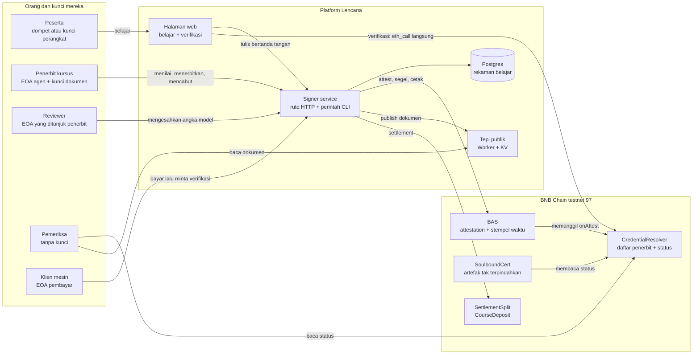

Dua hal yang gambar ini sengaja tunjukkan: halaman verifikasi **tidak lewat server kita** (ia membaca
resolver langsung), dan pemeriksa punya **dua jalan** yang sama-sama tidak butuh laptop kami.

## 4. Data tinggal di mana, dan siapa yang dipercaya untuknya

| # | tempat | isinya | siapa yang bisa menulis | siapa yang dipercaya pembaca |
|---|---|---|---|---|
| D1 | **Postgres** (Supabase) | `enrollments`, `lesson_progress`, `progress_events`, `attempts`, `attempt_components`, `submissions` (teks esai), `used_nonces`, `review_roles`, `judgement_reviews`, view `course_gates` | signer service saja (secret key). RLS aktif tanpa policy, jadi kunci publik tidak membaca apa pun | platform — ini rekaman kerja, bukan bukti publik |
| D2 | `signer/.store/state.json` | kredensial yang dipantau, nomor bit tiap kredensial, rekaman penerbitan + dokumen bertanda tangan | perintah penerbitan di mesin signer | platform |
| D3 | `signer/.keys/` | kunci dokumen Ed25519 tiap agen | `npm run agent` | penerbit (hari ini: di mesin platform) |
| D4 | **Workers KV** di tepi | dokumen kredensial, dokumen hasil, dokumen kriteria, dokumen penerbit, dua daftar status | `npm run publish:edge` | siapa pun bisa membaca; tanda tangan dokumennya yang dipercaya, bukan host-nya |
| D5 | **Chain 97** | attestation BAS, status di resolver, stempel waktu hash daftar status, artefak soulbound, setoran | agen (klaim), platform (daftar penerbit, segel, artefak) | **tidak perlu percaya siapa pun** |

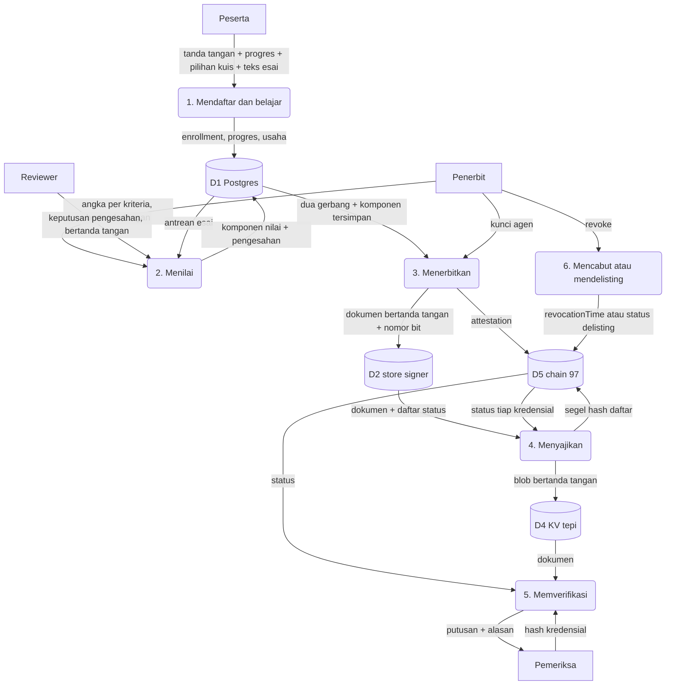

## 5. Alur A — penerbit menyiapkan kursus dan agennya

Ini bagian yang paling manual, dan harus dibaca apa adanya.

1. **Kursus ditulis sebagai data** (`web/src/courses/*.ts`): modul, lesson, soal kuis beserta kuncinya,
   rubrik esai per kriteria, bobot (`weights`), ambang lulus (`passMark`), masa berlaku (`validDays`),
   dan kursus prasyarat (`prereqCourseId`).
2. Data itu dibungkus **manifest penerbit** (`web/src/manifest.ts`). Dari manifest dihitung dua sidik
   jari: `rubricHash` (aturan penilaian: bobot, ambang, kunci, rubrik) dan `manifestHash` (seluruh
   isi, termasuk materi). Keduanya yang membuat pertanyaan "angka ini dinilai dengan aturan versi
   mana" punya jawaban.
3. Penerbit membuat **kunci dokumen** (`npm run agent`) — dokumen penerbitnya lalu tersaji di
   `/issuers/<slug>`, berisi kunci publik yang dipakai verifier standar.
4. **Platform** mendaftarkan EOA agen ke resolver (`addIssuer`, hanya owner). Tanpa ini setiap
   attestation agen itu ditolak `NotAnIssuer`.
5. Kriteria kursus tersaji publik di `/criteria/<courseId>` — bobot, ambang, rubrik, **tanpa** kunci
   jawaban kuis.

Tidak ada pendaftaran mandiri untuk penerbit: menambah kursus berarti mengubah kode, dan menambah
penerbit berarti platform menjalankan satu transaksi.

## 6. Alur B — peserta belajar

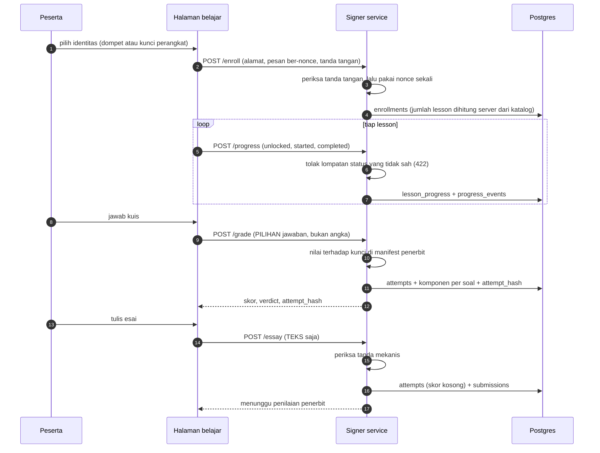

Aturan yang ditegakkan kode di alur ini:

- **Setiap tulisan ditandatangani peserta** atas pesan ber-nonce; nonce disimpan di database, jadi
  pesan yang sama tidak bisa dipakai dua kali (`signer/src/db.js` `authorizeLearner`).
- **Progres adalah mesin status**: `locked → unlocked → started → completed`. Melompat ditolak.
- **"Selesai" dihitung server**: penyebutnya (`lessons_total`) dibaca dari katalog penerbit, bukan dari
  kiriman klien.
- **Kuis dinilai server.** `/grade` menolak kiriman yang membawa `score`.
- **Esai masuk tanpa angka.** `/essay` menolak `score`, `rubric`, `max`. Yang diperiksa saat itu hanya
  lima tanda mekanis (panjang, menyebut alamat `0x…`, menyebut URL, menyebut fungsi atau perintah,
  menyatakan batas kesimpulannya). Kurang dari cukup → `insufficient`; cukup → masuk antrean.
- **`attempt_hash`** adalah sidik jari satu baris usaha (peserta, kursus, lesson, jenis, nomor usaha,
  skor, `rubricHash`). Ia yang nanti tercetak di dokumen hasil sebagai "alamat" angka itu.

## 7. Alur C — penilaian: siapa yang memberi angka

| jenis tugas | siapa yang menghitung angkanya | apa yang membuktikannya |
|---|---|---|
| **kuis** | server, terhadap kunci di manifest penerbit | komponen per soal tersimpan |
| **esai** | penerbit: lewat model, atau manusia | tanda tangan EOA penerbit; kalau dari model, tambah tanda tangan reviewer |
| **praktik** | **peserta sendiri** — `POST /attempts` menerima angka kiriman klien | hanya tanda tangan peserta. Ini lubang, lihat bagian 13 |

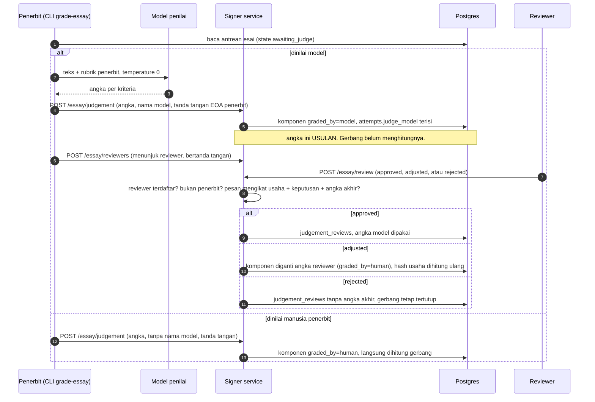

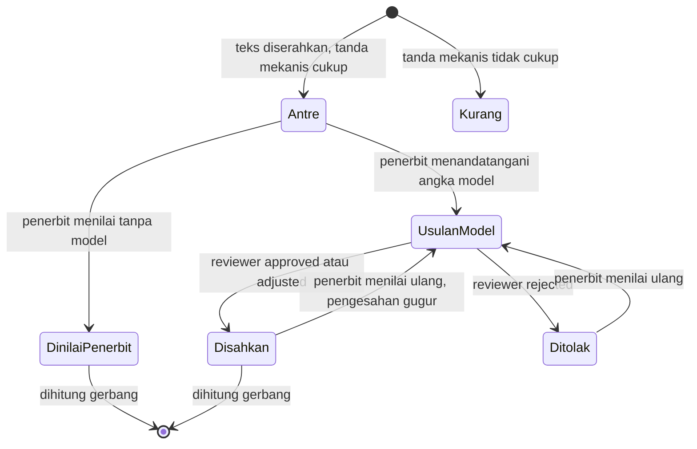

Hanya dua keadaan yang **dihitung gerbang**: `DinilaiPenerbit` dan `Disahkan`. "Ditolak reviewer"
tidak sama dengan "nilai nol" — tidak ada angka yang ditulis.

## 8. Alur D — penerbitan

Penerbitan **dijalankan penerbit lewat perintah** (`npm run issue -- --from-attempts --course … --learner …`),
bukan otomatis oleh halaman. Perintah itu membaca rekaman, dan boleh menolak.

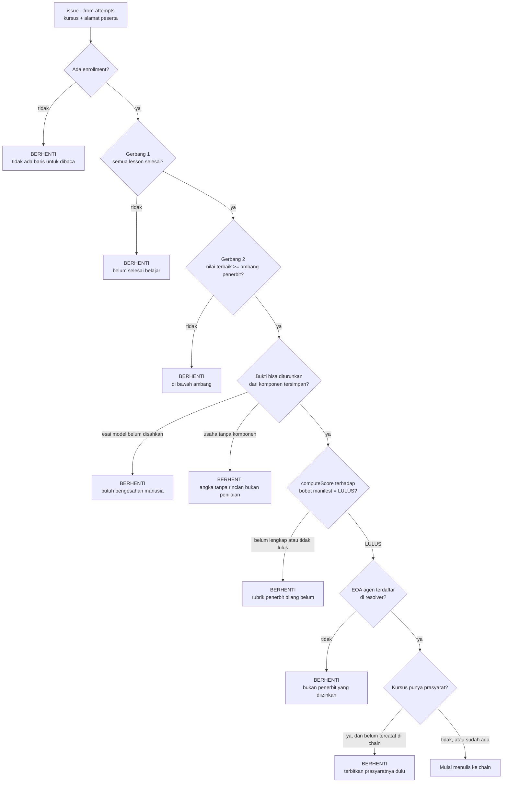

Semua kotak BERHENTI terjadi **sebelum gas bergerak**. Angka yang dipakai tidak pernah diambil dari
kolom `score`: `signer/src/fromAttempts.js` menurunkannya ulang dari `attempt_components`, dan kalau
perintah diberi angka lewat flag bersamaan dengan `--from-attempts`, ia menolak ("satu angka tidak
boleh punya dua jalan masuk").

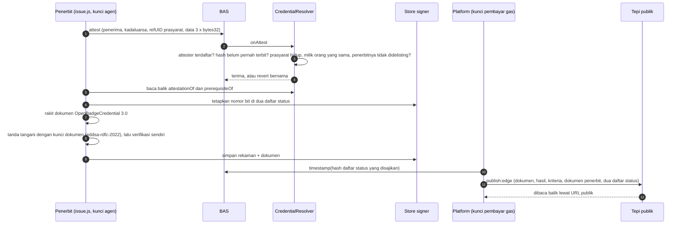

Yang dihasilkan satu penerbitan:

- **Attestation** di BAS. `attester` = EOA agen penerbit, `recipient` = alamat peserta, `expirationTime`
  = hari ini + `validDays` penerbit. Identitas kredensialnya `credentialHash = keccak256("vc:", alamat
  peserta, id kursus)`, jadi **satu peserta satu kertas per kursus** — resolver menolak duplikat
  (`AlreadyIssued`).
- **Dokumen** Open Badges 3.0 / VC 2.0 di `…/credentials/<credentialHash>`, yang mencetak URL penerbit,
  URL kriteria, URL hasil, dan entri daftar status (`signer/src/credential.js`).
- **Dokumen hasil** di `…/results/<courseId>/<credentialHash>`: angka, rubrik, `attempt_hash` tiap usaha,
  siapa menilai (model apa), dan siapa mengesahkan. Tanpa teks esai dan tanpa kunci jawaban.
- **Dua daftar status** (Bitstring Status List): `revocation` dan `suspension` (= penerbit didelisting).
  Bitnya **diturunkan dari chain**, bukan dari catatan kita, dan hash daftar yang disajikan distempel
  ke BAS.

**Dua jalur lain ke chain**, untuk penerbit yang memegang kuncinya sendiri dan tidak mau memegang BNB:

- `npm run delegate` — agen menandatangani permintaan attestation (EIP-712), platform yang menyiarkan
  dan membayar gas. `attester` yang tercatat tetap agen.
- `POST /relay` — bentuk layanan dari hal yang sama: agen menyerahkan delegasi bertanda tangan lewat
  HTTP; rute menolak sebelum gas segala yang pasti revert. Siaran mati kecuali `RELAY_BROADCAST=1`.
  Jalur ini hanya membuat attestation; dokumennya tetap dari `issue.js`.

**Artefak soulbound** (`contracts/SoulboundCert.sol`) adalah langkah terpisah dan milik **platform**:
hanya owner kontrak yang boleh `mint`/`mintBatch`, dan kontrak menolak kalau kredensialnya tidak ada,
dicabut, kadaluarsa, penerbitnya didelisting, pemegangnya bukan alamat itu, atau ia kredensial tingkat
lesson (artefak hanya untuk tingkat kursus). Token tidak bisa dipindahkan, dan `tokenURI` dirakit saat
dibaca dari status resolver — jadi artefak kredensial yang dicabut ikut terbaca dicabut.

## 9. Alur E — verifikasi: tiga jalan, tidak satu pun butuh percaya Lencana

| jalan | siapa | apa yang dibaca | batasnya |
|---|---|---|---|
| **Halaman verifikasi** | manusia | `statusOf` di resolver lewat RPC publik, langsung dari browser (`web/src/verify.ts`) | butuh RPC yang menjawab |
| **Verifier standar** (mis. validator Open Badges) | alat pihak ketiga | dokumen → dokumen penerbit → daftar status, semuanya lewat URL yang tercetak di dokumen | hanya melihat `revocation`; **delisting tidak terlihat** dari dokumen saja |
| **`POST /verify` berbayar** | mesin | logika yang sama dengan halaman, sampai 25 hash per pembayaran | lewat server kita |

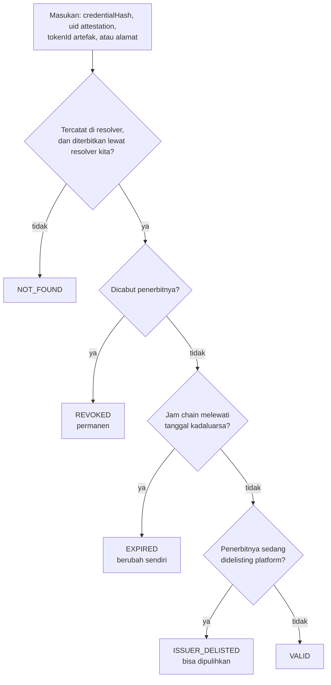

Sejak 1 Okt (B118) halaman juga membaca **identitas ERC-8004 agen penerbit**: manifest penerbit menyebut
`agentId`, lalu halaman membuktikan ke registry BNB bahwa `agentWallet` identitas itu = attester kertas.
Hasilnya satu kalimat alasan; verdict di bawah **tidak** berubah karenanya.

Urutannya disengaja: fakta tentang **kredensial** (dicabut, kadaluarsa) menang atas penilaian tentang
**penerbit** (didelisting). Halaman juga menelusuri rantai prasyarat (`prerequisiteOf`, berulang) dan
menampilkan keadaan tiap mata rantainya, serta artefak soulbound kalau ada.

Tepi publik (`cloudflare/worker.mjs`) tidak menandatangani apa pun. Tapi untuk kedua daftar status ia
**membaca chain saat permintaan datang** dan mencocokkan tiap bit dengan blob yang disajikan; kalau
berbeda, jawabannya 503 bertanda `x-lencana-stale`, bukan daftar lama yang tanda tangannya masih sah.

## 10. Alur F — sesudah terbit: mencabut, mendelisting, kadaluarsa

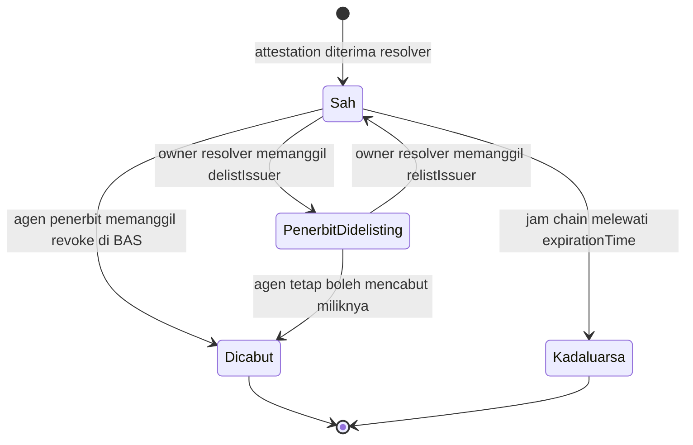

| kejadian | siapa yang bisa memicu | bisa dibatalkan? | akibat turunannya |
|---|---|---|---|
| **Pencabutan** | hanya `attester` asal (agen penerbit) — BAS menolak pihak lain, termasuk platform | tidak | bit `revocation` menyala; tidak bisa dipakai sebagai prasyarat; artefak baru ditolak |
| **Kadaluarsa** | tidak ada — waktu | tidak | sama dengan di atas, tanpa transaksi |
| **Delisting penerbit** | owner resolver (platform) | ya, `relistIssuer` | agen tidak bisa menerbitkan lagi; **semua** kertas lamanya terbaca `ISSUER_DELISTED`; bit `suspension` menyala; attestation-nya sendiri tidak disentuh |
| **Berhenti baik-baik** | owner resolver (`removeIssuer`) | — | agen tidak bisa menerbitkan lagi, kertas lama **tetap sah** |

Sesudah pencabutan atau delisting: daftar status disusun ulang dari chain, hash barunya distempel
(`npm run anchor`), lalu diterbitkan ulang ke tepi (`npm run publish:edge`). `npm run revoke -- --hash … --publish`
merangkai ketiganya.

Kredensial yang dicabut **merobohkan yang bergantung padanya hanya ke depan**: kertas lanjutan yang
sudah terbit tidak ikut tercabut, tetapi rantainya terbaca di halaman verifikasi, dan kredensial itu
tidak lagi diterima sebagai prasyarat penerbitan baru.

## 11. Alur G — uang

Verifikasi oleh manusia **gratis**. Dua tempat uang bergerak, dan keduanya memakai token demo.

**a. Verifikasi massal berbayar (x402).** Yang dijual bukan datanya — status chain memang publik —
melainkan pekerjaan membaca banyak kredensial sekaligus.

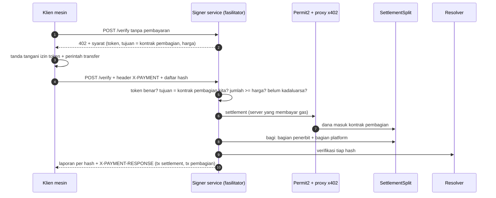

Klien tidak memegang BNB dan tidak mengirim transaksi. Yang dibayar adalah **penerbit**; platform
mengambil bagiannya lewat kontrak, dan `platformBps` di kontrak itu hanya bisa **turun**.

**b. Premi tenggat (`CourseDeposit`).** Peserta memilih tenggat 5 atau 7 hari dan menyetor premi;
selesai tepat waktu → premi kembali utuh; telat → premi hangus ke penerbit. Harga kursusnya sendiri
tidak pernah masuk kontrak ini.

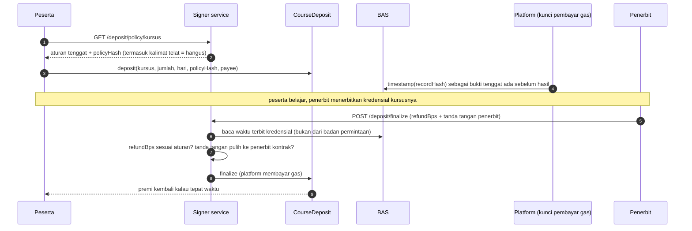

Stempel `recordHash` di langkah 4 hari ini hanya dilakukan harness (`npm run verify:deposit:live`)
dengan kunci platform — belum ada rute atau perintah produk yang melakukannya.

**Yang tidak ada:** pembelian kursus. Tabel `orders` ada di skema tetapi tidak ada kode yang menulisnya;
peserta mendaftar tanpa membayar, dan kontrak premi tidak dipanggil halaman mana pun.

## 12. Siapa memutuskan apa

| keputusan | yang memutuskan | ditegakkan di |
|---|---|---|
| rubrik, bobot, ambang lulus, masa berlaku, prasyarat | penerbit | manifest → `rubricHash` tercetak di tiap kertas |
| angka kuis | aturan penerbit, dihitung server | `signer/src/quiz.js` |
| angka esai | penerbit; kalau dari model, harus disahkan reviewer | `judgeEssay`, `reviewEssay`, view `course_gates`, `fromAttempts.js` |
| lulus atau tidak | `computeScore` terhadap manifest — bukan platform, bukan operator | `web/src/score.ts`, `signer/scripts/issue.js` |
| siapa boleh jadi penerbit | platform | `addIssuer` / `delistIssuer` (owner resolver) |
| mencabut satu kredensial | penerbit yang menerbitkannya, tidak ada orang lain | BAS (`attester == revoker`) |
| kredensial boleh jadi prasyarat | kontrak | `_validatePrerequisite` di resolver |
| siapa mendapat artefak | platform, tapi hanya untuk kredensial yang hidup | `SoulboundCert._mintOne` |
| status saat ini | chain | `statusOf` |

Kalimat ringkasnya: **platform memegang waktu dan daftar tamu, penerbit memegang isi.** Platform bisa
menunda atau menolak menyiarkan, dan bisa berhenti mengakui sebuah penerbit; ia tidak bisa mengarang,
mengubah, atau mencabut klaim penerbit.

## 13. Sambungan yang putus — yang belum menjadi satu alur

Ini bagian yang tidak akan terlihat kalau hanya membaca diagram di atas.

1. **Praktik tidak bisa diselesaikan dari halaman.** `computeScore` menuntut satu usaha `praktik` yang
   dinilai, dan satu-satunya jalan masuknya `POST /attempts` — yang **tidak dipanggil halaman belajar**
   (`grep -rn "/attempts" web/src` → nol pemanggil; harness memanggilnya langsung). Jadi peserta yang
   memakai halaman saja akan berhenti di "praktik: belum dikerjakan" saat penerbitan. Dan rute itu
   sendiri menerima angka kiriman peserta. Dicatat sebagai **B121** (1 Okt).
2. **Penerbitan tidak dipicu peserta.** Tidak ada rute "saya sudah selesai, terbitkan". Penerbit
   menjalankan `npm run issue` per peserta.
3. **Penerbit dan platform satu mesin.** Kunci agen ada di `signer/.keys/` dan `.env` platform. Jalur
   untuk memisahkannya ada (`/relay`), belum dipakai penerbit sungguhan.
4. **Reviewer adalah alamat.** Tidak ada identitas, tidak ada pencabutan penunjukan, tidak ada UI —
   hanya rute HTTP.
5. **Kunci jawaban kuis ada di bundel browser** (B80). Angka kuis tidak dilaporkan peserta, tetapi
   soalnya bisa dijawab dengan membaca bundel.
6. **Identitas peserta tidak tahan lama** kalau memakai kunci perangkat: tab ditutup = alamat baru =
   rekaman baru (B82).
7. **Tidak ada pembayaran kursus**, dan premi tenggat tidak tersambung ke halaman (bagian 11).
8. **Penerbit tidak bisa mendaftar sendiri**, dan halaman penerbit belum membaca data hidup (B105).
9. **Jalur hangus premi** hanya terbukti di uji kontrak, tidak di chain publik.
10. **Dua kursus, satu penerbit demo.** Penerbitnya fiktif dan disebut fiktif di namanya sendiri
    (`web/src/manifest.ts`); kursus kedua (`web3-lanjut-2026`) mensyaratkan yang pertama.
11. ~~**"Agen" belum punya identitas di luar resolver kita.**~~ **Ditutup 1 Okt (B118 F1):** agen penerbit
    sekarang agen ERC-8004 #2534 di IdentityRegistry BNB, pemiliknya Agent Owner, dompetnya = attester, dan
    halaman verifikasi membuktikannya per kertas. Yang masih putus di jalur ini: sewa per aktivitas (**B119**),
    reviewer sebagai penilai (**B120**), dan reputasi (B118 F2) — belum ada.

## 14. Cara membuktikan ulang tiap alur

| alur | perintah (dari `app/signer/`) | halaman uji |
|---|---|---|
| B belajar + C penilaian + pengesahan | `npm run verify:db` | [[09-Testing/T21 - signer db-probe.js]] |
| C → D, satu kertas dari rekaman | `npm run verify:attempts` · `npm run verify:attempts:live` | [[09-Testing/T22 - signer attempts-check.js]] |
| D dokumen + daftar status | `npm run check` · `npm run probe:serve` | [[09-Testing/T7 - signer check.js]] |
| D jalur delegasi | `npm run verify:relay` | [[09-Testing/T33 - signer relay-check.js]] |
| D → E tersaji publik | `npm run verify:edge` | [[09-Testing/T18 - signer verify-edge.js]] |
| E empat putusan | `npm run probe` (di `web/`) · `npm run check:samples` | [[09-Testing/T26 - signer sample-check.js]] |
| F pencabutan dan delisting | `npm run revoke` · `npm run specimen` | [[09-Testing/T26 - signer sample-check.js]] |
| G x402 | `npm run x402` | [[04-Signer-Service/S6 - x402 paid verification]] |
| G premi tenggat | `npm run verify:deposit` | [[09-Testing/T34 - signer deposit-check.js]] |
| A/E identitas agen ERC-8004 | `npm run verify:agent` | [[09-Testing/T35 - signer agent-identity-check.js]] |
| kontrak | `forge test` (di `app/`) | [[09-Testing/T1 - forge test on chain 97]] |
