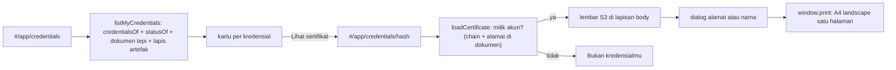

# FE9 - Halaman "Kredensial saya" dan lembar sertifikat

**Part of:** [[03-Frontend/01 - Frontend]] · **Backlog:** B165 di [[07-Backlog/03 - Findings and Tasks 2026-09-26]] ·
**AC:** [[07-Backlog/Acceptance-Criteria/AC-B165 - Halaman sertifikat dari dokumen kredensial]] · **Testing:** [[09-Testing/T88 - Uji peramban kartu kredensial dan lembar sertifikat (B165)]] ·
**Summary:** [[08-Results/B165 - Executive Summary]] · **Desain asal:** [[03-Frontend/Sertifikat/00 - Hub Desain Sertifikat]] (S3 "Kaca Segitiga") ·
**Verifier (sisi lain dari kredensial yang sama):** [[03-Frontend/FE1 - Verifier page and verify.ts]]

Bagian `#/app/credentials` di dasbor peserta. Sebelum B165 ia tabel hash; sesudahnya kartu per kredensial, dan `#/app/credentials/<hash>` membuka lembar sertifikat siap cetak.

## Peta berkas

| berkas | isi | catatan |
|---|---|---|
| `web/src/certificate.ts` | MURNI (tanpa DOM, tanpa jaringan): `parseCredentialDoc`, `parseCriteria`, `buildCertificate`, `statusVerdict`/`statusNoteFor`, tanggal WIB, `cleanName`/`effectiveMode`/`loadRecipient`/`saveRecipient`, `qrPath`, `facets` (kristal dari byte hash), `dialSvg` (cincin) | diuji `probe` grup B165 |
| `web/src/certificate-logo.ts` | data vektor lambang (disalin skrip dari desain S3) | hanya data |
| `web/src/credentials.ts` | lapisan data: `listMyCredentials(alamat)`, `loadCertificate(hash, alamat)`, `loadCredentialDoc` | chain (resolver + artefak) + host tepi; tanpa DOM; diuji `probe` terhadap B153 |
| `web/src/pages/credentials.ts` | halaman kartu `renderCredentials(lang, alamat, routeHash)` | dipanggil `dashboard.ts` |
| `web/src/pages/certificate-view.ts` | penampil lembar: `openCertificate`, `closeCertificate`, `certificateHashOf` | lapisan anak langsung `<body>` |
| `web/src/pages/certificate.css` | CSS lembar (disalin skrip dari S3, `.sheet` → `.cert-sheet`) + lapisan, bilah, dialog, cetak | selalu gelap |
| `web/src/pages/credentials.css` | kartu daftar | |
| `web/src/pages/certificate-extras.ts` | panel **Bukti on-chain** (B168), kotak **Cetak artefak NFT** (B169, `mintBox`), kotak **Bukti kepemilikan** per kartu (B170, `ownershipBox`), dialog Bagikan ke LinkedIn (B168) | `layers` dibagi dengan dialog bagikan dan diganti di tempat sesudah cetak; DOM saja, logikanya di `share.ts`/`ownership.ts` |
| `web/src/edge-fallback.ts` | jalur baca dokumen edge berlapis (B171): `edgeFetch`, `edgePathOf`, `installEdgeFallback` — proxy same-origin `/edge/*` (rewrite `vercel.json`) dan host edge langsung serentak; HTML bukan dokumen; gagal total → `TypeError` berpetunjuk blokir ISP | dipasang `main.ts`; tombol Coba lagi di `certificate-view.ts` |
| `web/src/ownership.ts` | MURNI: pernyataan kepemilikan baku, blok, `checkOwnership` (10 putusan), `chainReader`, `ownershipCast`, `ownershipLink` (B170) | diuji `probe` (21 pemeriksaan, termasuk chain 97 sungguhan) |
| `web/src/pages/ownership-check.ts` + `ownership.css` | bagian **Periksa bukti kepemilikan** di halaman verifikasi publik (`#ownership-check`) (B170) | dipanggil `main.ts` di `updateStaticText`; tidak menggambar ulang bila bahasa sama |
| `web/src/config.ts` | `CREDENTIAL_HOST`, `APP_HOST` (dipindah dari `main.ts`) | `main.ts` mengekspor ulang |

## Alur

## Aturan yang dijaga (dan di mana)

- **Kepemilikan dua arah** (`credentials.ts` `loadCertificate`): hash harus ada di `credentialsOf(akun)` DAN `credentialSubject.id` di dokumen harus alamat akun yang sama. Tanpa ini siapa pun bisa mencetak lembar atas nama peserta lain.
- **Tidak dikarang:** isian yang tidak ada di dokumen tidak ditampilkan; nilai per komponen tidak ada di dokumen yang tertanda tangan sehingga cincin dalam hanya bobot; batas lulus dan penerbit datang dari kriteria (boleh tidak ada).
- **Status bukan klaim:** lembar hanya menulis "Status dibaca dari chain pada <tanggal>; pindai QR untuk status terkini."; yang tidak BERLAKU diberi penanda di lembar dan kartu bertepi merah.
- **"Kosong" ≠ "gagal" ≠ "tidak tersaji":** daftar kosong yang sah, RPC gagal, dokumen 404, dan dokumen gagal diambil masing-masing punya tampilan sendiri.
- **Nama:** `cleanName` (tab/baris baru → spasi, kontrol dibuang, ≤ 60), selalu `textContent`, tersimpan di `localStorage` per alamat (`lencana.sertifikat.penerima:<alamat>`), tidak dikirim; mode "nama" dengan nama kosong jatuh ke alamat.
- **Label SVG dari dokumen:** kunci bobot disaring `[A-Za-z0-9_-]{1,24}` dan di-escape sebelum masuk ke SVG.
- **Selalu gelap:** tanpa tema terang dan tanpa tombol tema (sejak B166 juga tidak ada lagi varian terang otomatis di sistem terang: `color-scheme: dark` di `:root`). Cetak/PDF bawaannya gelap yang sama (kaca diganti isi padat karena `backdrop-filter` tidak ikut tercetak).
- **Latar cetak (B167):** dialog cetak punya pilihan "Gelap — seperti di layar" (bawaan) atau "Terang — hemat tinta", tersimpan per alamat (`lencana.sertifikat.latar:<alamat>`). Hanya berlaku di `@media print` lewat `data-paper="terang"` pada lembar dan lapisan; di layar lembar tetap gelap. Tokennya token terang S3 (kontras emas/abu yang gagal sudah dikoreksi di sana); kontras terukur dari piksel render: 0 gagal dari 38 teks di kedua latar.
- **Cetak artefak (B169):** kotak "Cetak artefak NFT" hanya bila **tidak ada** lapis yang memegang artefak **dan tidak ada** lapis yang gagal dibaca — "gagal baca" bukan "belum dicetak". Satu tanda tangan (`requestArtifactMint` → `POST /me/mint`); kontrak yang memutuskan boleh/tidaknya, jadi penolakan (bukan milikmu, dicabut, kedaluwarsa, penerbit didelisting) tampil apa adanya dan tombol hidup lagi; `409 already` membuat panel membaca ulang. Sesudah sukses `layers` diganti di tempat sehingga draf LinkedIn menyebut NFT.
- **Bukti kepemilikan (B170):** kotak hanya di kartu yang pemiliknya memang dompet akun (`ownerIsAccount`). `signOwnershipStatement` (`learning.ts`) menandatangani **hanya** pernyataan baku yang menyebut dompet akun yang masuk — bukan penanda tangan pesan sembarang. Pernyataan dibentuk `ownershipStatement`; pemeriksa menolak teks yang bila dibentuk ulang dari bidangnya tidak sama persis. Catatan batas (bukan identitas dunia nyata, potret saat diperiksa) ikut di kotak dan di pemeriksa.

## Hal yang mudah salah

- **Aturan global `p`/`h1` dari `style.css`** (`line-height: 1.6; max-width: 65ch`; `letter-spacing` pada `h1`) ikut mengenai teks lembar. Dinetralkan di `certificate.css` dengan `html :where(.cert-sheet) p` (spesifisitas (0,0,2)): menang atas aturan elemen global, kalah dari semua aturan kelas S3. Jangan diganti `.cert-sheet p` — itu menimpa `line-height` kelas S3.
- **Penampil adalah anak langsung `<body>`**, bukan di dalam kerangka dasbor: cetak menyembunyikan `body > *:not(.cert-layer)`. Kalau lapisan dipindah ke dalam dasbor, cetak menghasilkan halaman kosong tambahan.
- **Penutupan lapisan** ditangani tiga jalur: `renderApp` (`closeCertificate()` di awal), `hashchange` (ke halaman non-`#/app/credentials/`), dan Esc/"Kembali". Jalur baru ke rute lain tidak butuh kode tambahan.
- Kaki lembar bisa tiga baris (batas klaim + catatan status yang membungkus); isian penerbit/penandatangan dinaikkan 16 px dan `fitFoot` mengukur jarak, mengecilkan font sampai 9 px bila perlu.
- Tautan di kartu memakai `verifyLink(hash)` (relatif); QR dan "Salin tautan" memakai `APP_HOST` (produksi) supaya lembar yang dicetak dari mana pun menunjuk verifier yang sama.

## Batas

Cetak kertas sungguhan, peramban selain Chrome 154, dan pemindai QR telepon belum diuji (lihat T88 §Batas dan Summary §4).
